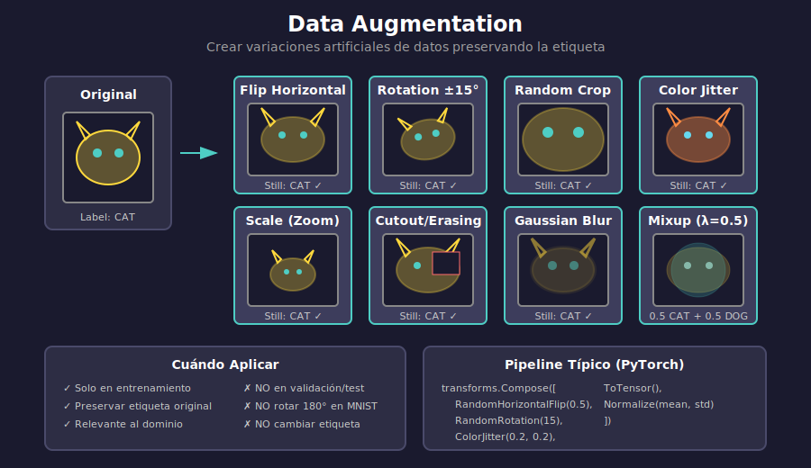

# 🖼️ Data Augmentation

## 🎯 Objetivos

- Comprender por qué aumentar datos ayuda
- Conocer transformaciones comunes para imágenes
- Implementar pipelines de augmentation
- Aplicar augmentation para texto y audio

---

## 1. ¿Por Qué Data Augmentation?

### El Problema

```
Datos de entrenamiento: 1,000 imágenes
Parámetros del modelo: 1,000,000

→ El modelo puede memorizar fácilmente
→ Overfitting garantizado
```

### La Solución

Crear **variaciones artificiales** de los datos existentes:

```
1,000 imágenes originales
    ↓ augmentation
10,000+ imágenes "nuevas"
    ↓
Más difícil de memorizar
    ↓
Mejor generalización
```

### Idea Clave

Las transformaciones deben **preservar la etiqueta**:



---

## 2. Transformaciones para Imágenes

### Geométricas

| Transformación | Descripción | Uso |
|----------------|-------------|-----|
| **Flip Horizontal** | Espejo horizontal | Casi siempre |
| **Flip Vertical** | Espejo vertical | Según dominio |
| **Rotación** | Girar ángulo aleatorio | General |
| **Crop aleatorio** | Recortar región | Muy común |
| **Escala** | Zoom in/out | General |
| **Traslación** | Mover imagen | General |

### De Color/Intensidad

| Transformación | Descripción | Uso |
|----------------|-------------|-----|
| **Brightness** | Ajustar brillo | General |
| **Contrast** | Ajustar contraste | General |
| **Saturación** | Ajustar colores | Imágenes a color |
| **Hue** | Cambiar tono | Con cuidado |
| **Normalización** | Media 0, std 1 | Siempre |

### Avanzadas

| Transformación | Descripción | Uso |
|----------------|-------------|-----|
| **Cutout** | Borrar región aleatoria | Regularización |
| **Mixup** | Mezclar dos imágenes | Regularización fuerte |
| **CutMix** | Recortar y pegar regiones | State-of-the-art |
| **AutoAugment** | Políticas aprendidas | Automático |

---

## 3. PyTorch: torchvision.transforms

### Transformaciones Básicas

```python
from torchvision import transforms

# Pipeline de augmentation para entrenamiento
train_transform = transforms.Compose([
    transforms.RandomHorizontalFlip(p=0.5),
    transforms.RandomRotation(degrees=15),
    transforms.RandomResizedCrop(224, scale=(0.8, 1.0)),
    transforms.ColorJitter(
        brightness=0.2,
        contrast=0.2,
        saturation=0.2,
        hue=0.1
    ),
    transforms.ToTensor(),
    transforms.Normalize(
        mean=[0.485, 0.456, 0.406],
        std=[0.229, 0.224, 0.225]
    )
])

# Para validación/test: SIN augmentation
test_transform = transforms.Compose([
    transforms.Resize(256),
    transforms.CenterCrop(224),
    transforms.ToTensor(),
    transforms.Normalize(
        mean=[0.485, 0.456, 0.406],
        std=[0.229, 0.224, 0.225]
    )
])
```

### Aplicar a Dataset

```python
from torchvision.datasets import ImageFolder

train_dataset = ImageFolder(
    root='data/train',
    transform=train_transform
)

test_dataset = ImageFolder(
    root='data/test',
    transform=test_transform  # Sin augmentation
)
```

---

## 4. Transformaciones en Detalle

### RandomHorizontalFlip

```python
# 50% de probabilidad de voltear horizontalmente
transforms.RandomHorizontalFlip(p=0.5)

# Resultado:
# Original: 🐱 mirando derecha
# Flipped:  🐱 mirando izquierda
```

### RandomRotation

```python
# Rotar entre -30 y +30 grados
transforms.RandomRotation(degrees=30)

# Con más control:
transforms.RandomRotation(
    degrees=(-30, 30),
    interpolation=transforms.InterpolationMode.BILINEAR,
    fill=0  # Color de relleno para bordes
)
```

### RandomResizedCrop

```python
# Recortar y redimensionar a 224x224
transforms.RandomResizedCrop(
    size=224,
    scale=(0.8, 1.0),  # Área del crop: 80-100%
    ratio=(0.9, 1.1)   # Aspect ratio
)
```

### ColorJitter

```python
transforms.ColorJitter(
    brightness=0.2,   # ±20% brillo
    contrast=0.2,     # ±20% contraste
    saturation=0.2,   # ±20% saturación
    hue=0.1           # ±10% hue (con cuidado)
)
```

### RandomErasing (Cutout)

```python
transforms.RandomErasing(
    p=0.5,                # Probabilidad
    scale=(0.02, 0.33),   # Área a borrar
    ratio=(0.3, 3.3),     # Aspect ratio del área
    value=0               # Valor de relleno
)
```

---

## 5. Visualizar Augmentations

```python
import matplotlib.pyplot as plt
import torchvision.transforms as T
from PIL import Image

def visualize_augmentations(image_path, transform, n_samples=8):
    """Visualiza múltiples augmentations de una imagen."""
    img = Image.open(image_path)
    
    fig, axes = plt.subplots(2, 4, figsize=(12, 6))
    
    for i, ax in enumerate(axes.flat):
        if i == 0:
            ax.imshow(img)
            ax.set_title('Original')
        else:
            augmented = transform(img)
            # Si es tensor, convertir a imagen
            if isinstance(augmented, torch.Tensor):
                augmented = augmented.permute(1, 2, 0).numpy()
                # Desnormalizar si es necesario
                augmented = (augmented * 0.229 + 0.485).clip(0, 1)
            ax.imshow(augmented)
            ax.set_title(f'Aug {i}')
        ax.axis('off')
    
    plt.tight_layout()
    plt.savefig('augmentations.png', dpi=150)
    plt.show()

# Uso
visualize_augmentations('cat.jpg', train_transform)
```

---

## 6. Augmentation para Dominios Específicos

### MNIST/Dígitos

```python
# Cuidado con rotaciones grandes (6 vs 9)
mnist_transform = transforms.Compose([
    transforms.RandomRotation(degrees=10),  # Solo ±10°
    transforms.RandomAffine(
        degrees=0,
        translate=(0.1, 0.1),  # Pequeña traslación
        scale=(0.9, 1.1)
    ),
    transforms.ToTensor(),
    transforms.Normalize((0.1307,), (0.3081,))
])
```

### Imágenes Médicas

```python
# Preservar información diagnóstica
medical_transform = transforms.Compose([
    transforms.RandomHorizontalFlip(),
    transforms.RandomRotation(degrees=5),  # Rotación mínima
    # NO usar ColorJitter agresivo
    transforms.RandomAdjustSharpness(sharpness_factor=1.5, p=0.3),
    transforms.ToTensor(),
    transforms.Normalize(mean, std)
])
```

### Detección de Objetos

```python
# Las transformaciones deben aplicarse también a bounding boxes
import albumentations as A

transform = A.Compose([
    A.HorizontalFlip(p=0.5),
    A.RandomBrightnessContrast(p=0.2),
    A.Rotate(limit=15, p=0.5),
], bbox_params=A.BboxParams(format='pascal_voc'))
```

---

## 7. Augmentation para Texto

```python
# Técnicas comunes
text_augmentations = {
    'synonym_replacement': 'Reemplazar palabras por sinónimos',
    'random_insertion': 'Insertar palabras aleatorias',
    'random_swap': 'Intercambiar posición de palabras',
    'random_deletion': 'Eliminar palabras aleatoriamente',
    'back_translation': 'Traducir a otro idioma y volver',
}

# Ejemplo con nlpaug
import nlpaug.augmenter.word as naw

aug = naw.SynonymAug(aug_src='wordnet')
text = "The quick brown fox jumps over the lazy dog"
augmented = aug.augment(text)
# "The fast brown fox jumps over the lazy dog"
```

---

## 8. Mixup y CutMix

### Mixup

Mezcla dos imágenes y sus etiquetas:

```python
def mixup_data(x, y, alpha=0.2):
    """Aplica Mixup a un batch."""
    lam = np.random.beta(alpha, alpha)
    batch_size = x.size(0)
    index = torch.randperm(batch_size)
    
    mixed_x = lam * x + (1 - lam) * x[index]
    y_a, y_b = y, y[index]
    
    return mixed_x, y_a, y_b, lam

def mixup_criterion(criterion, pred, y_a, y_b, lam):
    """Loss para Mixup."""
    return lam * criterion(pred, y_a) + (1 - lam) * criterion(pred, y_b)
```

### CutMix

Corta y pega regiones entre imágenes:

```python
def cutmix_data(x, y, alpha=1.0):
    """Aplica CutMix a un batch."""
    lam = np.random.beta(alpha, alpha)
    batch_size = x.size(0)
    index = torch.randperm(batch_size)
    
    # Generar región de corte
    W, H = x.size(2), x.size(3)
    cut_w = int(W * np.sqrt(1 - lam))
    cut_h = int(H * np.sqrt(1 - lam))
    
    cx = np.random.randint(W)
    cy = np.random.randint(H)
    
    x1 = np.clip(cx - cut_w // 2, 0, W)
    x2 = np.clip(cx + cut_w // 2, 0, W)
    y1 = np.clip(cy - cut_h // 2, 0, H)
    y2 = np.clip(cy + cut_h // 2, 0, H)
    
    # Aplicar corte
    x[:, :, y1:y2, x1:x2] = x[index, :, y1:y2, x1:x2]
    
    # Ajustar lambda según área real
    lam = 1 - ((x2 - x1) * (y2 - y1) / (W * H))
    
    return x, y, y[index], lam
```

---

## 9. Tips y Mejores Prácticas

### ✅ Hacer

```python
# 1. Solo en entrenamiento
train_dataset = Dataset(transform=train_augment)
test_dataset = Dataset(transform=test_transform)  # Sin augment

# 2. Empezar simple, agregar gradualmente
simple_aug = transforms.Compose([
    transforms.RandomHorizontalFlip(),
    transforms.ToTensor(),
    transforms.Normalize(mean, std)
])

# 3. Validar que las transformaciones tienen sentido
visualize_augmentations(image, transform)
```

### ❌ Evitar

```python
# 1. Augmentation en validación/test
# Resultados inconsistentes

# 2. Transformaciones que cambien la etiqueta
transforms.RandomRotation(180)  # 6 → 9

# 3. Augmentation demasiado agresivo
transforms.ColorJitter(brightness=1.0)  # Imagen irreconocible
```

---

## ✅ Checklist de Verificación

- [ ] Entiendo por qué Data Augmentation ayuda
- [ ] Conozco transformaciones geométricas y de color
- [ ] Sé usar torchvision.transforms.Compose
- [ ] Aplico augmentation solo en entrenamiento
- [ ] Puedo visualizar las transformaciones

---

## 📚 Recursos Adicionales

- [torchvision.transforms Documentation](https://pytorch.org/vision/stable/transforms.html)
- [Albumentations Library](https://albumentations.ai/)
- [AutoAugment Paper](https://arxiv.org/abs/1805.09501)
- [Mixup Paper](https://arxiv.org/abs/1710.09412)
- [CutMix Paper](https://arxiv.org/abs/1905.04899)

---

_Siguiente: Ejercicios prácticos para aplicar estas técnicas_
