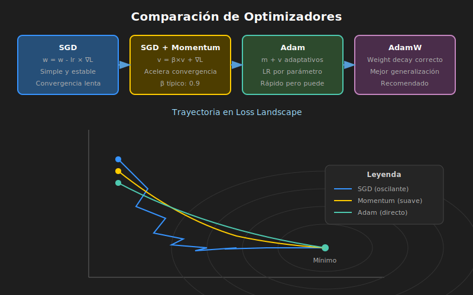

# ⚡ Optimizadores Modernos



## 🎯 Objetivos

- Comprender el descenso de gradiente y sus variantes
- Conocer SGD, Momentum, Adam, AdamW
- Saber cuándo usar cada optimizador

---

## 1. Descenso de Gradiente Básico

### Fórmula

$$\theta_{t+1} = \theta_t - \eta \cdot \nabla L(\theta_t)$$

Donde:
- $\theta$ = parámetros del modelo
- $\eta$ = learning rate
- $\nabla L$ = gradiente de la función de pérdida

### Problema

El gradiente básico puede ser lento y oscilar en valles estrechos.

---

## 2. SGD con Momentum

### Idea

Acumular "velocidad" en la dirección consistente del gradiente.

### Fórmula

$$v_t = \beta \cdot v_{t-1} + \nabla L(\theta_t)$$
$$\theta_{t+1} = \theta_t - \eta \cdot v_t$$

### PyTorch

```python
optimizer = torch.optim.SGD(
    model.parameters(),
    lr=0.01,
    momentum=0.9  # Valor típico
)
```

### Beneficios

- Acelera convergencia en direcciones consistentes
- Reduce oscilaciones
- Puede escapar mínimos locales superficiales

---

## 3. Adam (Adaptive Moment Estimation)

### Idea

Combina momentum con learning rates adaptativos por parámetro.

### Fórmulas

```
m_t = β₁ · m_{t-1} + (1 - β₁) · g_t     # Primer momento (media)
v_t = β₂ · v_{t-1} + (1 - β₂) · g_t²    # Segundo momento (varianza)

m̂_t = m_t / (1 - β₁^t)                  # Corrección de sesgo
v̂_t = v_t / (1 - β₂^t)

θ_{t+1} = θ_t - η · m̂_t / (√v̂_t + ε)
```

### PyTorch

```python
optimizer = torch.optim.Adam(
    model.parameters(),
    lr=0.001,        # LR típico para Adam
    betas=(0.9, 0.999),
    eps=1e-8
)
```

### Características

- Learning rate adaptativo por parámetro
- Funciona bien con gradientes ruidosos
- Buen default para la mayoría de casos

---

## 4. AdamW (Adam + Weight Decay Correcto)

### Problema de Adam

En Adam original, weight decay se implementa como L2 en el gradiente, lo cual no es equivalente a weight decay real.

### Solución: Decoupled Weight Decay

```python
# AdamW separa weight decay de la actualización de Adam
θ_{t+1} = θ_t - η · (m̂_t / (√v̂_t + ε) + λ · θ_t)
```

### PyTorch

```python
optimizer = torch.optim.AdamW(
    model.parameters(),
    lr=0.001,
    weight_decay=0.01  # Weight decay correcto
)
```

### ¿Cuándo usar AdamW?

- **Siempre que uses Adam con regularización**
- Transfer learning
- Transformers y modelos grandes

---

## 5. Comparación de Optimizadores

| Optimizador | LR típico | Uso recomendado |
|-------------|-----------|-----------------|
| **SGD** | 0.1 - 0.01 | Baseline, investigación |
| **SGD+Momentum** | 0.1 - 0.01 | CNNs, cuando hay tiempo |
| **Adam** | 0.001 - 0.0001 | Default rápido |
| **AdamW** | 0.001 - 0.0001 | Con regularización |

### Velocidad vs Generalización

```
SGD+Momentum: Más lento, mejor generalización final
Adam/AdamW:   Más rápido, puede sobreajustar
```

---

## 6. Ejemplo Comparativo

```python
import torch
import torch.nn as nn

model = nn.Sequential(
    nn.Linear(784, 256),
    nn.ReLU(),
    nn.Linear(256, 10)
)

# Diferentes optimizadores
optimizers = {
    'SGD': torch.optim.SGD(model.parameters(), lr=0.01),
    'SGD+Momentum': torch.optim.SGD(model.parameters(), lr=0.01, momentum=0.9),
    'Adam': torch.optim.Adam(model.parameters(), lr=0.001),
    'AdamW': torch.optim.AdamW(model.parameters(), lr=0.001, weight_decay=0.01),
}

# Loop de entrenamiento estándar
def train_step(model, optimizer, x, y, criterion):
    optimizer.zero_grad()
    output = model(x)
    loss = criterion(output, y)
    loss.backward()
    optimizer.step()
    return loss.item()
```

---

## 7. Tips Prácticos

### Empezar con Adam

```python
# Buen punto de partida
optimizer = torch.optim.Adam(model.parameters(), lr=1e-3)
```

### Cambiar a SGD para Fine-tuning

```python
# Después de Adam, SGD puede mejorar generalización
optimizer = torch.optim.SGD(model.parameters(), lr=1e-4, momentum=0.9)
```

### AdamW para Modelos Grandes

```python
# Transformers, modelos preentrenados
optimizer = torch.optim.AdamW(
    model.parameters(),
    lr=2e-5,
    weight_decay=0.01
)
```

---

## ✅ Checklist de Verificación

- [ ] Entiendo la diferencia entre SGD y Momentum
- [ ] Comprendo cómo Adam adapta learning rates
- [ ] Sé por qué AdamW es mejor que Adam con L2
- [ ] Puedo elegir el optimizador según el caso

---

## 📚 Recursos Adicionales

- [Adam Paper (Kingma & Ba 2014)](https://arxiv.org/abs/1412.6980)
- [AdamW Paper (Loshchilov 2017)](https://arxiv.org/abs/1711.05101)
- [PyTorch Optimizers](https://pytorch.org/docs/stable/optim.html)

---

_Siguiente: [02-learning-rate-schedules.md](02-learning-rate-schedules.md)_
