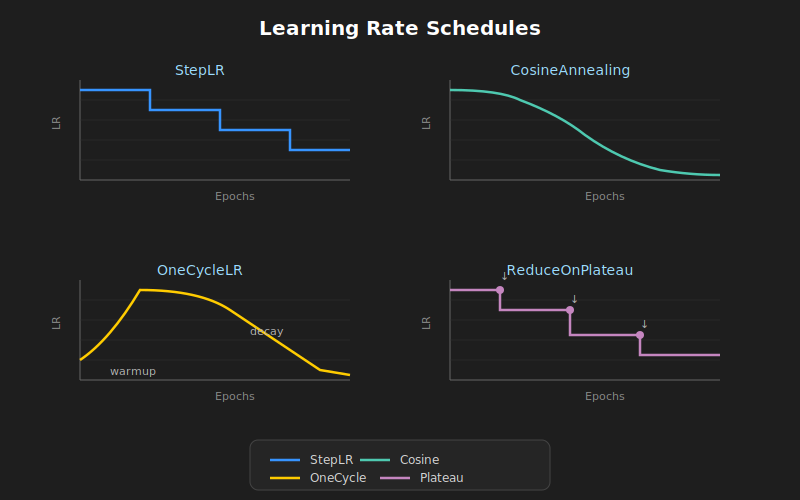

# 📉 Learning Rate Schedules



## 🎯 Objetivos

- Comprender por qué ajustar el learning rate
- Conocer schedules populares: Step, Cosine, OneCycle
- Implementar schedules en PyTorch

---

## 1. ¿Por Qué Ajustar el Learning Rate?

### Problema del LR Fijo

```
LR alto al inicio  → Rápida convergencia inicial
LR alto al final   → Oscila, no converge bien

LR bajo al inicio  → Muy lento
LR bajo al final   → Convergencia fina
```

### Solución

**Empezar alto, reducir gradualmente** para obtener lo mejor de ambos mundos.

---

## 2. StepLR

### Idea

Reduce el LR por un factor cada N épocas.

### Fórmula

$$\eta_t = \eta_0 \cdot \gamma^{\lfloor t / \text{step\_size} \rfloor}$$

### PyTorch

```python
optimizer = torch.optim.Adam(model.parameters(), lr=0.01)

scheduler = torch.optim.lr_scheduler.StepLR(
    optimizer,
    step_size=10,  # Cada 10 épocas
    gamma=0.1      # Multiplica por 0.1
)

# En el loop de entrenamiento
for epoch in range(epochs):
    train(...)
    scheduler.step()  # Actualiza LR
```

### Curva

```
LR
│
│████████████
│            ████████████
│                        ████████████
└────────────────────────────────────→ Época
   0        10        20        30
```

---

## 3. ExponentialLR

### Idea

Decae exponencialmente cada época.

### PyTorch

```python
scheduler = torch.optim.lr_scheduler.ExponentialLR(
    optimizer,
    gamma=0.95  # LR *= 0.95 cada época
)
```

---

## 4. CosineAnnealingLR

### Idea

LR sigue una curva coseno, decreciendo suavemente.

### Fórmula

$$\eta_t = \eta_{min} + \frac{1}{2}(\eta_{max} - \eta_{min})(1 + \cos(\frac{t}{T}\pi))$$

### PyTorch

```python
scheduler = torch.optim.lr_scheduler.CosineAnnealingLR(
    optimizer,
    T_max=50,      # Épocas totales
    eta_min=1e-6   # LR mínimo
)
```

### Curva

```
LR
│
│█
│ ██
│   ███
│      █████
│           ████████████████████
└────────────────────────────────→ Época
```

### Ventajas

- Transición suave
- Muy popular en papers recientes
- Buenos resultados en CNNs

---

## 5. OneCycleLR (Super-Convergence)

### Idea

Un ciclo: warmup → LR máximo → decay agresivo.

### Fases

1. **Warmup**: LR sube de `max_lr/div_factor` a `max_lr`
2. **Decay**: LR baja de `max_lr` a `max_lr/final_div_factor`

### PyTorch

```python
scheduler = torch.optim.lr_scheduler.OneCycleLR(
    optimizer,
    max_lr=0.01,
    epochs=30,
    steps_per_epoch=len(train_loader),
    pct_start=0.3,      # 30% warmup
    div_factor=25,      # LR inicial = max_lr/25
    final_div_factor=1e4  # LR final muy bajo
)

# IMPORTANTE: step() después de cada BATCH, no época
for epoch in range(epochs):
    for batch in train_loader:
        train_step(...)
        scheduler.step()  # Cada batch!
```

### Curva

```
LR
│        ████
│      ██    ███
│    ██         ████
│  ██               █████
│██                      ████████
└────────────────────────────────→ Steps
  warmup      decay
```

### Ventajas

- Entrenamiento más rápido
- Mejores resultados
- Recomendado para CNNs y Transfer Learning

---

## 6. ReduceLROnPlateau

### Idea

Reduce LR cuando una métrica deja de mejorar.

### PyTorch

```python
scheduler = torch.optim.lr_scheduler.ReduceLROnPlateau(
    optimizer,
    mode='min',       # Minimizar loss
    factor=0.1,       # Multiplica por 0.1
    patience=5,       # Espera 5 épocas sin mejora
    min_lr=1e-7
)

# Paso diferente: necesita la métrica
for epoch in range(epochs):
    train(...)
    val_loss = validate(...)
    scheduler.step(val_loss)  # Pasa la métrica
```

### Cuándo usar

- Cuando no sabes cuántas épocas entrenar
- Combinado con Early Stopping

---

## 7. Warmup Manual

### Idea

Empezar con LR muy bajo y subir gradualmente.

### Implementación

```python
def warmup_lr(epoch, warmup_epochs, initial_lr, target_lr):
    if epoch < warmup_epochs:
        return initial_lr + (target_lr - initial_lr) * epoch / warmup_epochs
    return target_lr

# O usando LambdaLR
warmup_epochs = 5
scheduler = torch.optim.lr_scheduler.LambdaLR(
    optimizer,
    lr_lambda=lambda epoch: min(1.0, (epoch + 1) / warmup_epochs)
)
```

### ¿Por qué warmup?

- Evita gradientes grandes al inicio
- Importante para BatchNorm (estadísticas inestables al inicio)
- Esencial en Transformers

---

## 8. Combinar Schedulers

```python
from torch.optim.lr_scheduler import SequentialLR, LinearLR, CosineAnnealingLR

# Warmup lineal + Cosine decay
scheduler1 = LinearLR(optimizer, start_factor=0.1, total_iters=5)
scheduler2 = CosineAnnealingLR(optimizer, T_max=45)

scheduler = SequentialLR(
    optimizer,
    schedulers=[scheduler1, scheduler2],
    milestones=[5]  # Cambia al scheduler2 en época 5
)
```

---

## 9. Visualizar LR Schedule

```python
import matplotlib.pyplot as plt

def plot_lr_schedule(scheduler, epochs, steps_per_epoch=1):
    lrs = []
    for epoch in range(epochs):
        for step in range(steps_per_epoch):
            lrs.append(scheduler.get_last_lr()[0])
            scheduler.step()
    
    plt.figure(figsize=(10, 4))
    plt.plot(lrs)
    plt.xlabel('Step')
    plt.ylabel('Learning Rate')
    plt.title('LR Schedule')
    plt.grid(True, alpha=0.3)
    plt.show()
```

---

## 10. Resumen de Schedules

| Schedule | Cuándo usar | Complejidad |
|----------|-------------|-------------|
| **StepLR** | Baseline simple | Baja |
| **CosineAnnealing** | CNNs, papers recientes | Media |
| **OneCycleLR** | Mejor rendimiento | Media |
| **ReduceOnPlateau** | No sabes épocas | Baja |
| **Warmup + X** | Transformers, modelos grandes | Alta |

---

## ✅ Checklist de Verificación

- [ ] Entiendo por qué ajustar LR durante entrenamiento
- [ ] Conozco StepLR, Cosine, OneCycle
- [ ] Sé cuándo usar step() por época vs por batch
- [ ] Puedo visualizar un LR schedule

---

## 📚 Recursos Adicionales

- [OneCycleLR Paper](https://arxiv.org/abs/1708.07120)
- [PyTorch LR Schedulers](https://pytorch.org/docs/stable/optim.html#how-to-adjust-learning-rate)

---

_Siguiente: [03-inicializacion-pesos.md](03-inicializacion-pesos.md)_
