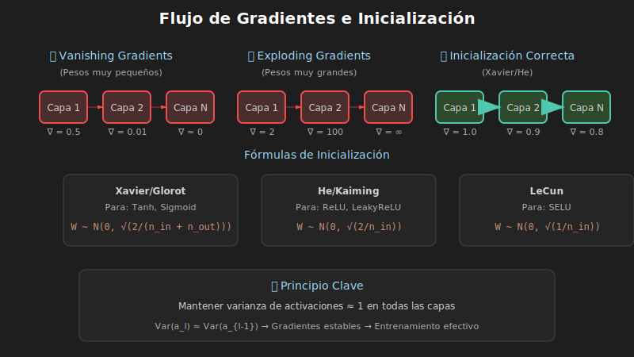

# 🎲 Inicialización de Pesos



## 🎯 Objetivos

- Comprender por qué la inicialización importa
- Conocer Xavier/Glorot y He/Kaiming
- Saber qué inicialización usar según la activación

---

## 1. ¿Por Qué Importa la Inicialización?

### Problema: Pesos Muy Pequeños

```
Capa 1 → Capa 2 → Capa 3 → ... → Capa N
  ↓         ↓         ↓              ↓
 0.5       0.25      0.125         ~0
 
Gradientes → 0 (Vanishing Gradients)
```

### Problema: Pesos Muy Grandes

```
Capa 1 → Capa 2 → Capa 3 → ... → Capa N
  ↓         ↓         ↓              ↓
  2         4         8           ∞
  
Gradientes → ∞ (Exploding Gradients)
```

### Objetivo

Mantener la **varianza de activaciones** constante a través de las capas.

---

## 2. Xavier/Glorot Initialization

### Para: Activaciones Lineales, Tanh, Sigmoid

### Fórmula (Uniform)

$$W \sim U\left[-\sqrt{\frac{6}{n_{in} + n_{out}}}, \sqrt{\frac{6}{n_{in} + n_{out}}}\right]$$

### Fórmula (Normal)

$$W \sim N\left(0, \sqrt{\frac{2}{n_{in} + n_{out}}}\right)$$

### PyTorch

```python
import torch.nn as nn

# Automático para Linear
layer = nn.Linear(256, 128)  # Ya usa Xavier por defecto

# Manual
nn.init.xavier_uniform_(layer.weight)
nn.init.xavier_normal_(layer.weight)
nn.init.zeros_(layer.bias)
```

### ¿Por qué funciona?

Mantiene varianza considerando tanto entrada como salida.

---

## 3. He/Kaiming Initialization

### Para: ReLU y variantes (LeakyReLU, ELU)

### Fórmula

$$W \sim N\left(0, \sqrt{\frac{2}{n_{in}}}\right)$$

### ¿Por qué diferente a Xavier?

ReLU "mata" la mitad de las activaciones (las negativas), por lo que necesitamos compensar con varianza mayor.

### PyTorch

```python
# Para ReLU
nn.init.kaiming_uniform_(layer.weight, mode='fan_in', nonlinearity='relu')
nn.init.kaiming_normal_(layer.weight, mode='fan_in', nonlinearity='relu')

# Para LeakyReLU
nn.init.kaiming_uniform_(layer.weight, mode='fan_in', nonlinearity='leaky_relu', a=0.01)
```

### Parámetros

- **mode='fan_in'**: Preserva varianza en forward pass
- **mode='fan_out'**: Preserva varianza en backward pass

---

## 4. Resumen: Qué Usar

| Activación | Inicialización |
|------------|----------------|
| Lineal, Tanh, Sigmoid | Xavier/Glorot |
| ReLU | He/Kaiming |
| LeakyReLU | He/Kaiming (con a) |
| SELU | LeCun Normal |

---

## 5. Inicializar una Red Completa

```python
def init_weights(model):
    """Inicializa pesos según tipo de capa y activación."""
    for name, module in model.named_modules():
        if isinstance(module, nn.Linear):
            nn.init.kaiming_normal_(module.weight, nonlinearity='relu')
            if module.bias is not None:
                nn.init.zeros_(module.bias)
        elif isinstance(module, nn.Conv2d):
            nn.init.kaiming_normal_(module.weight, mode='fan_out', nonlinearity='relu')
            if module.bias is not None:
                nn.init.zeros_(module.bias)
        elif isinstance(module, (nn.BatchNorm2d, nn.BatchNorm1d)):
            nn.init.ones_(module.weight)
            nn.init.zeros_(module.bias)

# Aplicar
model = MyNetwork()
model.apply(init_weights)
```

---

## 6. Otras Inicializaciones

### Zeros (No usar para pesos)

```python
nn.init.zeros_(layer.weight)  # ❌ Todas las neuronas iguales
nn.init.zeros_(layer.bias)    # ✅ OK para bias
```

### Ones

```python
nn.init.ones_(bn.weight)  # ✅ Para gamma en BatchNorm
```

### Constant

```python
nn.init.constant_(layer.bias, 0.1)
```

### Orthogonal (RNNs)

```python
nn.init.orthogonal_(rnn.weight_hh)  # Ayuda con vanishing gradients en RNNs
```

---

## 7. Verificar Inicialización

```python
def check_initialization(model):
    """Verifica que la inicialización es razonable."""
    for name, param in model.named_parameters():
        if 'weight' in name:
            mean = param.data.mean().item()
            std = param.data.std().item()
            print(f'{name}: mean={mean:.4f}, std={std:.4f}')

# Ejemplo de salida esperada:
# layer1.weight: mean=0.0012, std=0.0834
# layer2.weight: mean=-0.0008, std=0.0721
```

---

## 8. Transfer Learning

Cuando usas modelos preentrenados:

```python
# Cargar modelo preentrenado
model = torchvision.models.resnet18(pretrained=True)

# Solo inicializar la capa final (clasificador nuevo)
model.fc = nn.Linear(512, num_classes)
nn.init.kaiming_normal_(model.fc.weight)
nn.init.zeros_(model.fc.bias)
```

---

## ✅ Checklist de Verificación

- [ ] Entiendo vanishing/exploding gradients
- [ ] Sé cuándo usar Xavier vs He
- [ ] Puedo inicializar una red completa
- [ ] Conozco inicialización para BatchNorm

---

## 📚 Recursos Adicionales

- [Xavier Paper (Glorot 2010)](http://proceedings.mlr.press/v9/glorot10a.html)
- [He Paper (2015)](https://arxiv.org/abs/1502.01852)
- [PyTorch nn.init](https://pytorch.org/docs/stable/nn.init.html)

---

_Siguiente: [04-callbacks-checkpoints.md](04-callbacks-checkpoints.md)_
