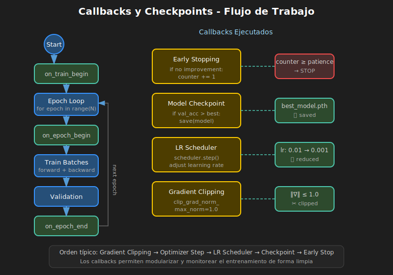

# 🔄 Callbacks y Checkpoints



## 🎯 Objetivos

- Implementar callbacks para monitorear entrenamiento
- Guardar y cargar checkpoints de modelos
- Usar Early Stopping efectivamente
- Crear callbacks personalizados

---

## 1. ¿Qué son los Callbacks?

Funciones que se ejecutan en momentos específicos del entrenamiento:

```
Inicio entrenamiento → on_train_begin
  │
  ├─ Inicio época → on_epoch_begin
  │    │
  │    ├─ Inicio batch → on_batch_begin
  │    │    │
  │    │    └─ Fin batch → on_batch_end
  │    │
  │    └─ Fin época → on_epoch_end
  │
  └─ Fin entrenamiento → on_train_end
```

---

## 2. Early Stopping

### Propósito

Detener entrenamiento cuando el modelo deja de mejorar.

### Implementación

```python
class EarlyStopping:
    """Detiene entrenamiento si no hay mejora."""
    
    def __init__(self, patience=7, min_delta=0.001, mode='min'):
        self.patience = patience
        self.min_delta = min_delta
        self.mode = mode
        self.counter = 0
        self.best_value = None
        self.should_stop = False
    
    def __call__(self, current_value):
        if self.best_value is None:
            self.best_value = current_value
            return False
        
        if self._is_improvement(current_value):
            self.best_value = current_value
            self.counter = 0
        else:
            self.counter += 1
            if self.counter >= self.patience:
                self.should_stop = True
        
        return self.should_stop
    
    def _is_improvement(self, current):
        if self.mode == 'min':
            return current < self.best_value - self.min_delta
        return current > self.best_value + self.min_delta

# Uso
early_stop = EarlyStopping(patience=10, mode='min')

for epoch in range(100):
    train_loss = train(...)
    val_loss = validate(...)
    
    if early_stop(val_loss):
        print(f'Early stopping at epoch {epoch}')
        break
```

---

## 3. Model Checkpoint

### Propósito

Guardar el mejor modelo durante entrenamiento.

### Implementación

```python
class ModelCheckpoint:
    """Guarda el mejor modelo."""
    
    def __init__(self, filepath, monitor='val_loss', mode='min'):
        self.filepath = filepath
        self.monitor = monitor
        self.mode = mode
        self.best_value = float('inf') if mode == 'min' else float('-inf')
    
    def __call__(self, model, current_value, epoch):
        is_best = (self.mode == 'min' and current_value < self.best_value) or \
                  (self.mode == 'max' and current_value > self.best_value)
        
        if is_best:
            self.best_value = current_value
            torch.save({
                'epoch': epoch,
                'model_state_dict': model.state_dict(),
                'best_value': self.best_value,
            }, self.filepath)
            print(f'Saved best model: {self.monitor}={current_value:.4f}')

# Uso
checkpoint = ModelCheckpoint('best_model.pth', monitor='val_acc', mode='max')

for epoch in range(epochs):
    train(...)
    val_acc = validate(...)
    checkpoint(model, val_acc, epoch)
```

---

## 4. Guardar Checkpoint Completo

### Guardar Todo el Estado

```python
def save_checkpoint(model, optimizer, scheduler, epoch, loss, filepath):
    """Guarda estado completo para resumir entrenamiento."""
    torch.save({
        'epoch': epoch,
        'model_state_dict': model.state_dict(),
        'optimizer_state_dict': optimizer.state_dict(),
        'scheduler_state_dict': scheduler.state_dict(),
        'loss': loss,
    }, filepath)

# Guardar
save_checkpoint(model, optimizer, scheduler, epoch, loss, 'checkpoint.pth')
```

### Cargar y Resumir

```python
def load_checkpoint(filepath, model, optimizer=None, scheduler=None):
    """Carga checkpoint y restaura estado."""
    checkpoint = torch.load(filepath)
    
    model.load_state_dict(checkpoint['model_state_dict'])
    
    if optimizer:
        optimizer.load_state_dict(checkpoint['optimizer_state_dict'])
    if scheduler:
        scheduler.load_state_dict(checkpoint['scheduler_state_dict'])
    
    return checkpoint['epoch'], checkpoint['loss']

# Cargar
start_epoch, best_loss = load_checkpoint('checkpoint.pth', model, optimizer, scheduler)

# Continuar entrenamiento
for epoch in range(start_epoch, total_epochs):
    train(...)
```

---

## 5. Gradient Clipping

### Propósito

Prevenir exploding gradients limitando su magnitud.

### Por Norma (Recomendado)

```python
# Después de backward, antes de step
loss.backward()
torch.nn.utils.clip_grad_norm_(model.parameters(), max_norm=1.0)
optimizer.step()
```

### Por Valor

```python
torch.nn.utils.clip_grad_value_(model.parameters(), clip_value=0.5)
```

### Monitorear Gradientes

```python
def get_grad_norm(model):
    """Calcula norma total de gradientes."""
    total_norm = 0
    for p in model.parameters():
        if p.grad is not None:
            total_norm += p.grad.data.norm(2).item() ** 2
    return total_norm ** 0.5

# En training loop
grad_norm = get_grad_norm(model)
if grad_norm > 10:
    print(f'Warning: Large gradient norm: {grad_norm:.2f}')
```

---

## 6. Logger de Métricas

```python
class MetricsLogger:
    """Registra métricas durante entrenamiento."""
    
    def __init__(self):
        self.history = {}
    
    def log(self, metrics_dict, step=None):
        for name, value in metrics_dict.items():
            if name not in self.history:
                self.history[name] = []
            self.history[name].append(value)
    
    def plot(self, metrics=None):
        metrics = metrics or list(self.history.keys())
        
        fig, axes = plt.subplots(1, len(metrics), figsize=(5*len(metrics), 4))
        if len(metrics) == 1:
            axes = [axes]
        
        for ax, metric in zip(axes, metrics):
            ax.plot(self.history[metric])
            ax.set_title(metric)
            ax.set_xlabel('Epoch')
            ax.grid(True, alpha=0.3)
        
        plt.tight_layout()
        plt.show()

# Uso
logger = MetricsLogger()

for epoch in range(epochs):
    train_loss, train_acc = train(...)
    val_loss, val_acc = validate(...)
    
    logger.log({
        'train_loss': train_loss,
        'val_loss': val_loss,
        'train_acc': train_acc,
        'val_acc': val_acc,
    })

logger.plot(['train_loss', 'val_loss'])
```

---

## 7. Training Manager Completo

```python
class TrainingManager:
    """Combina todas las técnicas de optimización."""
    
    def __init__(self, model, optimizer, scheduler, device='cpu'):
        self.model = model.to(device)
        self.optimizer = optimizer
        self.scheduler = scheduler
        self.device = device
        
        self.early_stop = EarlyStopping(patience=10)
        self.checkpoint = ModelCheckpoint('best.pth', mode='max')
        self.logger = MetricsLogger()
    
    def train_epoch(self, loader, criterion):
        self.model.train()
        total_loss, correct, total = 0, 0, 0
        
        for x, y in loader:
            x, y = x.to(self.device), y.to(self.device)
            
            self.optimizer.zero_grad()
            output = self.model(x)
            loss = criterion(output, y)
            loss.backward()
            
            # Gradient clipping
            torch.nn.utils.clip_grad_norm_(self.model.parameters(), 1.0)
            
            self.optimizer.step()
            
            total_loss += loss.item()
            correct += (output.argmax(1) == y).sum().item()
            total += y.size(0)
        
        return total_loss / len(loader), correct / total
    
    def fit(self, train_loader, val_loader, epochs, criterion):
        for epoch in range(epochs):
            train_loss, train_acc = self.train_epoch(train_loader, criterion)
            val_loss, val_acc = self.evaluate(val_loader, criterion)
            
            self.scheduler.step()
            
            self.logger.log({
                'train_loss': train_loss, 'val_loss': val_loss,
                'train_acc': train_acc, 'val_acc': val_acc,
                'lr': self.optimizer.param_groups[0]['lr']
            })
            
            self.checkpoint(self.model, val_acc, epoch)
            
            print(f'Epoch {epoch+1}: train_acc={train_acc:.4f}, val_acc={val_acc:.4f}')
            
            if self.early_stop(val_loss):
                print('Early stopping!')
                break
        
        return self.logger.history
```

---

## ✅ Checklist de Verificación

- [ ] Puedo implementar Early Stopping
- [ ] Sé guardar y cargar checkpoints completos
- [ ] Entiendo gradient clipping y cuándo usarlo
- [ ] Puedo crear un logger de métricas

---

## 📚 Recursos Adicionales

- [PyTorch Saving Models](https://pytorch.org/tutorials/beginner/saving_loading_models.html)
- [Gradient Clipping](https://pytorch.org/docs/stable/nn.utils.html#clip-grad-norm)

---

_Siguiente: Ejercicios prácticos_
