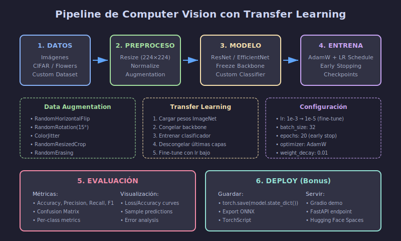

# 🖼️ Guía: Proyecto de Computer Vision



## 🎯 Objetivo

Construir un **clasificador de imágenes** usando transfer learning con modelos preentrenados (ResNet, EfficientNet, VGG).

---

## 📋 Checklist del Proyecto

### Fase 1: Preparación de Datos

- [ ] Elegir dataset (CIFAR-10, Flowers, Custom)
- [ ] Explorar y visualizar muestras
- [ ] Dividir en train/val/test
- [ ] Implementar data augmentation
- [ ] Crear DataLoaders

### Fase 2: Modelo

- [ ] Cargar modelo preentrenado
- [ ] Modificar capa final (número de clases)
- [ ] Decidir qué capas congelar
- [ ] Definir loss y optimizer

### Fase 3: Entrenamiento

- [ ] Configurar callbacks (Early Stopping, Checkpoints)
- [ ] Entrenar con learning rate schedule
- [ ] Monitorear métricas en validación
- [ ] Guardar mejor modelo

### Fase 4: Evaluación

- [ ] Evaluar en test set
- [ ] Generar matriz de confusión
- [ ] Calcular precision, recall, F1
- [ ] Visualizar predicciones

### Fase 5: Documentación

- [ ] Escribir README completo
- [ ] Documentar arquitectura
- [ ] Incluir gráficas de entrenamiento
- [ ] Conclusiones y mejoras futuras

---

## 🔧 Pipeline Técnico

### 1. Configuración del Entorno

```python
# requirements.txt
torch>=2.0.0
torchvision>=0.15.0
matplotlib>=3.7.0
scikit-learn>=1.3.0
tqdm>=4.65.0
Pillow>=9.5.0
```

### 2. Estructura de Datos

```python
import torch
from torch.utils.data import DataLoader
from torchvision import datasets, transforms

# Transformaciones para entrenamiento (con augmentation)
train_transform = transforms.Compose([
    transforms.RandomResizedCrop(224),
    transforms.RandomHorizontalFlip(),
    transforms.RandomRotation(15),
    transforms.ColorJitter(brightness=0.2, contrast=0.2),
    transforms.ToTensor(),
    transforms.Normalize(
        mean=[0.485, 0.456, 0.406],
        std=[0.229, 0.224, 0.225]
    )
])

# Transformaciones para validación/test (sin augmentation)
val_transform = transforms.Compose([
    transforms.Resize(256),
    transforms.CenterCrop(224),
    transforms.ToTensor(),
    transforms.Normalize(
        mean=[0.485, 0.456, 0.406],
        std=[0.229, 0.224, 0.225]
    )
])
```

### 3. Transfer Learning

```python
import torchvision.models as models
import torch.nn as nn

def create_model(num_classes: int, freeze_backbone: bool = True):
    """
    Crea modelo con transfer learning.
    
    Args:
        num_classes: Número de clases a clasificar
        freeze_backbone: Si True, congela capas del backbone
    
    Returns:
        Modelo listo para entrenar
    """
    # Cargar modelo preentrenado
    model = models.resnet50(weights='IMAGENET1K_V2')
    
    # Congelar backbone si se especifica
    if freeze_backbone:
        for param in model.parameters():
            param.requires_grad = False
    
    # Reemplazar capa final
    num_features = model.fc.in_features
    model.fc = nn.Sequential(
        nn.Dropout(0.5),
        nn.Linear(num_features, num_classes)
    )
    
    return model
```

### 4. Entrenamiento

```python
def train_model(
    model: nn.Module,
    train_loader: DataLoader,
    val_loader: DataLoader,
    epochs: int = 20,
    lr: float = 1e-3
) -> dict:
    """
    Entrena el modelo con early stopping.
    """
    device = torch.device('cuda' if torch.cuda.is_available() else 'cpu')
    model = model.to(device)
    
    criterion = nn.CrossEntropyLoss()
    optimizer = torch.optim.AdamW(
        filter(lambda p: p.requires_grad, model.parameters()),
        lr=lr,
        weight_decay=0.01
    )
    scheduler = torch.optim.lr_scheduler.ReduceLROnPlateau(
        optimizer, mode='min', patience=3, factor=0.5
    )
    
    history = {'train_loss': [], 'val_loss': [], 'val_acc': []}
    best_val_acc = 0
    patience_counter = 0
    
    for epoch in range(epochs):
        # Training phase
        model.train()
        train_loss = 0.0
        
        for images, labels in train_loader:
            images, labels = images.to(device), labels.to(device)
            
            optimizer.zero_grad()
            outputs = model(images)
            loss = criterion(outputs, labels)
            loss.backward()
            optimizer.step()
            
            train_loss += loss.item()
        
        # Validation phase
        model.eval()
        val_loss = 0.0
        correct = 0
        total = 0
        
        with torch.no_grad():
            for images, labels in val_loader:
                images, labels = images.to(device), labels.to(device)
                outputs = model(images)
                loss = criterion(outputs, labels)
                val_loss += loss.item()
                
                _, predicted = outputs.max(1)
                total += labels.size(0)
                correct += predicted.eq(labels).sum().item()
        
        val_acc = 100.0 * correct / total
        scheduler.step(val_loss)
        
        # Logging
        history['train_loss'].append(train_loss / len(train_loader))
        history['val_loss'].append(val_loss / len(val_loader))
        history['val_acc'].append(val_acc)
        
        print(f"Epoch {epoch+1}/{epochs} - "
              f"Train Loss: {train_loss/len(train_loader):.4f} - "
              f"Val Loss: {val_loss/len(val_loader):.4f} - "
              f"Val Acc: {val_acc:.2f}%")
        
        # Early stopping
        if val_acc > best_val_acc:
            best_val_acc = val_acc
            torch.save(model.state_dict(), 'best_model.pth')
            patience_counter = 0
        else:
            patience_counter += 1
            if patience_counter >= 5:
                print("Early stopping triggered")
                break
    
    return history
```

---

## 📊 Datasets Recomendados

### Opción 1: CIFAR-10 (Fácil)
- 60,000 imágenes (32x32)
- 10 clases
- Incluido en torchvision

```python
train_dataset = datasets.CIFAR10(
    root='./data', train=True, download=True, transform=train_transform
)
```

### Opción 2: Flowers-102 (Medio)
- ~8,000 imágenes
- 102 categorías de flores
- Requiere descarga

```python
train_dataset = datasets.Flowers102(
    root='./data', split='train', download=True, transform=train_transform
)
```

### Opción 3: Dataset Personalizado (Avanzado)
- Usa `ImageFolder` para estructura de carpetas
- Mínimo 100 imágenes por clase

```python
train_dataset = datasets.ImageFolder(
    root='./data/train', transform=train_transform
)
```

---

## 📈 Métricas y Evaluación

```python
from sklearn.metrics import classification_report, confusion_matrix
import matplotlib.pyplot as plt
import seaborn as sns

def evaluate_model(model, test_loader, class_names):
    """
    Evalúa el modelo y genera reporte completo.
    """
    device = torch.device('cuda' if torch.cuda.is_available() else 'cpu')
    model.eval()
    
    all_preds = []
    all_labels = []
    
    with torch.no_grad():
        for images, labels in test_loader:
            images = images.to(device)
            outputs = model(images)
            _, predicted = outputs.max(1)
            
            all_preds.extend(predicted.cpu().numpy())
            all_labels.extend(labels.numpy())
    
    # Classification report
    print(classification_report(all_labels, all_preds, target_names=class_names))
    
    # Confusion matrix
    cm = confusion_matrix(all_labels, all_preds)
    plt.figure(figsize=(10, 8))
    sns.heatmap(cm, annot=True, fmt='d', cmap='Blues',
                xticklabels=class_names, yticklabels=class_names)
    plt.xlabel('Predicted')
    plt.ylabel('True')
    plt.title('Confusion Matrix')
    plt.tight_layout()
    plt.savefig('confusion_matrix.png')
    plt.show()
```

---

## 🎯 Tips para Mejor Rendimiento

### Data Augmentation Efectivo

```python
# Augmentation agresivo para datasets pequeños
strong_augment = transforms.Compose([
    transforms.RandomResizedCrop(224, scale=(0.6, 1.0)),
    transforms.RandomHorizontalFlip(),
    transforms.RandomVerticalFlip(),  # Si tiene sentido para tu dataset
    transforms.RandomRotation(30),
    transforms.ColorJitter(0.4, 0.4, 0.4, 0.2),
    transforms.RandomGrayscale(p=0.1),
    transforms.GaussianBlur(kernel_size=3),
    transforms.ToTensor(),
    transforms.Normalize([0.485, 0.456, 0.406], [0.229, 0.224, 0.225]),
    transforms.RandomErasing(p=0.2),
])
```

### Fine-tuning Progresivo

```python
# Fase 1: Solo entrenar clasificador (5 epochs)
for param in model.parameters():
    param.requires_grad = False
for param in model.fc.parameters():
    param.requires_grad = True

# Fase 2: Descongelar últimas capas (10 epochs)
for param in model.layer4.parameters():
    param.requires_grad = True

# Fase 3: Fine-tune completo con lr bajo (5 epochs)
for param in model.parameters():
    param.requires_grad = True
# Usar lr muy bajo: 1e-5
```

### Modelos Alternativos

```python
# EfficientNet (mejor accuracy/parámetros)
model = models.efficientnet_b0(weights='IMAGENET1K_V1')
model.classifier[1] = nn.Linear(model.classifier[1].in_features, num_classes)

# MobileNetV3 (más rápido)
model = models.mobilenet_v3_small(weights='IMAGENET1K_V1')
model.classifier[3] = nn.Linear(model.classifier[3].in_features, num_classes)
```

---

## ✅ Criterios de Éxito

| Métrica | Mínimo | Objetivo | Excelente |
|---------|--------|----------|-----------|
| Test Accuracy | 80% | 85% | 90%+ |
| Código documentado | ✓ | ✓ | ✓ |
| README completo | ✓ | ✓ | ✓ |
| Visualizaciones | Básicas | Completas | Interactivas |

---

## 📚 Recursos Adicionales

- [PyTorch Transfer Learning Tutorial](https://pytorch.org/tutorials/beginner/transfer_learning_tutorial.html)
- [TorchVision Models](https://pytorch.org/vision/stable/models.html)
- [Data Augmentation Techniques](https://pytorch.org/vision/stable/transforms.html)

---

_Guía de Proyecto CV - Semana 28_
