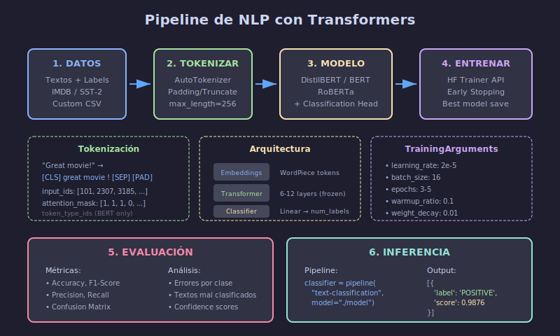

# 📝 Guía: Proyecto de NLP



## 🎯 Objetivo

Construir un **clasificador de texto** usando transfer learning con modelos de Hugging Face (BERT, DistilBERT, RoBERTa).

---

## 📋 Checklist del Proyecto

### Fase 1: Preparación de Datos

- [ ] Elegir dataset (IMDB, SST-2, Custom)
- [ ] Explorar y analizar distribución
- [ ] Dividir en train/val/test
- [ ] Configurar tokenizer
- [ ] Crear datasets de Hugging Face

### Fase 2: Modelo

- [ ] Cargar modelo preentrenado
- [ ] Configurar para clasificación
- [ ] Definir métricas de evaluación
- [ ] Configurar Trainer

### Fase 3: Entrenamiento

- [ ] Configurar TrainingArguments
- [ ] Implementar early stopping
- [ ] Monitorear métricas
- [ ] Guardar checkpoints

### Fase 4: Evaluación

- [ ] Evaluar en test set
- [ ] Analizar errores
- [ ] Generar matriz de confusión
- [ ] Probar con ejemplos nuevos

### Fase 5: Documentación

- [ ] Escribir README completo
- [ ] Documentar proceso
- [ ] Incluir ejemplos de inferencia
- [ ] Conclusiones y mejoras

---

## 🔧 Pipeline Técnico

### 1. Configuración del Entorno

```python
# requirements.txt
transformers>=4.30.0
datasets>=2.13.0
torch>=2.0.0
scikit-learn>=1.3.0
matplotlib>=3.7.0
accelerate>=0.20.0
evaluate>=0.4.0
```

### 2. Carga de Datos

```python
from datasets import load_dataset

# Opción 1: Dataset de Hugging Face
dataset = load_dataset("imdb")

# Opción 2: Dataset local
dataset = load_dataset("csv", data_files={
    "train": "data/train.csv",
    "test": "data/test.csv"
})

# Ver estructura
print(dataset)
print(dataset["train"][0])
```

### 3. Tokenización

```python
from transformers import AutoTokenizer

# Cargar tokenizer
model_name = "distilbert-base-uncased"
tokenizer = AutoTokenizer.from_pretrained(model_name)

def tokenize_function(examples):
    """
    Tokeniza los textos del dataset.
    
    Args:
        examples: Batch de ejemplos con campo 'text'
    
    Returns:
        Ejemplos tokenizados
    """
    return tokenizer(
        examples["text"],
        padding="max_length",
        truncation=True,
        max_length=256
    )

# Aplicar tokenización
tokenized_dataset = dataset.map(
    tokenize_function,
    batched=True,
    remove_columns=["text"]  # Remover texto original
)

# Renombrar columna de labels si es necesario
tokenized_dataset = tokenized_dataset.rename_column("label", "labels")

# Formato PyTorch
tokenized_dataset.set_format("torch")
```

### 4. Modelo y Entrenamiento

```python
from transformers import (
    AutoModelForSequenceClassification,
    TrainingArguments,
    Trainer,
    EarlyStoppingCallback
)
import evaluate
import numpy as np

# Cargar modelo
model = AutoModelForSequenceClassification.from_pretrained(
    model_name,
    num_labels=2  # Ajustar según tu problema
)

# Métricas
accuracy_metric = evaluate.load("accuracy")
f1_metric = evaluate.load("f1")

def compute_metrics(eval_pred):
    """
    Calcula métricas de evaluación.
    """
    logits, labels = eval_pred
    predictions = np.argmax(logits, axis=-1)
    
    accuracy = accuracy_metric.compute(
        predictions=predictions, references=labels
    )
    f1 = f1_metric.compute(
        predictions=predictions, references=labels, average="weighted"
    )
    
    return {
        "accuracy": accuracy["accuracy"],
        "f1": f1["f1"]
    }

# Configuración de entrenamiento
training_args = TrainingArguments(
    output_dir="./results",
    evaluation_strategy="epoch",
    save_strategy="epoch",
    learning_rate=2e-5,
    per_device_train_batch_size=16,
    per_device_eval_batch_size=16,
    num_train_epochs=5,
    weight_decay=0.01,
    load_best_model_at_end=True,
    metric_for_best_model="f1",
    greater_is_better=True,
    warmup_ratio=0.1,
    logging_steps=100,
    fp16=True,  # Mixed precision (si tienes GPU)
)

# Crear Trainer
trainer = Trainer(
    model=model,
    args=training_args,
    train_dataset=tokenized_dataset["train"],
    eval_dataset=tokenized_dataset["test"],
    compute_metrics=compute_metrics,
    callbacks=[EarlyStoppingCallback(early_stopping_patience=2)]
)

# Entrenar
trainer.train()
```

### 5. Evaluación e Inferencia

```python
# Evaluar en test
results = trainer.evaluate()
print(f"Test Results: {results}")

# Guardar modelo
trainer.save_model("./final_model")
tokenizer.save_pretrained("./final_model")

# Inferencia con nuevos textos
from transformers import pipeline

classifier = pipeline(
    "text-classification",
    model="./final_model",
    tokenizer="./final_model"
)

# Probar
texts = [
    "This movie was absolutely fantastic! I loved every minute.",
    "Terrible film. Waste of time and money.",
    "It was okay, nothing special but not bad either."
]

for text in texts:
    result = classifier(text)
    print(f"Text: {text[:50]}...")
    print(f"Prediction: {result}\n")
```

---

## 📊 Datasets Recomendados

### Opción 1: IMDB Reviews (Fácil)
- 50,000 reviews de películas
- Clasificación binaria (positivo/negativo)
- Muy usado como benchmark

```python
dataset = load_dataset("imdb")
```

### Opción 2: SST-2 (Medio)
- Stanford Sentiment Treebank
- Frases cortas de reviews
- Parte del benchmark GLUE

```python
dataset = load_dataset("glue", "sst2")
```

### Opción 3: Dataset Personalizado (Avanzado)
- Mínimo 1,000 ejemplos por clase
- Formato CSV con columnas: text, label

```python
from datasets import Dataset
import pandas as pd

df = pd.read_csv("my_data.csv")
dataset = Dataset.from_pandas(df)
```

---

## 📈 Análisis de Errores

```python
from sklearn.metrics import classification_report, confusion_matrix
import matplotlib.pyplot as plt
import seaborn as sns

def analyze_errors(trainer, test_dataset, tokenizer):
    """
    Analiza errores del modelo.
    """
    # Predicciones
    predictions = trainer.predict(test_dataset)
    preds = np.argmax(predictions.predictions, axis=-1)
    labels = predictions.label_ids
    
    # Reporte de clasificación
    print("Classification Report:")
    print(classification_report(labels, preds, 
                                target_names=["Negative", "Positive"]))
    
    # Matriz de confusión
    cm = confusion_matrix(labels, preds)
    plt.figure(figsize=(8, 6))
    sns.heatmap(cm, annot=True, fmt='d', cmap='Blues',
                xticklabels=["Negative", "Positive"],
                yticklabels=["Negative", "Positive"])
    plt.xlabel('Predicted')
    plt.ylabel('True')
    plt.title('Confusion Matrix')
    plt.tight_layout()
    plt.savefig('confusion_matrix.png')
    plt.show()
    
    # Ejemplos mal clasificados
    errors = []
    for i, (pred, label) in enumerate(zip(preds, labels)):
        if pred != label:
            errors.append({
                'index': i,
                'predicted': pred,
                'actual': label
            })
    
    print(f"\nTotal errors: {len(errors)}/{len(labels)}")
    print("\nSample errors:")
    for err in errors[:5]:
        print(f"  Predicted: {err['predicted']}, Actual: {err['actual']}")

analyze_errors(trainer, tokenized_dataset["test"], tokenizer)
```

---

## 🎯 Tips para Mejor Rendimiento

### Selección de Modelo

```python
# DistilBERT - Rápido, buen balance
model_name = "distilbert-base-uncased"

# BERT base - Más preciso, más lento
model_name = "bert-base-uncased"

# RoBERTa - Generalmente mejor que BERT
model_name = "roberta-base"

# Para español
model_name = "dccuchile/bert-base-spanish-wwm-uncased"
```

### Optimización de Hiperparámetros

```python
# Learning rates típicos para fine-tuning
# BERT/RoBERTa: 1e-5 a 3e-5
# DistilBERT: 2e-5 a 5e-5

# Batch size: 16-32 (depende de GPU)
# Epochs: 3-5 (más puede causar overfitting)

# Experimentar con
training_args = TrainingArguments(
    learning_rate=2e-5,  # Probar: 1e-5, 2e-5, 3e-5
    per_device_train_batch_size=16,  # Probar: 8, 16, 32
    num_train_epochs=3,  # Probar: 3, 4, 5
    warmup_ratio=0.1,  # Probar: 0.0, 0.1, 0.2
    weight_decay=0.01,  # Probar: 0.0, 0.01, 0.1
)
```

### Manejo de Textos Largos

```python
# Truncar inteligentemente
def smart_tokenize(examples):
    # Truncar desde el principio (mantener final)
    return tokenizer(
        examples["text"],
        padding="max_length",
        truncation=True,
        max_length=512,
        # Para algunos casos, truncar desde inicio
        # truncation_side="left"
    )

# O dividir en chunks
def chunk_text(text, max_length=256, overlap=50):
    """Divide texto largo en chunks con overlap."""
    tokens = tokenizer.encode(text)
    chunks = []
    for i in range(0, len(tokens), max_length - overlap):
        chunk = tokens[i:i + max_length]
        chunks.append(tokenizer.decode(chunk))
    return chunks
```

### Data Augmentation para Texto

```python
# Usando nlpaug (pip install nlpaug)
import nlpaug.augmenter.word as naw

# Sinónimos
aug_syn = naw.SynonymAug(aug_src='wordnet')

# Back-translation (requiere conexión)
aug_bt = naw.BackTranslationAug(
    from_model_name='facebook/wmt19-en-de',
    to_model_name='facebook/wmt19-de-en'
)

def augment_dataset(examples):
    augmented_texts = []
    for text in examples["text"]:
        augmented_texts.append(aug_syn.augment(text))
    return {"text": augmented_texts, "label": examples["label"]}
```

---

## ✅ Criterios de Éxito

| Métrica | Mínimo | Objetivo | Excelente |
|---------|--------|----------|-----------|
| Test F1-Score | 75% | 80% | 85%+ |
| Test Accuracy | 75% | 80% | 85%+ |
| Código documentado | ✓ | ✓ | ✓ |
| Inferencia funcionando | ✓ | ✓ | ✓ |

---

## 📚 Recursos Adicionales

- [Hugging Face Course](https://huggingface.co/course)
- [Transformers Documentation](https://huggingface.co/docs/transformers)
- [Fine-tuning BERT Tutorial](https://huggingface.co/docs/transformers/training)
- [Datasets Library](https://huggingface.co/docs/datasets)

---

_Guía de Proyecto NLP - Semana 28_
