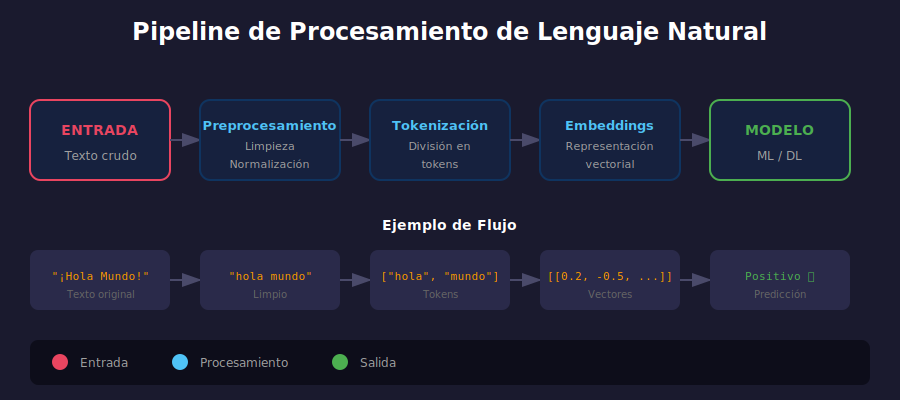

# 🌐 Introducción al Procesamiento de Lenguaje Natural



## 🎯 Objetivos

- Comprender qué es NLP y sus aplicaciones
- Conocer los desafíos del procesamiento de texto
- Entender el pipeline típico de NLP

---

## 📋 ¿Qué es NLP?

**Natural Language Processing (NLP)** es el campo de la IA que permite a las computadoras entender, interpretar y generar lenguaje humano.

### Aplicaciones Comunes

| Aplicación | Descripción | Ejemplos |
|------------|-------------|----------|
| Clasificación de texto | Asignar categorías a documentos | Spam detection, sentiment analysis |
| NER | Identificar entidades nombradas | Extraer nombres, fechas, lugares |
| Traducción | Convertir entre idiomas | Google Translate |
| QA | Responder preguntas | ChatGPT, asistentes virtuales |
| Resumen | Condensar documentos | Resúmenes automáticos |
| Generación | Crear texto nuevo | GPT, escritura automática |

---

## 🔄 Pipeline de NLP

El procesamiento de texto sigue un pipeline típico:

```
Texto Crudo → Preprocesamiento → Tokenización → Representación → Modelo → Salida
```

### 1. Preprocesamiento
- Limpieza de texto
- Normalización
- Eliminación de ruido

### 2. Tokenización
- Dividir texto en unidades (tokens)
- Palabras, subpalabras o caracteres

### 3. Representación Vectorial
- Convertir tokens en vectores numéricos
- One-hot, TF-IDF, embeddings

### 4. Modelado
- Aplicar algoritmos de ML/DL
- Clasificadores, secuencia a secuencia

### 5. Post-procesamiento
- Decodificar salida
- Formatear resultados

---

## 🎭 Desafíos del NLP

### Ambigüedad Léxica

```python
# La misma palabra, diferentes significados
"banco"  # Institución financiera o asiento
"vela"   # Objeto de cera o del verbo "velar"
```

### Ambigüedad Sintáctica

```
"Vi al hombre con el telescopio"
# ¿Quién tiene el telescopio?
```

### Contexto y Conocimiento del Mundo

```python
# Requiere conocimiento implícito
"El trofeo no cabe en la maleta porque es muy grande"
# ¿Qué es grande? El trofeo o la maleta?
```

### Variabilidad del Lenguaje

```python
# Múltiples formas de expresar lo mismo
"Me gusta esta película"
"Esta peli me mola"
"Qué buena película!"
"⭐⭐⭐⭐⭐"
```

---

## 📊 Representaciones de Texto

### Representaciones Sparse (Tradicionales)

**Bag of Words (BoW)**
```python
# Documento: "el gato come pescado"
# Vocabulario: [el, gato, come, pescado, perro]
# Vector: [1, 1, 1, 1, 0]
```

**TF-IDF**
- Term Frequency × Inverse Document Frequency
- Pondera palabras por importancia

### Representaciones Dense (Modernas)

**Word Embeddings**
- Vectores densos de dimensión fija (100-300)
- Capturan significado semántico
- Palabras similares → vectores cercanos

```python
# Ejemplo conceptual
"rey"    → [0.2, -0.5, 0.8, ...]  # 300 dimensiones
"reina"  → [0.3, -0.4, 0.7, ...]  # Similar a "rey"
"banana" → [-0.8, 0.1, -0.3, ...] # Muy diferente
```

---

## 🔢 De Texto a Números

```python
# Flujo típico
texto = "Me encanta Python"

# 1. Tokenizar
tokens = ["me", "encanta", "python"]

# 2. Vocabulario
vocab = {"me": 0, "encanta": 1, "python": 2, ...}

# 3. IDs
ids = [0, 1, 2]

# 4. Embeddings
embeddings = [
    [0.1, 0.2, ...],  # me
    [0.3, 0.4, ...],  # encanta
    [0.5, 0.6, ...]   # python
]
```

---

## 🛠️ Herramientas de NLP

| Librería | Uso Principal |
|----------|---------------|
| NLTK | Educativo, lingüística |
| spaCy | Producción, velocidad |
| Gensim | Word embeddings, topic modeling |
| Hugging Face | Transformers, modelos pre-entrenados |
| TextBlob | Análisis simple |

---

## ✅ Checklist de Verificación

- [ ] Entiendo qué es NLP y sus aplicaciones
- [ ] Conozco las fases del pipeline de NLP
- [ ] Comprendo los desafíos del procesamiento de texto
- [ ] Distingo entre representaciones sparse y dense

---

## 📚 Recursos

- [Speech and Language Processing - Jurafsky](https://web.stanford.edu/~jurafsky/slp3/)
- [NLTK Book](https://www.nltk.org/book/)
- [spaCy 101](https://spacy.io/usage/spacy-101)

---

_Siguiente: [Preprocesamiento de Texto](02-preprocesamiento.md)_
