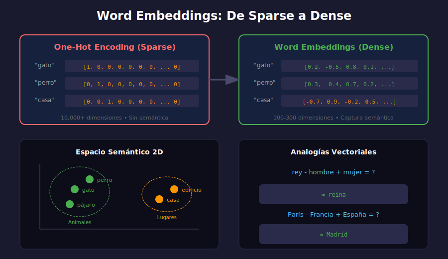

# 🎯 Word Embeddings



## 🎯 Objetivos

- Comprender qué son los word embeddings
- Conocer Word2Vec y sus variantes
- Implementar operaciones con embeddings
- Calcular similaridad semántica

---

## 📋 ¿Qué son los Word Embeddings?

**Word embeddings** son representaciones vectoriales densas de palabras que capturan su significado semántico.

```python
# One-hot encoding (sparse, sin semántica)
"gato"  → [1, 0, 0, 0, 0, ...]  # 10,000 dimensiones
"perro" → [0, 1, 0, 0, 0, ...]

# Word embedding (dense, con semántica)
"gato"  → [0.2, -0.5, 0.8, 0.1, ...]  # 300 dimensiones
"perro" → [0.3, -0.4, 0.7, 0.2, ...]  # Similar a gato!
```

### Propiedades Clave

1. **Dimensionalidad reducida**: 100-300 dims vs 10,000+
2. **Semántica capturada**: Palabras similares → vectores cercanos
3. **Operaciones algebraicas**: rey - hombre + mujer ≈ reina

---

## 🧠 Word2Vec

Desarrollado por Google (2013). Dos arquitecturas:

### Skip-gram

Predice palabras del contexto dada una palabra central.

```
Entrada: "gato"
Salida: ["el", "come", "pescado"]

Oración: "El gato come pescado"
         ↑   ↑    ↑      ↑
       ctx  inp  ctx    ctx
```

### CBOW (Continuous Bag of Words)

Predice palabra central dado el contexto.

```
Entrada: ["el", "come", "pescado"]
Salida: "gato"
```

### Intuición del Entrenamiento

```
"El gato come pescado"
"El perro come carne"
"El gato bebe leche"

→ "gato" y "perro" aparecen en contextos similares
→ Sus vectores serán similares
```

---

## 📊 GloVe (Global Vectors)

Desarrollado por Stanford. Combina:
- Estadísticas globales de co-ocurrencia
- Predicción local tipo Word2Vec

```python
# Matriz de co-ocurrencia
#        el    gato   come   pescado
# el      0      5      2       1
# gato    5      0      8       3
# come    2      8      0       6
# pescado 1      3      6       0
```

---

## 🛠️ Usando Embeddings Pre-entrenados

### Cargar con Gensim

```python
import gensim.downloader as api

# Descargar modelo pre-entrenado
model = api.load('glove-wiki-gigaword-100')  # 100 dimensiones

# Obtener vector de una palabra
vector = model['king']
print(vector.shape)  # (100,)

# Palabras más similares
similar = model.most_similar('king', topn=5)
# [('queen', 0.89), ('prince', 0.85), ('monarch', 0.82), ...]
```

### Operaciones con Vectores

```python
# Analogía: rey - hombre + mujer = ?
result = model.most_similar(
    positive=['king', 'woman'],
    negative=['man'],
    topn=1
)
# [('queen', 0.88)]

# Similaridad entre palabras
sim = model.similarity('dog', 'cat')
# 0.76

sim = model.similarity('dog', 'computer')
# 0.12
```

---

## 📐 Similaridad Coseno

Mide el ángulo entre dos vectores (ignora magnitud).

$$\text{cosine}(A, B) = \frac{A \cdot B}{\|A\| \|B\|} = \frac{\sum_{i} A_i B_i}{\sqrt{\sum_{i} A_i^2} \sqrt{\sum_{i} B_i^2}}$$

```python
import numpy as np

def cosine_similarity(v1: np.ndarray, v2: np.ndarray) -> float:
    """Calcula similaridad coseno entre dos vectores."""
    dot_product = np.dot(v1, v2)
    norm_v1 = np.linalg.norm(v1)
    norm_v2 = np.linalg.norm(v2)
    
    if norm_v1 == 0 or norm_v2 == 0:
        return 0.0
    
    return dot_product / (norm_v1 * norm_v2)

# Uso
v1 = model['cat']
v2 = model['dog']
sim = cosine_similarity(v1, v2)
# ~0.76
```

**Interpretación:**
- 1.0 = Idénticos (mismo ángulo)
- 0.0 = Ortogonales (sin relación)
- -1.0 = Opuestos

---

## 📝 Embeddings de Documentos

### Promedio Simple

```python
def document_embedding(text: str, model) -> np.ndarray:
    """Calcula embedding de documento como promedio de palabras."""
    words = text.lower().split()
    vectors = []
    
    for word in words:
        if word in model:
            vectors.append(model[word])
    
    if not vectors:
        return np.zeros(model.vector_size)
    
    return np.mean(vectors, axis=0)

# Uso
doc1 = "El gato come pescado"
doc2 = "El perro come carne"
doc3 = "Python es un lenguaje de programación"

emb1 = document_embedding(doc1, model)
emb2 = document_embedding(doc2, model)
emb3 = document_embedding(doc3, model)

# doc1 y doc2 serán más similares que doc1 y doc3
print(cosine_similarity(emb1, emb2))  # ~0.85
print(cosine_similarity(emb1, emb3))  # ~0.30
```

### TF-IDF Weighted

```python
from sklearn.feature_extraction.text import TfidfVectorizer

def tfidf_weighted_embedding(texts: list, model) -> np.ndarray:
    """Embeddings ponderados por TF-IDF."""
    # Calcular TF-IDF
    vectorizer = TfidfVectorizer()
    tfidf_matrix = vectorizer.fit_transform(texts)
    feature_names = vectorizer.get_feature_names_out()
    
    embeddings = []
    for i, text in enumerate(texts):
        weighted_sum = np.zeros(model.vector_size)
        total_weight = 0
        
        for j, word in enumerate(feature_names):
            weight = tfidf_matrix[i, j]
            if weight > 0 and word in model:
                weighted_sum += weight * model[word]
                total_weight += weight
        
        if total_weight > 0:
            embeddings.append(weighted_sum / total_weight)
        else:
            embeddings.append(np.zeros(model.vector_size))
    
    return np.array(embeddings)
```

---

## 🔍 Visualización de Embeddings

```python
from sklearn.manifold import TSNE
import matplotlib.pyplot as plt

def visualize_embeddings(words: list, model):
    """Visualiza embeddings en 2D usando t-SNE."""
    # Obtener vectores
    vectors = np.array([model[w] for w in words if w in model])
    valid_words = [w for w in words if w in model]
    
    # Reducir a 2D
    tsne = TSNE(n_components=2, random_state=42, perplexity=5)
    vectors_2d = tsne.fit_transform(vectors)
    
    # Plotear
    plt.figure(figsize=(10, 8))
    plt.scatter(vectors_2d[:, 0], vectors_2d[:, 1])
    
    for i, word in enumerate(valid_words):
        plt.annotate(word, (vectors_2d[i, 0], vectors_2d[i, 1]))
    
    plt.title('Word Embeddings Visualization')
    plt.show()

# Uso
words = ['king', 'queen', 'man', 'woman', 'prince', 'princess',
         'dog', 'cat', 'puppy', 'kitten']
visualize_embeddings(words, model)
```

---

## ⚠️ Limitaciones

### Embeddings Estáticos
```python
# Misma palabra, diferentes significados
"banco"  # Financiero vs asiento
# → Mismo vector para ambos significados!
```

**Solución:** Embeddings contextuales (BERT, GPT) - Semana 30

### Sesgo en Embeddings
```python
# Los embeddings pueden capturar sesgos del corpus
model.most_similar(positive=['doctor', 'woman'], negative=['man'])
# Puede dar 'nurse' debido a sesgos históricos
```

---

## ✅ Checklist de Verificación

- [ ] Entiendo qué son los word embeddings
- [ ] Conozco Word2Vec (Skip-gram y CBOW)
- [ ] Puedo calcular similaridad coseno
- [ ] Sé crear embeddings de documentos
- [ ] Conozco las limitaciones de embeddings estáticos

---

## 📚 Recursos

- [Word2Vec Paper](https://arxiv.org/abs/1301.3781)
- [GloVe Project](https://nlp.stanford.edu/projects/glove/)
- [Gensim Documentation](https://radimrehurek.com/gensim/)

---

_Siguiente: [Ejercicio 01 - Preprocesamiento](../2-practicas/ejercicio-01-preprocesamiento/)_
