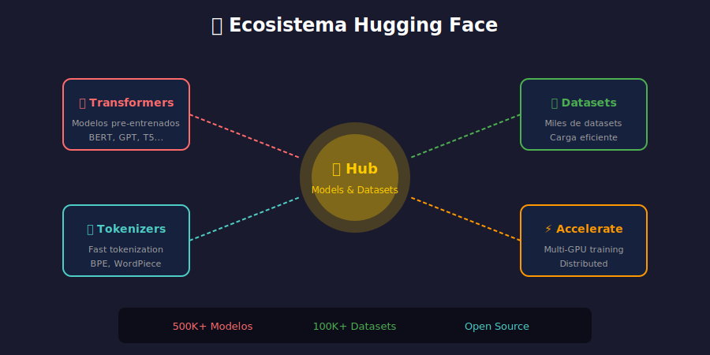

# 🤗 Introducción a Hugging Face



## 🎯 Objetivos

- Conocer el ecosistema Hugging Face
- Entender qué son los Transformers
- Instalar y configurar la librería

---

## 📋 ¿Qué es Hugging Face?

**Hugging Face** es la plataforma líder para Machine Learning, especialmente NLP. Ofrece:

1. **🤗 Transformers**: Librería de modelos pre-entrenados
2. **📚 Datasets**: Colección de datasets para ML
3. **🎯 Hub**: Repositorio de modelos compartidos
4. **🔤 Tokenizers**: Tokenizadores rápidos en Rust
5. **⚡ Accelerate**: Entrenamiento distribuido

---

## 🏗️ Arquitectura Transformer

Los **Transformers** revolucionaron NLP en 2017 con el paper "Attention is All You Need".

### Componentes Clave

```
┌─────────────────────────────────────────┐
│              TRANSFORMER                │
├──────────────────┬──────────────────────┤
│     ENCODER      │      DECODER         │
│  (comprensión)   │   (generación)       │
├──────────────────┼──────────────────────┤
│  - BERT          │  - GPT               │
│  - RoBERTa       │  - GPT-2, GPT-3      │
│  - DistilBERT    │  - LLaMA             │
│  - ALBERT        │  - Mistral           │
├──────────────────┴──────────────────────┤
│           ENCODER-DECODER               │
│  - T5, BART, mT5, FLAN-T5              │
└─────────────────────────────────────────┘
```

### Tipos de Modelos

| Tipo | Arquitectura | Tareas | Ejemplos |
|------|--------------|--------|----------|
| **Encoder** | Solo encoder | Clasificación, NER, QA extractivo | BERT, RoBERTa |
| **Decoder** | Solo decoder | Generación de texto | GPT, LLaMA |
| **Encoder-Decoder** | Completo | Traducción, Resumen | T5, BART |

---

## ⚙️ Instalación

```bash
# Instalación básica
pip install transformers

# Con PyTorch (recomendado)
pip install transformers torch

# Con TensorFlow
pip install transformers tensorflow

# Instalación completa
pip install transformers[torch] datasets accelerate
```

### Verificar Instalación

```python
import transformers
print(f"Transformers version: {transformers.__version__}")

# Verificar backend
import torch
print(f"PyTorch version: {torch.__version__}")
print(f"CUDA available: {torch.cuda.is_available()}")
```

---

## 🚀 Primer Ejemplo

```python
from transformers import pipeline

# Crear pipeline de análisis de sentimientos
classifier = pipeline("sentiment-analysis")

# Clasificar texto
result = classifier("I love using Hugging Face!")
print(result)
# [{'label': 'POSITIVE', 'score': 0.9998}]

# Clasificar múltiples textos
texts = [
    "This is amazing!",
    "I hate waiting in line.",
    "The weather is okay today."
]
results = classifier(texts)
for text, res in zip(texts, results):
    print(f"{text} → {res['label']} ({res['score']:.2%})")
```

---

## 🌐 Hugging Face Hub

El **Hub** es un repositorio con miles de modelos y datasets.

### Explorar Modelos

```python
from huggingface_hub import list_models

# Buscar modelos de sentiment analysis
models = list_models(filter="sentiment-analysis", limit=5)
for model in models:
    print(f"- {model.modelId}")
```

### Modelos Populares

| Modelo | Parámetros | Uso |
|--------|------------|-----|
| `bert-base-uncased` | 110M | Clasificación, NER |
| `distilbert-base-uncased` | 66M | Versión ligera de BERT |
| `roberta-base` | 125M | Mejor que BERT en muchas tareas |
| `gpt2` | 124M | Generación de texto |
| `t5-small` | 60M | Tareas seq2seq |

### Modelos en Español

| Modelo | Descripción |
|--------|-------------|
| `dccuchile/bert-base-spanish-wwm-cased` | BERT entrenado en español |
| `PlanTL-GOB-ES/roberta-base-bne` | RoBERTa del Plan TL España |
| `bertin-project/bertin-roberta-base-spanish` | BERTIN |
| `mrm8488/bert-spanish-cased-finetuned-ner` | NER en español |

---

## 📁 Caché de Modelos

Los modelos se descargan a `~/.cache/huggingface/`:

```python
import os
from pathlib import Path

# Ver directorio de caché
cache_dir = Path.home() / ".cache" / "huggingface"
print(f"Caché: {cache_dir}")

# Cambiar directorio de caché
os.environ["HF_HOME"] = "/path/to/custom/cache"

# O al cargar modelo
from transformers import AutoModel
model = AutoModel.from_pretrained("bert-base-uncased", cache_dir="./my_cache")
```

---

## 🔑 Autenticación (Opcional)

Para modelos privados o subir modelos:

```bash
# Login desde terminal
huggingface-cli login

# O con token
huggingface-cli login --token YOUR_TOKEN
```

```python
# Login desde Python
from huggingface_hub import login
login(token="YOUR_TOKEN")

# O usar variable de entorno
# export HF_TOKEN=your_token
```

---

## ✅ Checklist de Verificación

- [ ] Entiendo el ecosistema Hugging Face
- [ ] Conozco los tipos de modelos (encoder, decoder, encoder-decoder)
- [ ] Tengo transformers instalado correctamente
- [ ] Puedo ejecutar un pipeline básico

---

_Siguiente: [Pipelines](02-pipelines.md)_
