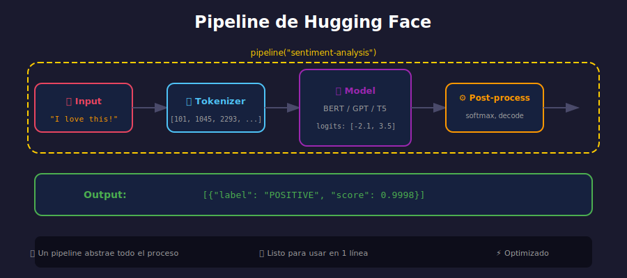

# 🔧 Pipelines de Hugging Face



## 🎯 Objetivos

- Usar pipelines para tareas NLP comunes
- Conocer los pipelines disponibles
- Configurar y personalizar pipelines

---

## 📋 ¿Qué son los Pipelines?

Los **pipelines** son la forma más simple de usar modelos de Hugging Face. Abstraen:

1. Preprocesamiento (tokenización)
2. Inferencia del modelo
3. Postprocesamiento (decodificación)

```python
from transformers import pipeline

# Un pipeline encapsula todo el proceso
classifier = pipeline("sentiment-analysis")
result = classifier("I love this!")
# Internamente: texto → tokens → modelo → logits → label
```

---

## 📊 Pipelines Disponibles

### NLP (Texto)

| Pipeline | Tarea | Ejemplo |
|----------|-------|---------|
| `sentiment-analysis` | Clasificación de sentimientos | Positivo/Negativo |
| `text-classification` | Clasificación general | Spam, Tópicos |
| `ner` | Reconocimiento de entidades | Personas, Lugares |
| `question-answering` | Preguntas y respuestas | Extraer respuesta |
| `fill-mask` | Completar texto | BERT style |
| `text-generation` | Generar texto | GPT style |
| `summarization` | Resumir texto | Artículos |
| `translation` | Traducción | EN→ES |
| `zero-shot-classification` | Clasificación sin entrenamiento | Cualquier etiqueta |

### Otros

| Pipeline | Tarea |
|----------|-------|
| `image-classification` | Clasificar imágenes |
| `object-detection` | Detectar objetos |
| `automatic-speech-recognition` | Voz a texto |
| `text-to-speech` | Texto a voz |

---

## 🎭 Análisis de Sentimientos

```python
from transformers import pipeline

# Crear pipeline
sentiment = pipeline("sentiment-analysis")

# Análisis simple
result = sentiment("This movie was fantastic!")
print(result)
# [{'label': 'POSITIVE', 'score': 0.9998}]

# Múltiples textos
texts = [
    "I love this product!",
    "This is terrible.",
    "It's okay, nothing special."
]
results = sentiment(texts)
for text, res in zip(texts, results):
    print(f"{res['label']:8} ({res['score']:.2%}) | {text}")
```

### Con Modelo Específico

```python
# Modelo en español
sentiment_es = pipeline(
    "sentiment-analysis",
    model="nlptown/bert-base-multilingual-uncased-sentiment"
)

result = sentiment_es("¡Me encanta esta película!")
print(result)
# [{'label': '5 stars', 'score': 0.65}]
```

---

## 🏷️ Reconocimiento de Entidades (NER)

```python
from transformers import pipeline

# Pipeline NER
ner = pipeline("ner", aggregation_strategy="simple")

text = "Apple Inc. was founded by Steve Jobs in California."
entities = ner(text)

for entity in entities:
    print(f"{entity['word']:15} → {entity['entity_group']:5} ({entity['score']:.2%})")

# Apple Inc.      → ORG   (99.85%)
# Steve Jobs      → PER   (99.92%)
# California      → LOC   (99.78%)
```

### NER en Español

```python
ner_es = pipeline(
    "ner",
    model="mrm8488/bert-spanish-cased-finetuned-ner",
    aggregation_strategy="simple"
)

text = "Pablo Neruda nació en Chile y ganó el Premio Nobel."
entities = ner_es(text)

for e in entities:
    print(f"{e['word']:15} → {e['entity_group']}")
```

---

## ❓ Preguntas y Respuestas

```python
from transformers import pipeline

# Pipeline QA
qa = pipeline("question-answering")

context = """
Hugging Face was founded in 2016 by Clément Delangue, Julien Chaumond, 
and Thomas Wolf. The company is headquartered in New York City.
It provides tools for building applications using machine learning.
"""

questions = [
    "When was Hugging Face founded?",
    "Where is Hugging Face located?",
    "Who founded Hugging Face?"
]

for question in questions:
    result = qa(question=question, context=context)
    print(f"Q: {question}")
    print(f"A: {result['answer']} (score: {result['score']:.2%})\n")
```

---

## ✍️ Generación de Texto

```python
from transformers import pipeline

# Pipeline de generación
generator = pipeline("text-generation", model="gpt2")

prompt = "Artificial intelligence will"
results = generator(
    prompt,
    max_length=50,
    num_return_sequences=2,
    do_sample=True,
    temperature=0.7
)

for i, result in enumerate(results, 1):
    print(f"--- Resultado {i} ---")
    print(result['generated_text'])
    print()
```

### Parámetros de Generación

| Parámetro | Descripción | Default |
|-----------|-------------|---------|
| `max_length` | Longitud máxima total | 50 |
| `max_new_tokens` | Nuevos tokens a generar | None |
| `num_return_sequences` | Número de secuencias | 1 |
| `do_sample` | Muestreo aleatorio | False |
| `temperature` | Creatividad (0.1-2.0) | 1.0 |
| `top_k` | Top K tokens | 50 |
| `top_p` | Nucleus sampling | 1.0 |

---

## 🔄 Zero-Shot Classification

Clasificar sin entrenar en esas categorías específicas:

```python
from transformers import pipeline

# Pipeline zero-shot
classifier = pipeline("zero-shot-classification")

text = "The new iPhone has an amazing camera and great battery life."

# Definir categorías (sin entrenamiento previo)
labels = ["technology", "sports", "politics", "entertainment"]

result = classifier(text, candidate_labels=labels)

print(f"Texto: {text}\n")
for label, score in zip(result['labels'], result['scores']):
    print(f"  {label:15} → {score:.2%}")
```

---

## 📝 Resumir Texto

```python
from transformers import pipeline

summarizer = pipeline("summarization", model="facebook/bart-large-cnn")

article = """
Artificial intelligence has transformed many industries in recent years.
From healthcare to finance, AI systems are being deployed to automate
tasks, improve decision-making, and discover patterns in data. Machine
learning, a subset of AI, enables computers to learn from experience
without being explicitly programmed. Deep learning, using neural networks
with many layers, has achieved remarkable results in image recognition,
natural language processing, and game playing.
"""

summary = summarizer(article, max_length=50, min_length=25)
print("Resumen:")
print(summary[0]['summary_text'])
```

---

## ⚙️ Configuración Avanzada

### Especificar Dispositivo

```python
# Usar GPU si está disponible
classifier = pipeline("sentiment-analysis", device=0)  # GPU 0

# Forzar CPU
classifier = pipeline("sentiment-analysis", device=-1)

# Auto-detectar
import torch
device = 0 if torch.cuda.is_available() else -1
classifier = pipeline("sentiment-analysis", device=device)
```

### Batch Processing

```python
# Procesar en batches para mayor eficiencia
texts = ["Text 1", "Text 2", ..., "Text 1000"]

# Con batch_size
results = classifier(texts, batch_size=32)
```

---

## ✅ Checklist de Verificación

- [ ] Puedo crear pipelines para diferentes tareas
- [ ] Sé usar sentiment-analysis, NER, QA
- [ ] Entiendo los parámetros de generación de texto
- [ ] Puedo usar zero-shot classification

---

_Siguiente: [Tokenizers](03-tokenizers.md)_
