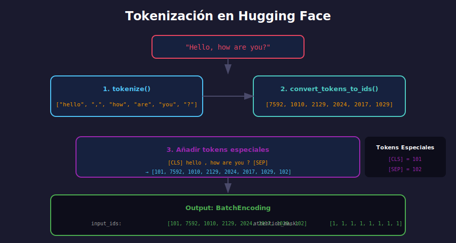

# 🔤 Tokenizers de Hugging Face



## 🎯 Objetivos

- Entender cómo funcionan los tokenizers de HF
- Usar AutoTokenizer para cargar tokenizers
- Manejar padding, truncation y attention masks

---

## 📋 ¿Qué es un Tokenizer?

Un **tokenizer** convierte texto en números que el modelo puede procesar:

```
Texto → Tokens → IDs → Tensor
"Hola mundo" → ["Hola", "mundo"] → [4521, 2930] → tensor([4521, 2930])
```

Los tokenizers de HF son:
- **Rápidos**: Implementados en Rust (🦀)
- **Consistentes**: Mismo preprocesamiento que el modelo
- **Completos**: Incluyen tokens especiales

---

## 🚀 Cargar Tokenizers

### AutoTokenizer (Recomendado)

```python
from transformers import AutoTokenizer

# Cargar tokenizer de cualquier modelo
tokenizer = AutoTokenizer.from_pretrained("bert-base-uncased")

# Ver información
print(f"Vocabulario: {tokenizer.vocab_size} tokens")
print(f"Tokens especiales: {tokenizer.special_tokens_map}")
```

### Tokenizers Específicos

```python
from transformers import BertTokenizer, GPT2Tokenizer

# BERT tokenizer
bert_tokenizer = BertTokenizer.from_pretrained("bert-base-uncased")

# GPT-2 tokenizer
gpt2_tokenizer = GPT2Tokenizer.from_pretrained("gpt2")
```

---

## 🔧 Tokenización Básica

### Tokenizar Texto

```python
from transformers import AutoTokenizer

tokenizer = AutoTokenizer.from_pretrained("bert-base-uncased")

text = "Hello, how are you doing today?"

# Solo tokenizar (sin IDs)
tokens = tokenizer.tokenize(text)
print(f"Tokens: {tokens}")
# ['hello', ',', 'how', 'are', 'you', 'doing', 'today', '?']

# Tokenizar y convertir a IDs
ids = tokenizer.encode(text)
print(f"IDs: {ids}")
# [101, 7592, 1010, 2129, 2024, 2017, 2725, 2651, 1029, 102]
# Nota: 101=[CLS], 102=[SEP]
```

### Método __call__ (Completo)

```python
# Forma recomendada: retorna diccionario
encoding = tokenizer(text)

print(encoding.keys())
# dict_keys(['input_ids', 'token_type_ids', 'attention_mask'])

print(f"input_ids: {encoding['input_ids']}")
print(f"attention_mask: {encoding['attention_mask']}")
```

### Decodificar

```python
# IDs a texto
ids = [101, 7592, 1010, 2129, 2024, 2017, 102]
decoded = tokenizer.decode(ids)
print(decoded)
# "[CLS] hello, how are you [SEP]"

# Sin tokens especiales
decoded_clean = tokenizer.decode(ids, skip_special_tokens=True)
print(decoded_clean)
# "hello, how are you"
```

---

## 📏 Padding y Truncation

### ¿Por qué son necesarios?

Los modelos esperan tensores de tamaño fijo:

```python
texts = [
    "Short text",
    "This is a much longer text that needs more tokens"
]

# Sin padding: diferentes longitudes
for text in texts:
    tokens = tokenizer.encode(text)
    print(f"{len(tokens)} tokens: {text[:30]}...")
```

### Aplicar Padding

```python
# Padding a longitud máxima del batch
encoding = tokenizer(
    texts,
    padding=True,  # Pad al más largo del batch
    return_tensors="pt"  # Retornar PyTorch tensors
)

print(f"Shape: {encoding['input_ids'].shape}")
# Shape: torch.Size([2, 12])  # 2 textos, 12 tokens cada uno
```

### Opciones de Padding

```python
# Padding a longitud específica
encoding = tokenizer(
    text,
    padding="max_length",
    max_length=20,
    return_tensors="pt"
)

# Opciones:
# padding=True          → Pad al más largo del batch
# padding="max_length"  → Pad a max_length especificado
# padding="longest"     → Igual que True
```

### Truncation

```python
# Truncar textos muy largos
encoding = tokenizer(
    text,
    truncation=True,      # Activar truncation
    max_length=10,        # Máximo 10 tokens
    return_tensors="pt"
)

print(f"Truncado a: {encoding['input_ids'].shape}")
```

---

## 🎭 Attention Mask

El **attention_mask** indica qué tokens son reales (1) y cuáles son padding (0):

```python
texts = ["Hello", "Hello world, how are you?"]

encoding = tokenizer(
    texts,
    padding=True,
    return_tensors="pt"
)

print("Input IDs:")
print(encoding['input_ids'])
# tensor([[ 101, 7592,  102,    0,    0,    0,    0,    0],
#         [ 101, 7592, 2088, 1010, 2129, 2024, 2017, 102]])

print("\nAttention Mask:")
print(encoding['attention_mask'])
# tensor([[1, 1, 1, 0, 0, 0, 0, 0],
#         [1, 1, 1, 1, 1, 1, 1, 1]])
```

---

## 🏷️ Tokens Especiales

### BERT Style

```python
tokenizer = AutoTokenizer.from_pretrained("bert-base-uncased")

print(f"[CLS]: {tokenizer.cls_token} → {tokenizer.cls_token_id}")
print(f"[SEP]: {tokenizer.sep_token} → {tokenizer.sep_token_id}")
print(f"[PAD]: {tokenizer.pad_token} → {tokenizer.pad_token_id}")
print(f"[UNK]: {tokenizer.unk_token} → {tokenizer.unk_token_id}")
print(f"[MASK]: {tokenizer.mask_token} → {tokenizer.mask_token_id}")
```

### GPT Style

```python
tokenizer = AutoTokenizer.from_pretrained("gpt2")

# GPT-2 no tiene pad_token por defecto
print(f"EOS: {tokenizer.eos_token} → {tokenizer.eos_token_id}")
print(f"BOS: {tokenizer.bos_token}")  # None en GPT-2

# Añadir pad_token si es necesario
tokenizer.pad_token = tokenizer.eos_token
```

---

## 🔀 Tokenización de Pares

Para tareas como QA o NLI que requieren dos textos:

```python
tokenizer = AutoTokenizer.from_pretrained("bert-base-uncased")

question = "What is the capital of France?"
context = "Paris is the capital and largest city of France."

# Tokenizar par de textos
encoding = tokenizer(
    question,
    context,
    padding=True,
    truncation=True,
    max_length=128,
    return_tensors="pt"
)

print(f"token_type_ids: {encoding['token_type_ids']}")
# [0, 0, ..., 0, 1, 1, ..., 1]
# 0s para question, 1s para context
```

---

## ⚡ Fast vs Slow Tokenizers

```python
# Fast tokenizer (Rust, por defecto)
fast_tokenizer = AutoTokenizer.from_pretrained("bert-base-uncased")

# Slow tokenizer (Python puro)
slow_tokenizer = AutoTokenizer.from_pretrained(
    "bert-base-uncased",
    use_fast=False
)

# Fast tokenizers tienen features adicionales
encoding = fast_tokenizer("Hello world", return_offsets_mapping=True)
print(f"Offsets: {encoding['offset_mapping']}")
# [(0, 0), (0, 5), (6, 11), (0, 0)]  # Posiciones en texto original
```

---

## 📊 Batch Encoding

```python
# Tokenizar múltiples textos eficientemente
texts = [
    "First example",
    "Second example is longer",
    "Third"
]

batch = tokenizer(
    texts,
    padding=True,
    truncation=True,
    max_length=20,
    return_tensors="pt"
)

print(f"Batch shape: {batch['input_ids'].shape}")
# torch.Size([3, 7])  # 3 textos, 7 tokens (con padding)
```

---

## 💾 Guardar y Cargar

```python
# Guardar tokenizer
tokenizer.save_pretrained("./my_tokenizer")

# Cargar tokenizer guardado
loaded_tokenizer = AutoTokenizer.from_pretrained("./my_tokenizer")
```

---

## ✅ Checklist de Verificación

- [ ] Puedo cargar tokenizers con AutoTokenizer
- [ ] Entiendo tokenize, encode, decode
- [ ] Sé usar padding y truncation
- [ ] Comprendo attention_mask y token_type_ids
- [ ] Conozco los tokens especiales

---

_Siguiente: [Modelos Pre-entrenados](04-modelos-pretrained.md)_
