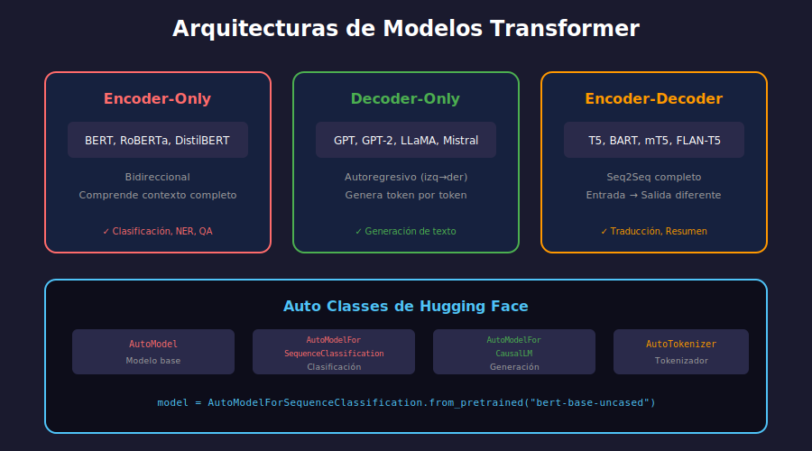

# 🧠 Modelos Pre-entrenados



## 🎯 Objetivos

- Cargar modelos pre-entrenados con AutoModel
- Entender las diferentes cabezas de clasificación
- Ejecutar inferencia manual

---

## 📋 Auto Classes

Hugging Face provee clases `Auto` que detectan automáticamente la arquitectura:

```python
from transformers import (
    AutoModel,           # Modelo base (sin cabeza)
    AutoModelForSequenceClassification,  # Clasificación
    AutoModelForTokenClassification,     # NER
    AutoModelForQuestionAnswering,       # QA
    AutoModelForCausalLM,                # Generación (GPT)
    AutoModelForMaskedLM,                # MLM (BERT)
)
```

---

## 🏗️ Cargar Modelos

### Modelo Base

```python
from transformers import AutoModel, AutoTokenizer

# Cargar modelo y tokenizer
model_name = "bert-base-uncased"
tokenizer = AutoTokenizer.from_pretrained(model_name)
model = AutoModel.from_pretrained(model_name)

# Ver arquitectura
print(model)
print(f"Parámetros: {model.num_parameters():,}")
# Parámetros: 109,482,240
```

### Con Cabeza de Clasificación

```python
from transformers import AutoModelForSequenceClassification

# Modelo para clasificación binaria
model = AutoModelForSequenceClassification.from_pretrained(
    "bert-base-uncased",
    num_labels=2  # Positivo/Negativo
)

# O cargar modelo ya fine-tuneado
model = AutoModelForSequenceClassification.from_pretrained(
    "distilbert-base-uncased-finetuned-sst-2-english"
)
```

---

## 🔄 Flujo de Inferencia

### Paso a Paso

```python
import torch
from transformers import AutoTokenizer, AutoModelForSequenceClassification

# 1. Cargar modelo y tokenizer
model_name = "distilbert-base-uncased-finetuned-sst-2-english"
tokenizer = AutoTokenizer.from_pretrained(model_name)
model = AutoModelForSequenceClassification.from_pretrained(model_name)

# 2. Preparar input
text = "I love this movie!"
inputs = tokenizer(text, return_tensors="pt")

print(f"Input keys: {inputs.keys()}")
# dict_keys(['input_ids', 'attention_mask'])

# 3. Inferencia (sin gradientes)
model.eval()
with torch.no_grad():
    outputs = model(**inputs)

# 4. Procesar outputs
print(f"Logits shape: {outputs.logits.shape}")
# torch.Size([1, 2])  # 1 ejemplo, 2 clases

# 5. Convertir a probabilidades
probs = torch.softmax(outputs.logits, dim=-1)
print(f"Probabilidades: {probs}")
# tensor([[0.0002, 0.9998]])  # [NEGATIVE, POSITIVE]

# 6. Obtener predicción
pred_id = torch.argmax(probs, dim=-1).item()
labels = ["NEGATIVE", "POSITIVE"]
print(f"Predicción: {labels[pred_id]}")
```

---

## 📊 Tipos de Output

### SequenceClassifierOutput

```python
from transformers import AutoModelForSequenceClassification

model = AutoModelForSequenceClassification.from_pretrained(
    "bert-base-uncased", num_labels=3
)
outputs = model(**inputs)

print(type(outputs))
# SequenceClassifierOutput

print(outputs.logits.shape)  # (batch, num_labels)
print(outputs.hidden_states)  # None (si no se pide)
print(outputs.attentions)     # None (si no se pide)
```

### Obtener Hidden States

```python
model = AutoModelForSequenceClassification.from_pretrained(
    "bert-base-uncased",
    num_labels=2,
    output_hidden_states=True
)

outputs = model(**inputs)

# Todos los hidden states (uno por capa)
print(f"Número de capas: {len(outputs.hidden_states)}")
# 13 para BERT-base (embedding + 12 capas)

# Último hidden state
last_hidden = outputs.hidden_states[-1]
print(f"Shape: {last_hidden.shape}")
# (batch_size, seq_len, hidden_size)
```

---

## 🏷️ Token Classification (NER)

```python
from transformers import AutoTokenizer, AutoModelForTokenClassification
import torch

model_name = "dslim/bert-base-NER"
tokenizer = AutoTokenizer.from_pretrained(model_name)
model = AutoModelForTokenClassification.from_pretrained(model_name)

text = "Steve Jobs founded Apple in California"
inputs = tokenizer(text, return_tensors="pt")

model.eval()
with torch.no_grad():
    outputs = model(**inputs)

# Logits para cada token
logits = outputs.logits  # (1, seq_len, num_labels)
predictions = torch.argmax(logits, dim=-1)

# Mapear IDs a etiquetas
tokens = tokenizer.convert_ids_to_tokens(inputs['input_ids'][0])
labels = model.config.id2label

for token, pred_id in zip(tokens, predictions[0]):
    label = labels[pred_id.item()]
    if label != "O":  # O = Outside (no es entidad)
        print(f"{token:15} → {label}")
```

---

## ❓ Question Answering

```python
from transformers import AutoTokenizer, AutoModelForQuestionAnswering
import torch

model_name = "distilbert-base-uncased-distilled-squad"
tokenizer = AutoTokenizer.from_pretrained(model_name)
model = AutoModelForQuestionAnswering.from_pretrained(model_name)

question = "What is the capital of France?"
context = "Paris is the capital and largest city of France."

inputs = tokenizer(question, context, return_tensors="pt")

model.eval()
with torch.no_grad():
    outputs = model(**inputs)

# Posiciones de inicio y fin de la respuesta
start_idx = torch.argmax(outputs.start_logits)
end_idx = torch.argmax(outputs.end_logits)

# Extraer respuesta
answer_ids = inputs['input_ids'][0][start_idx:end_idx+1]
answer = tokenizer.decode(answer_ids)
print(f"Respuesta: {answer}")
# Respuesta: Paris
```

---

## ✍️ Generación de Texto (Causal LM)

```python
from transformers import AutoTokenizer, AutoModelForCausalLM
import torch

model_name = "gpt2"
tokenizer = AutoTokenizer.from_pretrained(model_name)
model = AutoModelForCausalLM.from_pretrained(model_name)

# Importante: GPT2 necesita pad_token
tokenizer.pad_token = tokenizer.eos_token

prompt = "Artificial intelligence is"
inputs = tokenizer(prompt, return_tensors="pt")

# Generar
model.eval()
with torch.no_grad():
    outputs = model.generate(
        **inputs,
        max_new_tokens=30,
        do_sample=True,
        temperature=0.7,
        top_p=0.9,
        pad_token_id=tokenizer.eos_token_id
    )

generated = tokenizer.decode(outputs[0], skip_special_tokens=True)
print(generated)
```

---

## 🌍 Modelos Multilingües

```python
# BERT Multilingüe
model = AutoModel.from_pretrained("bert-base-multilingual-cased")

# XLM-RoBERTa (mejor para multilingüe)
model = AutoModel.from_pretrained("xlm-roberta-base")

# mT5 (encoder-decoder multilingüe)
from transformers import MT5ForConditionalGeneration
model = MT5ForConditionalGeneration.from_pretrained("google/mt5-small")
```

### Modelos en Español

```python
# BETO (BERT español)
model = AutoModel.from_pretrained("dccuchile/bert-base-spanish-wwm-cased")

# RoBERTa BNE
model = AutoModel.from_pretrained("PlanTL-GOB-ES/roberta-base-bne")

# MarIA (español)
model = AutoModel.from_pretrained("PlanTL-GOB-ES/roberta-base-biomedical-es")
```

---

## ⚙️ Configuración del Modelo

```python
from transformers import AutoConfig, AutoModel

# Ver configuración
config = AutoConfig.from_pretrained("bert-base-uncased")
print(f"Hidden size: {config.hidden_size}")
print(f"Num layers: {config.num_hidden_layers}")
print(f"Num heads: {config.num_attention_heads}")
print(f"Vocab size: {config.vocab_size}")

# Modificar configuración
config.num_labels = 5
model = AutoModelForSequenceClassification.from_pretrained(
    "bert-base-uncased",
    config=config
)
```

---

## 💾 Guardar y Cargar

```python
# Guardar modelo y tokenizer
model.save_pretrained("./my_model")
tokenizer.save_pretrained("./my_model")

# Cargar
model = AutoModelForSequenceClassification.from_pretrained("./my_model")
tokenizer = AutoTokenizer.from_pretrained("./my_model")
```

---

## 🎮 GPU/CPU

```python
import torch

# Mover a GPU
device = torch.device("cuda" if torch.cuda.is_available() else "cpu")
model = model.to(device)
inputs = {k: v.to(device) for k, v in inputs.items()}

# O usar device_map (para modelos grandes)
model = AutoModel.from_pretrained(
    "bert-base-uncased",
    device_map="auto"  # Distribuye automáticamente
)
```

---

## ✅ Checklist de Verificación

- [ ] Puedo cargar modelos con AutoModel
- [ ] Entiendo el flujo: tokenizar → modelo → postprocesar
- [ ] Sé usar diferentes cabezas (clasificación, NER, QA)
- [ ] Puedo ejecutar inferencia manual

---

_Siguiente: [Ejercicio 01 - Pipelines](../2-practicas/ejercicio-01-pipelines/)_
