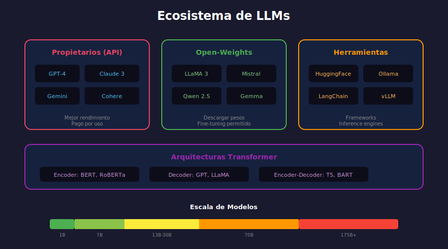

# 🤖 Introducción a Large Language Models (LLMs)

## 🎯 Objetivos de Aprendizaje

- Entender qué son los LLMs y por qué son revolucionarios
- Conocer la historia y evolución de los modelos de lenguaje
- Comprender el paradigma pre-training + fine-tuning
- Identificar casos de uso y limitaciones

---

## 📋 Contenido



### 1. ¿Qué son los LLMs?

Los **Large Language Models** son redes neuronales con miles de millones de parámetros, entrenadas en enormes cantidades de texto para comprender y generar lenguaje natural.

```
┌─────────────────────────────────────────────────────────────┐
│                    EVOLUCIÓN DE LLMs                        │
├─────────────────────────────────────────────────────────────┤
│  2017: Transformer (Attention Is All You Need)              │
│  2018: GPT-1 (117M params) | BERT (340M params)             │
│  2019: GPT-2 (1.5B params)                                  │
│  2020: GPT-3 (175B params)                                  │
│  2022: ChatGPT | LLaMA                                      │
│  2023: GPT-4 | LLaMA 2 | Mistral                            │
│  2024: LLaMA 3 | Claude 3 | GPT-4o                          │
└─────────────────────────────────────────────────────────────┘
```

### 2. Características Clave

#### Escala Sin Precedentes

| Modelo | Parámetros | Tokens de Entrenamiento |
|--------|------------|-------------------------|
| BERT-base | 110M | 3.3B |
| GPT-2 | 1.5B | 40B |
| GPT-3 | 175B | 300B |
| LLaMA 2 | 7B - 70B | 2T |
| GPT-4 | ~1.7T (estimado) | 13T+ |

#### Capacidades Emergentes

A cierta escala, los modelos desarrollan capacidades que no fueron explícitamente entrenadas:

- **Razonamiento**: Resolver problemas paso a paso
- **Few-shot learning**: Aprender de pocos ejemplos en el prompt
- **Code generation**: Escribir código funcional
- **Traducción**: Sin entrenamiento específico en traducción

### 3. El Paradigma de Pre-training

Los LLMs siguen un proceso de dos fases:

```
┌──────────────────────────────────────────────────────────────┐
│                     FASE 1: PRE-TRAINING                     │
├──────────────────────────────────────────────────────────────┤
│                                                              │
│   Internet Text (TB)  →  [LLM Base]  →  Modelo Generalista   │
│   - Wikipedia                          - Conocimiento        │
│   - Libros                             - Gramática           │
│   - Código                             - Razonamiento        │
│   - Web crawl                          - Multilingüe         │
│                                                              │
│   Objetivo: Predecir el siguiente token                      │
│   Costo: $$$$ (millones de dólares)                          │
│   Tiempo: Semanas/meses en clusters de GPUs                  │
│                                                              │
└──────────────────────────────────────────────────────────────┘

┌──────────────────────────────────────────────────────────────┐
│                 FASE 2: FINE-TUNING / ALIGNMENT              │
├──────────────────────────────────────────────────────────────┤
│                                                              │
│   Modelo Base  →  [Fine-tuning]  →  Modelo Especializado     │
│                                                              │
│   Opciones:                                                  │
│   1. Supervised Fine-tuning (SFT)                            │
│   2. RLHF (Reinforcement Learning from Human Feedback)       │
│   3. PEFT (Parameter-Efficient Fine-Tuning)                  │
│                                                              │
│   Costo: $ (horas de GPU)                                    │
│                                                              │
└──────────────────────────────────────────────────────────────┘
```

### 4. Tipos de Modelos

#### Por Arquitectura

| Tipo | Arquitectura | Ejemplos | Uso Principal |
|------|--------------|----------|---------------|
| **Encoder-only** | BERT | BERT, RoBERTa, DeBERTa | Clasificación, NER |
| **Decoder-only** | GPT | GPT, LLaMA, Mistral | Generación |
| **Encoder-Decoder** | T5 | T5, BART, Flan-T5 | Seq2Seq, traducción |

#### Por Licencia

| Categoría | Ejemplos | Características |
|-----------|----------|-----------------|
| **Propietarios** | GPT-4, Claude, Gemini | API de pago, mejor rendimiento |
| **Open-weights** | LLaMA 2/3, Mistral | Pesos públicos, restricciones de uso |
| **Open-source** | Falcon, BLOOM | Totalmente abiertos |

### 5. Capacidades y Limitaciones

#### ✅ Lo que los LLMs hacen bien

- **Generación de texto** fluido y coherente
- **Seguir instrucciones** complejas
- **Resumir** y **reformular** contenido
- **Traducción** entre idiomas
- **Generación de código** en múltiples lenguajes
- **Responder preguntas** basándose en contexto
- **Razonamiento** en cadena (Chain-of-Thought)

#### ❌ Limitaciones importantes

| Limitación | Descripción | Mitigación |
|------------|-------------|------------|
| **Alucinaciones** | Inventan información falsa con confianza | RAG, verificación |
| **Conocimiento desactualizado** | No saben eventos recientes | RAG, fine-tuning |
| **Matemáticas** | Errores en cálculos complejos | Code interpreter |
| **Razonamiento lógico** | Fallan en problemas formales | CoT, verificación |
| **Contexto limitado** | No recuerdan conversaciones largas | Memoria externa |
| **Sesgos** | Reflejan sesgos de los datos | Alignment, filtros |

### 6. El Ecosistema de LLMs Abiertos

```
┌─────────────────────────────────────────────────────────────┐
│              MODELOS OPEN-WEIGHTS POPULARES                 │
├─────────────────────────────────────────────────────────────┤
│                                                             │
│  Meta LLaMA 3                    Mistral AI                 │
│  ├── LLaMA 3-8B                  ├── Mistral-7B             │
│  ├── LLaMA 3-70B                 ├── Mixtral-8x7B (MoE)     │
│  └── LLaMA 3.1-405B              └── Mistral-Large          │
│                                                             │
│  Google                          Alibaba                    │
│  ├── Gemma-2B/7B                 └── Qwen 2.5 (0.5B-72B)    │
│  └── Flan-T5                                                │
│                                                             │
│  Microsoft                       01.AI                      │
│  └── Phi-3 (3.8B)                └── Yi (6B-34B)            │
│                                                             │
└─────────────────────────────────────────────────────────────┘
```

### 7. Cómo Usar LLMs

#### Opción 1: APIs (Más Fácil)

```python
# OpenAI API
from openai import OpenAI

client = OpenAI()
response = client.chat.completions.create(
    model="gpt-4",
    messages=[{"role": "user", "content": "Explica qué es un LLM"}]
)
```

#### Opción 2: Hugging Face (Local)

```python
from transformers import pipeline

# Modelo pequeño que corre en CPU
generator = pipeline("text-generation", model="gpt2")
result = generator("The future of AI is", max_length=50)
```

#### Opción 3: Ollama (Local, Fácil)

```bash
# Instalar modelo
ollama pull llama3

# Usar
ollama run llama3 "Explica qué es machine learning"
```

### 8. Consideraciones Éticas

Los LLMs plantean importantes cuestiones éticas:

- **Desinformación**: Pueden generar fake news convincentes
- **Privacidad**: Pueden memorizar datos sensibles del entrenamiento
- **Sesgos**: Amplifican sesgos existentes en los datos
- **Impacto laboral**: Automatizan tareas de escritura
- **Medio ambiente**: El entrenamiento consume mucha energía

---

## 🔑 Conceptos Clave

| Concepto | Definición |
|----------|------------|
| **LLM** | Modelo de lenguaje con miles de millones de parámetros |
| **Pre-training** | Entrenamiento inicial en grandes corpus de texto |
| **Fine-tuning** | Adaptación a tareas específicas |
| **Emergent abilities** | Capacidades que aparecen solo a gran escala |
| **Hallucination** | Generación de información falsa pero plausible |
| **Context window** | Cantidad máxima de tokens que el modelo puede procesar |

---

## 📊 Comparativa de Modelos Populares

| Modelo | Tamaño | Contexto | Open | Ideal para |
|--------|--------|----------|------|------------|
| GPT-4o | ~1.7T | 128K | ❌ | Producción, calidad máxima |
| Claude 3 | ? | 200K | ❌ | Documentos largos |
| LLaMA 3-8B | 8B | 8K | ✅ | Local, recursos limitados |
| Mistral-7B | 7B | 32K | ✅ | Balance rendimiento/costo |
| Phi-3-mini | 3.8B | 128K | ✅ | Edge, móviles |

---

## ✅ Checklist de Verificación

- [ ] Entiendo la diferencia entre pre-training y fine-tuning
- [ ] Conozco las arquitecturas principales (encoder, decoder, encoder-decoder)
- [ ] Sé identificar capacidades y limitaciones de los LLMs
- [ ] Comprendo qué son las alucinaciones y cómo mitigarlas
- [ ] Puedo elegir el modelo apropiado según el caso de uso

---

## 🔗 Recursos

- [State of GPT - Andrej Karpathy](https://www.youtube.com/watch?v=bZQun8Y4L2A)
- [Hugging Face Model Hub](https://huggingface.co/models)
- [LLM Leaderboard](https://huggingface.co/spaces/HuggingFaceH4/open_llm_leaderboard)
- [Ollama](https://ollama.ai/)
