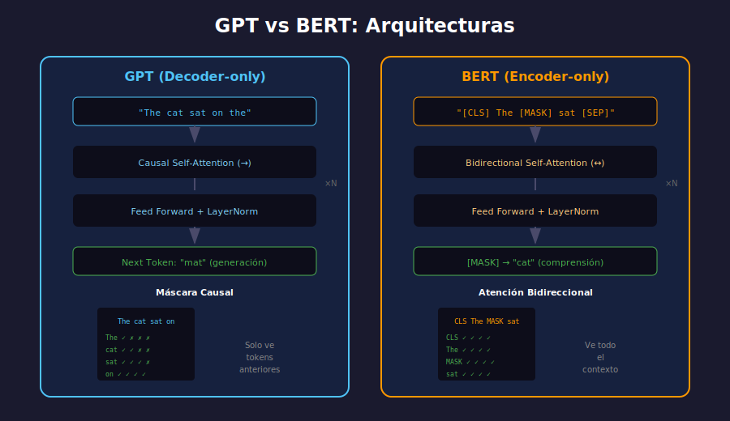

# 🏗️ Arquitecturas: GPT vs BERT

## 🎯 Objetivos de Aprendizaje

- Comprender la arquitectura Transformer en profundidad
- Diferenciar modelos autoregresivos (GPT) de bidireccionales (BERT)
- Entender los objetivos de pre-training de cada arquitectura
- Saber cuándo usar cada tipo de modelo

---

## 📋 Contenido



### 1. Repaso del Transformer

El Transformer, introducido en 2017, es la base de todos los LLMs modernos.

```
┌─────────────────────────────────────────────────────────────┐
│                   TRANSFORMER ORIGINAL                       │
├──────────────────────┬──────────────────────────────────────┤
│      ENCODER         │           DECODER                    │
├──────────────────────┼──────────────────────────────────────┤
│                      │                                      │
│  ┌────────────────┐  │  ┌────────────────┐                  │
│  │ Self-Attention │  │  │ Masked Self-   │                  │
│  │ (bidireccional)│  │  │ Attention      │                  │
│  └───────┬────────┘  │  └───────┬────────┘                  │
│          ↓           │          ↓                           │
│  ┌────────────────┐  │  ┌────────────────┐                  │
│  │  Feed Forward  │  │  │Cross-Attention │ ← Output Encoder │
│  └───────┬────────┘  │  └───────┬────────┘                  │
│          ↓           │          ↓                           │
│      (×N capas)      │  ┌────────────────┐                  │
│                      │  │  Feed Forward  │                  │
│                      │  └───────┬────────┘                  │
│                      │          ↓                           │
│                      │      (×N capas)                      │
│                      │                                      │
└──────────────────────┴──────────────────────────────────────┘
         ↑                         ↑
    Input (source)            Output (target)
```

### 2. Arquitectura GPT (Decoder-Only)

GPT usa **solo el Decoder** del Transformer, con atención **causal** (solo ve tokens anteriores).

#### Estructura

```
┌─────────────────────────────────────────────────────────────┐
│                    GPT ARCHITECTURE                          │
├─────────────────────────────────────────────────────────────┤
│                                                             │
│   Input: "The cat sat on the"                               │
│              ↓                                              │
│   ┌─────────────────────────────────────────┐               │
│   │         Token Embeddings                │               │
│   │    + Positional Embeddings              │               │
│   └─────────────────────────────────────────┘               │
│              ↓                                              │
│   ┌─────────────────────────────────────────┐               │
│   │      Masked Self-Attention              │  ×N layers    │
│   │    (causal: solo ve pasado)             │               │
│   └─────────────────────────────────────────┘               │
│              ↓                                              │
│   ┌─────────────────────────────────────────┐               │
│   │         Feed Forward (MLP)              │               │
│   └─────────────────────────────────────────┘               │
│              ↓                                              │
│   ┌─────────────────────────────────────────┐               │
│   │    LM Head (vocab_size output)          │               │
│   └─────────────────────────────────────────┘               │
│              ↓                                              │
│   Output: Probabilidad para cada token del vocabulario      │
│           → "mat" (siguiente token más probable)            │
│                                                             │
└─────────────────────────────────────────────────────────────┘
```

#### Atención Causal

```python
# Ejemplo conceptual de máscara causal
# El token en posición i solo puede atender a tokens 0..i

#           the  cat  sat  on  the
# the        ✓    ✗    ✗    ✗   ✗
# cat        ✓    ✓    ✗    ✗   ✗
# sat        ✓    ✓    ✓    ✗   ✗
# on         ✓    ✓    ✓    ✓   ✗
# the        ✓    ✓    ✓    ✓   ✓
```

#### Objetivo de Pre-training: Causal Language Modeling

```python
# Predecir el siguiente token
input:  "The cat sat on the"
target: "cat sat on the mat"

# Loss: Cross-entropy entre predicción y siguiente token real
```

#### Código: Generar con GPT-2

```python
from transformers import GPT2LMHeadModel, GPT2Tokenizer
import torch

# Cargar modelo y tokenizer
model = GPT2LMHeadModel.from_pretrained('gpt2')
tokenizer = GPT2Tokenizer.from_pretrained('gpt2')

# Tokenizar input
input_text = "The future of artificial intelligence is"
input_ids = tokenizer.encode(input_text, return_tensors='pt')

# Generar
with torch.no_grad():
    output = model.generate(
        input_ids,
        max_length=50,
        num_return_sequences=1,
        temperature=0.7,
        do_sample=True,
        pad_token_id=tokenizer.eos_token_id
    )

# Decodificar
generated_text = tokenizer.decode(output[0], skip_special_tokens=True)
print(generated_text)
```

### 3. Arquitectura BERT (Encoder-Only)

BERT usa **solo el Encoder**, con atención **bidireccional** (ve todo el contexto).

#### Estructura

```
┌─────────────────────────────────────────────────────────────┐
│                    BERT ARCHITECTURE                         │
├─────────────────────────────────────────────────────────────┤
│                                                             │
│   Input: "[CLS] The cat [MASK] on the mat [SEP]"            │
│              ↓                                              │
│   ┌─────────────────────────────────────────┐               │
│   │         Token Embeddings                │               │
│   │    + Positional Embeddings              │               │
│   │    + Segment Embeddings                 │               │
│   └─────────────────────────────────────────┘               │
│              ↓                                              │
│   ┌─────────────────────────────────────────┐               │
│   │      Bidirectional Self-Attention       │  ×N layers    │
│   │       (ve todo el contexto)             │               │
│   └─────────────────────────────────────────┘               │
│              ↓                                              │
│   ┌─────────────────────────────────────────┐               │
│   │         Feed Forward (MLP)              │               │
│   └─────────────────────────────────────────┘               │
│              ↓                                              │
│   Output: Representaciones contextualizadas                 │
│           [CLS] → clasificación de secuencia                │
│           [MASK] → predicción de token: "sat"               │
│                                                             │
└─────────────────────────────────────────────────────────────┘
```

#### Atención Bidireccional

```python
# Cada token puede atender a TODOS los demás

#           [CLS] The  cat [MASK] on  the  mat [SEP]
# [CLS]       ✓    ✓    ✓    ✓    ✓    ✓    ✓    ✓
# The         ✓    ✓    ✓    ✓    ✓    ✓    ✓    ✓
# cat         ✓    ✓    ✓    ✓    ✓    ✓    ✓    ✓
# [MASK]      ✓    ✓    ✓    ✓    ✓    ✓    ✓    ✓
# ...
```

#### Objetivos de Pre-training

**1. Masked Language Modeling (MLM)**
```python
# 15% de tokens se enmascaran
# El modelo debe predecirlos usando contexto bidireccional

input:  "The cat [MASK] on the mat"
target: "sat"
```

**2. Next Sentence Prediction (NSP)**
```python
# Predecir si sentence B sigue a sentence A

# Positivo (50%)
[CLS] The cat sat. [SEP] It was tired. [SEP] → IsNext

# Negativo (50%)  
[CLS] The cat sat. [SEP] Paris is beautiful. [SEP] → NotNext
```

#### Código: Clasificación con BERT

```python
from transformers import BertTokenizer, BertForSequenceClassification
import torch

# Cargar modelo fine-tuned para sentiment
model = BertForSequenceClassification.from_pretrained(
    'nlptown/bert-base-multilingual-uncased-sentiment'
)
tokenizer = BertTokenizer.from_pretrained(
    'nlptown/bert-base-multilingual-uncased-sentiment'
)

# Tokenizar
text = "This movie was absolutely fantastic!"
inputs = tokenizer(text, return_tensors='pt', truncation=True)

# Inferencia
with torch.no_grad():
    outputs = model(**inputs)
    predictions = torch.softmax(outputs.logits, dim=-1)
    
# El modelo predice 1-5 estrellas
stars = predictions.argmax().item() + 1
print(f"Rating: {stars} estrellas")
```

### 4. Comparativa Detallada

| Aspecto | GPT (Decoder) | BERT (Encoder) |
|---------|---------------|----------------|
| **Atención** | Causal (unidireccional) | Bidireccional |
| **Pre-training** | Predecir siguiente token | Predecir tokens enmascarados |
| **Flujo** | Izquierda → Derecha | Todo el contexto |
| **Generación** | ✅ Excelente | ❌ No diseñado para esto |
| **Comprensión** | Buena | ✅ Excelente |
| **Clasificación** | Posible (menos eficiente) | ✅ Ideal |
| **NER/Tagging** | Posible | ✅ Ideal |
| **QA Extractivo** | Posible | ✅ Ideal |
| **Resumen** | ✅ Ideal (generativo) | ❌ No adecuado |
| **Traducción** | ✅ Posible | ❌ No adecuado |

### 5. Modelos Modernos de Cada Familia

#### Familia GPT (Decoder-only)

| Modelo | Parámetros | Contexto | Características |
|--------|------------|----------|-----------------|
| GPT-2 | 1.5B | 1024 | Modelo base, open-source |
| GPT-3.5 | ~175B | 4K-16K | ChatGPT original |
| GPT-4 | ~1.7T | 128K | Multimodal |
| LLaMA 3 | 8B-70B | 8K | Open-weights, Meta |
| Mistral | 7B | 32K | Eficiente, open-weights |

#### Familia BERT (Encoder-only)

| Modelo | Parámetros | Mejoras sobre BERT |
|--------|------------|-------------------|
| RoBERTa | 355M | Más datos, sin NSP |
| ALBERT | 12M-235M | Factorización de parámetros |
| DeBERTa | 134M-1.5B | Disentangled attention |
| DistilBERT | 66M | Destilación, 60% más rápido |

#### Familia T5 (Encoder-Decoder)

| Modelo | Parámetros | Características |
|--------|------------|-----------------|
| T5 | 60M-11B | Text-to-text framework |
| BART | 139M-406M | Denoising autoencoder |
| Flan-T5 | 80M-11B | Instruction-tuned |

### 6. Cuándo Usar Cada Uno

```
┌─────────────────────────────────────────────────────────────┐
│                  GUÍA DE SELECCIÓN                          │
├─────────────────────────────────────────────────────────────┤
│                                                             │
│  ¿Necesitas GENERAR texto nuevo?                            │
│  └─ SÍ → GPT / LLaMA / Mistral                             │
│                                                             │
│  ¿Necesitas CLASIFICAR o ETIQUETAR?                         │
│  └─ SÍ → BERT / RoBERTa / DeBERTa                          │
│                                                             │
│  ¿Necesitas TRANSFORMAR texto (traducir, resumir)?          │
│  └─ SÍ → T5 / BART / Flan-T5                               │
│                                                             │
│  ¿Necesitas un CHATBOT o ASISTENTE?                         │
│  └─ SÍ → GPT-4 / LLaMA + instruct / Mistral-Instruct       │
│                                                             │
│  ¿Tienes RECURSOS LIMITADOS?                                │
│  └─ SÍ → DistilBERT / Phi-3 / Mistral-7B                   │
│                                                             │
└─────────────────────────────────────────────────────────────┘
```

### 7. Ejemplo: Mismo Input, Diferente Uso

```python
text = "The movie was absolutely terrible and I hated every minute of it."

# Con BERT: Clasificación
from transformers import pipeline
classifier = pipeline("sentiment-analysis")
result = classifier(text)
# → {'label': 'NEGATIVE', 'score': 0.99}

# Con GPT: Generación
generator = pipeline("text-generation", model="gpt2")
continuation = generator(text + " However,", max_length=50)
# → "The movie was absolutely terrible... However, the cinematography was stunning..."
```

---

## 🔑 Conceptos Clave

| Concepto | GPT | BERT |
|----------|-----|------|
| **Atención** | Causal (masked) | Bidireccional |
| **Objetivo** | Next token prediction | Masked token prediction |
| **Token especial** | BOS, EOS | [CLS], [SEP], [MASK] |
| **Output** | Siguiente token | Representaciones |

---

## ✅ Checklist de Verificación

- [ ] Entiendo la diferencia entre atención causal y bidireccional
- [ ] Sé cuándo usar modelos encoder vs decoder
- [ ] Comprendo MLM vs CLM como objetivos de pre-training
- [ ] Puedo elegir el modelo correcto para una tarea específica
- [ ] Conozco modelos populares de cada familia

---

## 🔗 Recursos

- [The Illustrated BERT](https://jalammar.github.io/illustrated-bert/)
- [The Illustrated GPT-2](https://jalammar.github.io/illustrated-gpt2/)
- [BERT Paper](https://arxiv.org/abs/1810.04805)
- [GPT-3 Paper](https://arxiv.org/abs/2005.14165)
