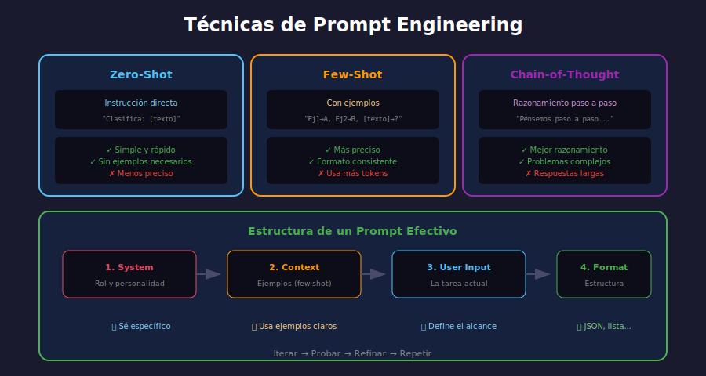

# ✍️ Prompt Engineering

## 🎯 Objetivos de Aprendizaje

- Dominar técnicas de prompt engineering
- Diseñar prompts efectivos para diferentes tareas
- Implementar few-shot y chain-of-thought prompting
- Optimizar prompts iterativamente

---

## 📋 Contenido



### 1. ¿Qué es Prompt Engineering?

El **prompt engineering** es el arte de diseñar instrucciones que maximicen la calidad de las respuestas de un LLM.

```
┌─────────────────────────────────────────────────────────────┐
│                    PROMPT ANATOMY                            │
├─────────────────────────────────────────────────────────────┤
│                                                             │
│   ┌─────────────────────────────────────────────────────┐   │
│   │ SYSTEM PROMPT (Contexto y personalidad)             │   │
│   │ "Eres un asistente experto en Python..."            │   │
│   └─────────────────────────────────────────────────────┘   │
│                           ↓                                 │
│   ┌─────────────────────────────────────────────────────┐   │
│   │ FEW-SHOT EXAMPLES (Ejemplos de referencia)          │   │
│   │ Input: X → Output: Y                                │   │
│   │ Input: A → Output: B                                │   │
│   └─────────────────────────────────────────────────────┘   │
│                           ↓                                 │
│   ┌─────────────────────────────────────────────────────┐   │
│   │ USER PROMPT (La pregunta o tarea actual)            │   │
│   │ "¿Cómo puedo leer un archivo CSV?"                  │   │
│   └─────────────────────────────────────────────────────┘   │
│                           ↓                                 │
│   ┌─────────────────────────────────────────────────────┐   │
│   │ OUTPUT FORMAT (Formato esperado - opcional)         │   │
│   │ "Responde en formato JSON con campos..."            │   │
│   └─────────────────────────────────────────────────────┘   │
│                                                             │
└─────────────────────────────────────────────────────────────┘
```

### 2. Técnicas de Prompting

#### Zero-Shot Prompting

Sin ejemplos, solo instrucciones:

```python
# ❌ Prompt básico (puede dar respuestas inconsistentes)
prompt = "Clasifica este texto: 'Me encantó la película'"

# ✅ Prompt mejorado con instrucciones claras
prompt = """Clasifica el sentimiento del siguiente texto.
Responde SOLO con: POSITIVO, NEGATIVO o NEUTRAL.

Texto: "Me encantó la película"
Sentimiento:"""
```

#### Few-Shot Prompting

Incluir ejemplos para guiar al modelo:

```python
prompt = """Clasifica el sentimiento de los textos.

Ejemplos:
Texto: "Este producto es increíble, lo recomiendo"
Sentimiento: POSITIVO

Texto: "Terrible experiencia, nunca más"
Sentimiento: NEGATIVO

Texto: "Está bien, cumple su función"
Sentimiento: NEUTRAL

Ahora clasifica:
Texto: "Me encantó la película, la mejor del año"
Sentimiento:"""
```

#### Chain-of-Thought (CoT) Prompting

Hacer que el modelo razone paso a paso:

```python
# Sin CoT - puede fallar
prompt = "Si tengo 3 manzanas y compro 2 bolsas con 4 manzanas cada una, ¿cuántas tengo?"

# Con CoT - mejor razonamiento
prompt = """Resuelve el problema paso a paso.

Problema: Si tengo 3 manzanas y compro 2 bolsas con 4 manzanas cada una, ¿cuántas tengo?

Pensemos paso a paso:
1. Empiezo con 3 manzanas
2. Compro 2 bolsas con 4 manzanas cada una
3. 2 bolsas × 4 manzanas = 8 manzanas nuevas
4. Total: 3 + 8 = 11 manzanas

Respuesta: 11 manzanas

Ahora resuelve:
Problema: Un tren viaja a 60 km/h. ¿Cuánto tiempo tarda en recorrer 180 km?

Pensemos paso a paso:"""
```

#### Self-Consistency

Generar múltiples respuestas y elegir la más común:

```python
from collections import Counter

def self_consistent_answer(llm, prompt, n_samples=5):
    """Genera n respuestas y devuelve la más frecuente."""
    responses = []
    for _ in range(n_samples):
        response = llm.generate(prompt, temperature=0.7)
        responses.append(extract_answer(response))
    
    # Votar por la respuesta más común
    return Counter(responses).most_common(1)[0][0]
```

### 3. Estructura de Prompts Efectivos

#### Template Básico

```python
prompt_template = """
### Contexto
{context}

### Instrucciones
{instructions}

### Formato de Respuesta
{output_format}

### Input
{user_input}

### Respuesta:
"""
```

#### Ejemplo Completo

```python
system_prompt = """Eres un asistente de código Python experto.

Tu personalidad:
- Preciso y técnico
- Incluyes ejemplos de código
- Explicas el razonamiento
- Mencionas mejores prácticas

Reglas:
1. Responde SOLO sobre Python
2. Si no sabes algo, dilo honestamente
3. Incluye comentarios en el código
4. Usa type hints cuando sea apropiado"""

user_prompt = """¿Cómo puedo leer un archivo CSV y filtrar filas donde una columna sea mayor a 100?

Formato de respuesta:
1. Explicación breve
2. Código con comentarios
3. Ejemplo de uso"""
```

### 4. Técnicas Avanzadas

#### Role Prompting

```python
prompt = """Eres un profesor universitario de física con 20 años de experiencia.
Explica conceptos de manera clara y usa analogías del mundo real.
Siempre verificas que el estudiante entienda antes de continuar.

Estudiante: ¿Qué es la relatividad especial?
Profesor:"""
```

#### Structured Output

```python
prompt = """Extrae información del texto y devuélvela en formato JSON.

Texto: "Apple Inc. fue fundada por Steve Jobs en California en 1976. 
La empresa tiene su sede en Cupertino."

JSON requerido:
{
    "empresa": string,
    "fundador": string,
    "ubicacion": string,
    "año_fundacion": number,
    "sede_actual": string
}

Respuesta JSON:"""
```

#### Constrained Generation

```python
prompt = """Genera un haiku sobre inteligencia artificial.

Reglas del haiku:
- Línea 1: 5 sílabas
- Línea 2: 7 sílabas  
- Línea 3: 5 sílabas

Haiku:"""
```

### 5. Errores Comunes y Soluciones

| Error | Ejemplo | Solución |
|-------|---------|----------|
| **Vago** | "Háblame de ML" | "Explica 3 algoritmos de ML supervisado con ejemplos" |
| **Sin formato** | "Resume este texto" | "Resume en 3 bullet points de máx. 20 palabras cada uno" |
| **Sin contexto** | "¿Qué opinas?" | "Eres un experto en X. Analiza Y considerando Z" |
| **Demasiado largo** | Prompt de 2000 palabras | Dividir en pasos o usar few-shot mínimo |
| **Ambiguo** | "Haz algo con esto" | Instrucciones específicas y ejemplos |

### 6. Implementación en Python

```python
from transformers import pipeline

class PromptEngineer:
    """Clase para gestionar prompts de forma estructurada."""
    
    def __init__(self, model_name: str = "gpt2"):
        self.generator = pipeline(
            "text-generation", 
            model=model_name,
            device=-1  # CPU
        )
    
    def build_prompt(
        self, 
        task: str,
        context: str = "",
        examples: list[tuple[str, str]] = None,
        user_input: str = "",
        output_format: str = ""
    ) -> str:
        """Construye un prompt estructurado."""
        prompt_parts = []
        
        # Contexto/Sistema
        if context:
            prompt_parts.append(f"### Contexto\n{context}\n")
        
        # Tarea
        prompt_parts.append(f"### Tarea\n{task}\n")
        
        # Few-shot examples
        if examples:
            prompt_parts.append("### Ejemplos")
            for inp, out in examples:
                prompt_parts.append(f"Input: {inp}")
                prompt_parts.append(f"Output: {out}\n")
        
        # Formato de salida
        if output_format:
            prompt_parts.append(f"### Formato de Respuesta\n{output_format}\n")
        
        # Input del usuario
        prompt_parts.append(f"### Input\n{user_input}\n")
        prompt_parts.append("### Output:")
        
        return "\n".join(prompt_parts)
    
    def generate(self, prompt: str, max_length: int = 200) -> str:
        """Genera respuesta dado un prompt."""
        result = self.generator(
            prompt,
            max_length=max_length,
            num_return_sequences=1,
            temperature=0.7,
            do_sample=True,
            pad_token_id=self.generator.tokenizer.eos_token_id
        )
        return result[0]['generated_text'][len(prompt):]


# Uso
engineer = PromptEngineer()

prompt = engineer.build_prompt(
    task="Clasifica el sentimiento del texto",
    examples=[
        ("Me encanta este producto", "POSITIVO"),
        ("Terrible experiencia", "NEGATIVO"),
    ],
    user_input="La película estuvo bastante bien",
    output_format="Responde solo: POSITIVO, NEGATIVO o NEUTRAL"
)

response = engineer.generate(prompt)
print(response)
```

### 7. Prompts para Tareas Comunes

#### Clasificación

```python
classification_prompt = """Clasifica el texto en una de las categorías.

Categorías: [tecnología, deportes, política, entretenimiento]

Texto: "{text}"

Categoría:"""
```

#### Extracción de Información

```python
extraction_prompt = """Extrae las entidades del texto.

Texto: "{text}"

Entidades a extraer:
- Personas (PER)
- Organizaciones (ORG)
- Lugares (LOC)
- Fechas (DATE)

Resultado (formato JSON):"""
```

#### Generación Creativa

```python
creative_prompt = """Escribe un párrafo publicitario para el siguiente producto.

Producto: {product_name}
Características: {features}
Público objetivo: {target_audience}
Tono: {tone}

Texto publicitario:"""
```

#### Resumen

```python
summary_prompt = """Resume el siguiente texto en {num_sentences} oraciones.

Texto:
{text}

Requisitos:
- Mantén la información más importante
- Usa lenguaje claro y conciso
- No añadas información que no esté en el texto

Resumen:"""
```

### 8. Iteración y Mejora

```
┌─────────────────────────────────────────────────────────────┐
│              CICLO DE MEJORA DE PROMPTS                     │
├─────────────────────────────────────────────────────────────┤
│                                                             │
│   1. DISEÑAR                                                │
│      └── Crear prompt inicial basado en la tarea            │
│                  ↓                                          │
│   2. PROBAR                                                 │
│      └── Ejecutar con múltiples inputs de prueba            │
│                  ↓                                          │
│   3. ANALIZAR                                               │
│      └── Identificar errores y patrones de fallo            │
│                  ↓                                          │
│   4. REFINAR                                                │
│      └── Ajustar instrucciones, añadir ejemplos             │
│                  ↓                                          │
│   5. VALIDAR                                                │
│      └── Probar en casos edge y datos nuevos                │
│                  ↓                                          │
│      (Repetir hasta lograr calidad deseada)                 │
│                                                             │
└─────────────────────────────────────────────────────────────┘
```

---

## 🔑 Conceptos Clave

| Técnica | Descripción | Cuándo Usar |
|---------|-------------|-------------|
| **Zero-shot** | Sin ejemplos | Tareas simples, modelo potente |
| **Few-shot** | Con ejemplos | Formato específico, tareas nuevas |
| **CoT** | Razonamiento paso a paso | Problemas complejos, matemáticas |
| **Role prompting** | Asignar personalidad | Expertise específico |
| **Self-consistency** | Múltiples respuestas + votación | Mejorar precisión |

---

## ✅ Checklist de Verificación

- [ ] Sé diseñar prompts zero-shot efectivos
- [ ] Puedo crear ejemplos few-shot apropiados
- [ ] Aplico chain-of-thought cuando es necesario
- [ ] Entiendo cómo iterar y mejorar prompts
- [ ] Conozco técnicas para estructurar outputs

---

## 🔗 Recursos

- [Prompt Engineering Guide](https://www.promptingguide.ai/)
- [OpenAI Best Practices](https://platform.openai.com/docs/guides/prompt-engineering)
- [Anthropic Claude Prompting](https://docs.anthropic.com/claude/docs/introduction-to-prompt-design)
- [LangChain Prompts](https://python.langchain.com/docs/modules/model_io/prompts/)
