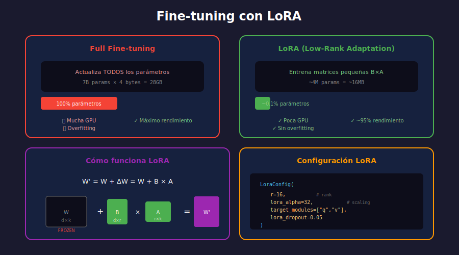

# 🔧 Fine-tuning y PEFT

## 🎯 Objetivos de Aprendizaje

- Entender cuándo y por qué hacer fine-tuning
- Dominar técnicas de Parameter-Efficient Fine-Tuning (PEFT)
- Implementar LoRA y QLoRA para entrenamiento eficiente
- Preparar datasets para fine-tuning

---

## 📋 Contenido



### 1. ¿Qué es Fine-tuning?

Fine-tuning es el proceso de adaptar un modelo pre-entrenado a una tarea específica usando datos etiquetados.

```
┌─────────────────────────────────────────────────────────────┐
│                  PROCESO DE FINE-TUNING                     │
├─────────────────────────────────────────────────────────────┤
│                                                             │
│   Modelo Pre-entrenado                                      │
│   (conocimiento general)                                    │
│            │                                                │
│            ▼                                                │
│   ┌─────────────────────┐                                   │
│   │    Fine-tuning      │ ← Dataset específico              │
│   │  (ajustar pesos)    │   (cientos/miles de ejemplos)     │
│   └─────────────────────┘                                   │
│            │                                                │
│            ▼                                                │
│   Modelo Especializado                                      │
│   (experto en tu tarea)                                     │
│                                                             │
└─────────────────────────────────────────────────────────────┘
```

### 2. ¿Cuándo Hacer Fine-tuning?

| Situación | Recomendación |
|-----------|---------------|
| Tarea genérica (resumen, QA) | ❌ Usa modelo pre-entrenado |
| Formato de salida específico | 🤔 Prueba prompt engineering primero |
| Dominio especializado (legal, médico) | ✅ Fine-tuning recomendado |
| Datos propietarios/privados | ✅ Fine-tuning necesario |
| Máxima calidad en tarea específica | ✅ Fine-tuning vale la pena |
| Reducir latencia/costo | ✅ Fine-tune modelo pequeño |

### 3. Tipos de Fine-tuning

```
┌─────────────────────────────────────────────────────────────┐
│                TIPOS DE FINE-TUNING                         │
├─────────────────────────────────────────────────────────────┤
│                                                             │
│   FULL FINE-TUNING                                          │
│   └── Actualiza TODOS los parámetros                        │
│       ✅ Mejor rendimiento                                  │
│       ❌ Requiere mucha GPU/memoria                         │
│       ❌ Riesgo de overfitting                              │
│       ❌ Modelo completo por tarea                          │
│                                                             │
│   PARAMETER-EFFICIENT (PEFT)                                │
│   └── Actualiza POCOS parámetros                            │
│       ✅ Requiere menos recursos                            │
│       ✅ Menos overfitting                                  │
│       ✅ Adaptadores pequeños                               │
│       🤔 Rendimiento cercano a full                         │
│                                                             │
│   Técnicas PEFT:                                            │
│   ├── LoRA (Low-Rank Adaptation)                            │
│   ├── QLoRA (Quantized LoRA)                                │
│   ├── Prefix Tuning                                         │
│   ├── Prompt Tuning                                         │
│   └── Adapters                                              │
│                                                             │
└─────────────────────────────────────────────────────────────┘
```

### 4. LoRA (Low-Rank Adaptation)

LoRA congela el modelo original y entrena matrices de bajo rango que se suman a los pesos.

```
┌─────────────────────────────────────────────────────────────┐
│                    LORA EXPLAINED                           │
├─────────────────────────────────────────────────────────────┤
│                                                             │
│   Peso original W (congelado):  d × k matriz                │
│                                                             │
│   En lugar de actualizar W directamente:                    │
│                                                             │
│   W' = W + ΔW                                               │
│                                                             │
│   LoRA descompone ΔW en dos matrices pequeñas:              │
│                                                             │
│   ΔW = B × A                                                │
│                                                             │
│   Donde:                                                    │
│   - A: r × k  (r << d, típicamente r=8,16,32)               │
│   - B: d × r                                                │
│                                                             │
│   ┌─────┐     ┌─────────────┐                               │
│   │  W  │  +  │  B  ×  A    │  =  W'                        │
│   │ d×k │     │ d×r   r×k   │                               │
│   │FROZEN│    │ TRAINABLE   │                               │
│   └─────┘     └─────────────┘                               │
│                                                             │
│   Parámetros originales: d × k = 768 × 768 = 590K           │
│   Parámetros LoRA (r=8): 768×8 + 8×768 = 12.3K (2%)         │
│                                                             │
└─────────────────────────────────────────────────────────────┘
```

#### Implementación con PEFT

```python
from transformers import AutoModelForCausalLM, AutoTokenizer
from peft import LoraConfig, get_peft_model, TaskType

# Cargar modelo base
model_name = "meta-llama/Llama-2-7b-hf"
model = AutoModelForCausalLM.from_pretrained(
    model_name,
    torch_dtype=torch.float16,
    device_map="auto"
)
tokenizer = AutoTokenizer.from_pretrained(model_name)

# Configurar LoRA
lora_config = LoraConfig(
    r=16,                           # Rank de las matrices
    lora_alpha=32,                  # Scaling factor
    target_modules=[                # Qué módulos adaptar
        "q_proj", 
        "v_proj",
        "k_proj",
        "o_proj",
    ],
    lora_dropout=0.05,              # Regularización
    bias="none",                    # No entrenar biases
    task_type=TaskType.CAUSAL_LM    # Tipo de tarea
)

# Aplicar LoRA
model = get_peft_model(model, lora_config)

# Ver parámetros entrenables
model.print_trainable_parameters()
# Output: trainable params: 4,194,304 || all params: 6,742,609,920 || trainable%: 0.0622
```

### 5. QLoRA (Quantized LoRA)

QLoRA combina cuantización a 4 bits con LoRA para reducir aún más los requisitos de memoria.

```python
from transformers import BitsAndBytesConfig

# Configuración de cuantización 4-bit
bnb_config = BitsAndBytesConfig(
    load_in_4bit=True,                        # Cargar en 4 bits
    bnb_4bit_quant_type="nf4",               # Tipo de cuantización
    bnb_4bit_compute_dtype=torch.bfloat16,   # Dtype para cómputo
    bnb_4bit_use_double_quant=True           # Doble cuantización
)

# Cargar modelo cuantizado
model = AutoModelForCausalLM.from_pretrained(
    model_name,
    quantization_config=bnb_config,
    device_map="auto"
)

# Preparar para entrenamiento con gradientes
from peft import prepare_model_for_kbit_training
model = prepare_model_for_kbit_training(model)

# Aplicar LoRA normalmente
model = get_peft_model(model, lora_config)
```

### 6. Preparación de Datos

#### Formato de Dataset

```python
# Formato típico para instruction tuning
dataset = [
    {
        "instruction": "Resume el siguiente texto",
        "input": "El machine learning es una rama de la IA...",
        "output": "El ML es IA que aprende de datos automáticamente."
    },
    {
        "instruction": "Traduce al inglés",
        "input": "Hola, ¿cómo estás?",
        "output": "Hello, how are you?"
    }
]
```

#### Template de Prompt

```python
def format_prompt(example: dict) -> str:
    """Formatea un ejemplo para entrenamiento."""
    if example.get("input"):
        return f"""### Instruction:
{example['instruction']}

### Input:
{example['input']}

### Response:
{example['output']}"""
    else:
        return f"""### Instruction:
{example['instruction']}

### Response:
{example['output']}"""


def tokenize_function(example, tokenizer, max_length=512):
    """Tokeniza un ejemplo."""
    prompt = format_prompt(example)
    
    result = tokenizer(
        prompt,
        truncation=True,
        max_length=max_length,
        padding="max_length",
    )
    
    # Para causal LM, labels = input_ids
    result["labels"] = result["input_ids"].copy()
    
    return result
```

### 7. Training Loop

```python
from transformers import TrainingArguments, Trainer
from datasets import Dataset

# Crear dataset de Hugging Face
train_data = Dataset.from_list(training_examples)
train_data = train_data.map(
    lambda x: tokenize_function(x, tokenizer),
    remove_columns=train_data.column_names
)

# Configurar entrenamiento
training_args = TrainingArguments(
    output_dir="./results",
    num_train_epochs=3,
    per_device_train_batch_size=4,
    gradient_accumulation_steps=4,
    learning_rate=2e-4,
    fp16=True,
    logging_steps=10,
    save_strategy="epoch",
    warmup_ratio=0.03,
    lr_scheduler_type="cosine",
)

# Crear trainer
trainer = Trainer(
    model=model,
    args=training_args,
    train_dataset=train_data,
    tokenizer=tokenizer,
)

# Entrenar
trainer.train()

# Guardar adaptadores LoRA (solo ~30MB)
model.save_pretrained("./my-lora-adapter")
```

### 8. Inferencia con Modelo Fine-tuned

```python
from peft import PeftModel

# Cargar modelo base
base_model = AutoModelForCausalLM.from_pretrained(
    model_name,
    torch_dtype=torch.float16,
    device_map="auto"
)

# Cargar adaptadores LoRA
model = PeftModel.from_pretrained(base_model, "./my-lora-adapter")

# Generar
model.eval()
prompt = "### Instruction:\nResume el siguiente texto\n\n### Input:\n..."

inputs = tokenizer(prompt, return_tensors="pt").to(model.device)
with torch.no_grad():
    outputs = model.generate(
        **inputs,
        max_new_tokens=200,
        temperature=0.7,
        do_sample=True
    )

response = tokenizer.decode(outputs[0], skip_special_tokens=True)
print(response)
```

### 9. Supervised Fine-Tuning (SFT) Simplificado

Con la librería `trl` de Hugging Face:

```python
from trl import SFTTrainer
from datasets import load_dataset

# Cargar dataset (ej: Alpaca)
dataset = load_dataset("tatsu-lab/alpaca", split="train")

# Configurar SFT Trainer
trainer = SFTTrainer(
    model=model,
    train_dataset=dataset,
    dataset_text_field="text",  # Campo con el texto formateado
    max_seq_length=512,
    tokenizer=tokenizer,
    args=training_args,
    peft_config=lora_config,
)

trainer.train()
```

### 10. Mejores Prácticas

```
┌─────────────────────────────────────────────────────────────┐
│              MEJORES PRÁCTICAS FINE-TUNING                  │
├─────────────────────────────────────────────────────────────┤
│                                                             │
│  📊 DATOS                                                   │
│  ├── Mínimo 100-1000 ejemplos de calidad                    │
│  ├── Diversidad en los ejemplos                             │
│  ├── Limpiar datos de ruido                                 │
│  └── Validar formato consistente                            │
│                                                             │
│  ⚙️ CONFIGURACIÓN                                            │
│  ├── Empezar con r=8-16 en LoRA                             │
│  ├── Learning rate bajo: 1e-4 a 2e-4                        │
│  ├── Usar warmup (3-5% de steps)                            │
│  └── Gradient accumulation si batch pequeño                 │
│                                                             │
│  🔍 EVALUACIÓN                                               │
│  ├── Guardar checkpoints frecuentes                         │
│  ├── Evaluar en conjunto de validación                      │
│  ├── Probar con ejemplos manuales                           │
│  └── Monitorear overfitting                                 │
│                                                             │
│  💾 RECURSOS                                                 │
│  ├── 7B modelo: ~16GB VRAM con QLoRA                        │
│  ├── 13B modelo: ~24GB VRAM con QLoRA                       │
│  └── Usar gradient checkpointing si falta memoria           │
│                                                             │
└─────────────────────────────────────────────────────────────┘
```

### 11. Comparativa de Métodos

| Método | Parámetros Entrenados | Memoria | Rendimiento |
|--------|----------------------|---------|-------------|
| Full Fine-tuning | 100% | Alto | ⭐⭐⭐⭐⭐ |
| LoRA (r=16) | ~0.1% | Medio | ⭐⭐⭐⭐ |
| QLoRA (4-bit) | ~0.1% | Bajo | ⭐⭐⭐⭐ |
| Prompt Tuning | ~0.01% | Muy bajo | ⭐⭐⭐ |

---

## 🔑 Conceptos Clave

| Concepto | Descripción |
|----------|-------------|
| **Fine-tuning** | Adaptar modelo pre-entrenado a tarea específica |
| **PEFT** | Técnicas que actualizan pocos parámetros |
| **LoRA** | Matrices de bajo rango sumadas a pesos originales |
| **QLoRA** | LoRA + cuantización 4-bit |
| **Rank (r)** | Dimensión de matrices LoRA, controla capacidad |
| **SFT** | Supervised Fine-Tuning con pares input-output |

---

## ✅ Checklist de Verificación

- [ ] Entiendo cuándo hacer fine-tuning vs usar prompts
- [ ] Sé configurar LoRA con parámetros apropiados
- [ ] Puedo preparar un dataset en el formato correcto
- [ ] Conozco las mejores prácticas de entrenamiento
- [ ] Sé cargar y usar un modelo fine-tuned

---

## 🔗 Recursos

- [PEFT Documentation](https://huggingface.co/docs/peft)
- [LoRA Paper](https://arxiv.org/abs/2106.09685)
- [QLoRA Paper](https://arxiv.org/abs/2305.14314)
- [TRL Library](https://huggingface.co/docs/trl)
- [Alpaca Dataset](https://github.com/tatsu-lab/stanford_alpaca)
