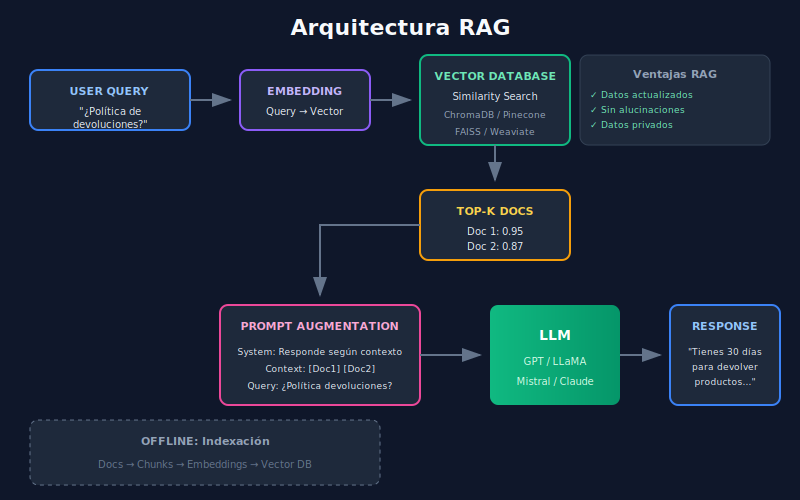

# 🔍 Introducción a RAG



## 🎯 Objetivos de Aprendizaje

- Entender qué es RAG y por qué es revolucionario
- Conocer las limitaciones de LLMs que RAG resuelve
- Comprender el flujo completo de un sistema RAG
- Identificar casos de uso ideales

---

## 📋 Contenido

### 1. ¿Qué es RAG?

**Retrieval Augmented Generation (RAG)** es un patrón arquitectónico que combina:

1. **Retrieval**: Buscar información relevante en una base de conocimiento
2. **Augmentation**: Inyectar esa información en el contexto del LLM
3. **Generation**: Generar respuestas basadas en el conocimiento recuperado

```
┌─────────────────────────────────────────────────────────────────┐
│                    ARQUITECTURA RAG                              │
├─────────────────────────────────────────────────────────────────┤
│                                                                 │
│   Usuario: "¿Cuál es la política de devoluciones?"              │
│                          │                                      │
│                          ▼                                      │
│              ┌───────────────────┐                              │
│              │    EMBEDDING      │                              │
│              │   (query → vector)│                              │
│              └─────────┬─────────┘                              │
│                        │                                        │
│                        ▼                                        │
│              ┌───────────────────┐      ┌──────────────────┐    │
│              │   VECTOR SEARCH   │ ───▶ │  Base de Datos   │    │
│              │   (similitud)     │ ◀─── │   Vectorial      │    │
│              └─────────┬─────────┘      └──────────────────┘    │
│                        │                                        │
│                        ▼                                        │
│              ┌───────────────────┐                              │
│              │   TOP-K DOCS      │                              │
│              │   (relevantes)    │                              │
│              └─────────┬─────────┘                              │
│                        │                                        │
│                        ▼                                        │
│   ┌─────────────────────────────────────────────────────────┐   │
│   │                    PROMPT AUGMENTADO                    │   │
│   │  Sistema: Responde basándote en el contexto.            │   │
│   │  Contexto: [Doc1] [Doc2] [Doc3]                         │   │
│   │  Pregunta: ¿Cuál es la política de devoluciones?        │   │
│   └─────────────────────────────┬───────────────────────────┘   │
│                                 │                               │
│                                 ▼                               │
│                        ┌───────────────┐                        │
│                        │      LLM      │                        │
│                        └───────┬───────┘                        │
│                                │                                │
│                                ▼                                │
│   Respuesta: "Según nuestra política, tienes 30 días..."        │
│                                                                 │
└─────────────────────────────────────────────────────────────────┘
```

### 2. ¿Por qué necesitamos RAG?

Los LLMs tienen limitaciones importantes que RAG resuelve:

| Limitación del LLM | Problema | Solución RAG |
|-------------------|----------|--------------|
| **Conocimiento estático** | Entrenado hasta fecha X | Datos actualizados en tiempo real |
| **Alucinaciones** | Inventa información | Respuestas basadas en fuentes |
| **Sin datos privados** | No conoce tu empresa | Tu propia base de conocimiento |
| **Contexto limitado** | Max ~128K tokens | Retrieval selectivo |
| **Costo de fine-tuning** | Caro y lento | Sin reentrenamiento |

### 3. Componentes de un Sistema RAG

```
┌─────────────────────────────────────────────────────────────────┐
│                    PIPELINE RAG COMPLETO                        │
├─────────────────────────────────────────────────────────────────┤
│                                                                 │
│   FASE OFFLINE (Indexación)                                     │
│   ═══════════════════════════                                   │
│                                                                 │
│   Documentos ──▶ Chunking ──▶ Embeddings ──▶ Vector DB          │
│   (PDF, TXT)    (dividir)     (vectores)     (almacenar)        │
│                                                                 │
│   ─────────────────────────────────────────────────────────     │
│                                                                 │
│   FASE ONLINE (Query)                                           │
│   ═══════════════════                                           │
│                                                                 │
│   Query ──▶ Embedding ──▶ Search ──▶ Rerank ──▶ Generate        │
│   (user)    (vector)      (top-k)   (filtrar)   (LLM)           │
│                                                                 │
└─────────────────────────────────────────────────────────────────┘
```

#### Componente 1: Document Loader

Carga documentos de diferentes fuentes:

```python
# Ejemplo conceptual
from langchain.document_loaders import PyPDFLoader, TextLoader

# Cargar PDF
pdf_loader = PyPDFLoader("manual.pdf")
pdf_docs = pdf_loader.load()

# Cargar texto
text_loader = TextLoader("faq.txt")
text_docs = text_loader.load()
```

#### Componente 2: Text Splitter (Chunking)

Divide documentos en fragmentos manejables:

```python
from langchain.text_splitter import RecursiveCharacterTextSplitter

splitter = RecursiveCharacterTextSplitter(
    chunk_size=500,      # Tamaño del chunk
    chunk_overlap=50,    # Solapamiento entre chunks
    separators=["\n\n", "\n", ". ", " "]
)

chunks = splitter.split_documents(documents)
```

#### Componente 3: Embedding Model

Convierte texto en vectores numéricos:

```python
from sentence_transformers import SentenceTransformer

model = SentenceTransformer('all-MiniLM-L6-v2')

# Texto → Vector
embedding = model.encode("¿Cuál es la política de devoluciones?")
# Shape: (384,) - vector de 384 dimensiones
```

#### Componente 4: Vector Database

Almacena y busca vectores eficientemente:

```python
import chromadb

client = chromadb.Client()
collection = client.create_collection("my_docs")

# Insertar
collection.add(
    documents=["doc1", "doc2"],
    embeddings=[[0.1, 0.2, ...], [0.3, 0.4, ...]],
    ids=["id1", "id2"]
)

# Buscar
results = collection.query(
    query_embeddings=[query_vector],
    n_results=3
)
```

#### Componente 5: LLM Generator

Genera respuestas basadas en contexto:

```python
prompt = f"""Responde basándote SOLO en el contexto proporcionado.

Contexto:
{retrieved_documents}

Pregunta: {user_question}

Respuesta:"""

response = llm.generate(prompt)
```

### 4. Casos de Uso de RAG

| Caso de Uso | Descripción | Ejemplo |
|-------------|-------------|---------|
| **Q&A Empresarial** | Responder sobre docs internos | "¿Cuál es el proceso de onboarding?" |
| **Soporte al Cliente** | Chatbot con base de conocimiento | "¿Cómo reseteo mi contraseña?" |
| **Investigación** | Buscar en papers/artículos | "¿Qué dice este estudio sobre X?" |
| **Legal** | Analizar contratos | "¿Hay cláusulas de penalización?" |
| **Código** | Documentación técnica | "¿Cómo uso esta API?" |

### 5. RAG vs Fine-tuning

| Aspecto | RAG | Fine-tuning |
|---------|-----|-------------|
| **Actualización** | Instantánea (cambiar docs) | Reentrenar modelo |
| **Costo** | Bajo (solo embeddings) | Alto (GPU, tiempo) |
| **Trazabilidad** | ✅ Citar fuentes | ❌ Caja negra |
| **Datos privados** | ✅ Nunca salen | ⚠️ En el modelo |
| **Mejor para** | Conocimiento factual | Estilo/comportamiento |

### 6. Métricas de Evaluación

```
┌─────────────────────────────────────────────────────────────────┐
│                    MÉTRICAS RAG                                 │
├─────────────────────────────────────────────────────────────────┤
│                                                                 │
│   RETRIEVAL (¿Encontramos los docs correctos?)                  │
│   ────────────────────────────────────────────                  │
│   • Recall@K: % de docs relevantes en top-K                     │
│   • Precision@K: % de top-K que son relevantes                  │
│   • MRR: Posición del primer doc relevante                      │
│                                                                 │
│   GENERATION (¿La respuesta es buena?)                          │
│   ────────────────────────────────────────                      │
│   • Faithfulness: ¿Respuesta basada en contexto?                │
│   • Answer Relevancy: ¿Responde la pregunta?                    │
│   • Context Precision: ¿Contexto fue útil?                      │
│                                                                 │
└─────────────────────────────────────────────────────────────────┘
```

---

## 🔑 Puntos Clave

1. **RAG = Retrieval + Augmentation + Generation**
2. **Resuelve**: conocimiento desactualizado, alucinaciones, datos privados
3. **Pipeline**: Documentos → Chunks → Embeddings → Vector DB → Query → LLM
4. **Ventaja sobre fine-tuning**: actualización instantánea, trazabilidad

---

## 📚 Recursos Adicionales

- [RAG Paper Original](https://arxiv.org/abs/2005.11401)
- [LangChain RAG Tutorial](https://python.langchain.com/docs/use_cases/question_answering/)
- [LlamaIndex Documentation](https://docs.llamaindex.ai/)

---

## ✅ Checklist de Verificación

- [ ] Puedo explicar qué significa RAG
- [ ] Entiendo los 5 componentes principales
- [ ] Sé cuándo usar RAG vs fine-tuning
- [ ] Comprendo las métricas de evaluación
