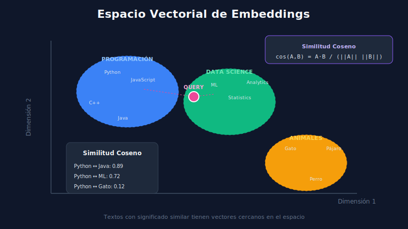

# 🎯 Embeddings y Vectores



## 🎯 Objetivos de Aprendizaje

- Comprender qué son los embeddings semánticos
- Entender cómo funcionan los modelos de embedding
- Calcular similitud entre vectores
- Elegir el modelo de embedding adecuado

---

## 📋 Contenido

### 1. ¿Qué son los Embeddings?

Los **embeddings** son representaciones vectoriales densas que capturan el significado semántico del texto.

```
┌─────────────────────────────────────────────────────────────────┐
│                    DE TEXTO A VECTOR                            │
├─────────────────────────────────────────────────────────────────┤
│                                                                 │
│   "El gato duerme"  ──▶  [0.23, -0.15, 0.67, ..., 0.42]        │
│                              │                                  │
│                              └── Vector de 384-1536 dimensiones │
│                                                                 │
│   Textos similares ──▶ Vectores cercanos en el espacio          │
│                                                                 │
│   "El gato descansa" ≈ "El gato duerme"                        │
│   [0.21, -0.14, 0.65, ...]  ≈  [0.23, -0.15, 0.67, ...]        │
│                                                                 │
└─────────────────────────────────────────────────────────────────┘
```

### 2. Espacio Vectorial Semántico

Los embeddings organizan conceptos en un espacio donde:
- **Conceptos similares** → vectores cercanos
- **Conceptos diferentes** → vectores lejanos

```
                    Espacio 2D (simplificado)
                    
         animal │
                │    🐱 gato
                │         🐕 perro
                │
                │                    🚗 carro
                │                         🚌 bus
                │
         ───────┼─────────────────────────────────
                │                              vehículo
                │
```

### 3. Modelos de Embedding Populares

| Modelo | Dimensiones | Contexto | Uso |
|--------|-------------|----------|-----|
| all-MiniLM-L6-v2 | 384 | 256 tokens | Rápido, bueno para empezar |
| all-mpnet-base-v2 | 768 | 384 tokens | Balance calidad/velocidad |
| text-embedding-ada-002 | 1536 | 8191 tokens | OpenAI, alta calidad |
| text-embedding-3-small | 1536 | 8191 tokens | OpenAI, más barato |
| bge-large-en-v1.5 | 1024 | 512 tokens | Open source, muy bueno |
| e5-large-v2 | 1024 | 512 tokens | Microsoft, excelente |

### 4. Generando Embeddings

```python
from sentence_transformers import SentenceTransformer

# Cargar modelo
model = SentenceTransformer('all-MiniLM-L6-v2')

# Generar embedding de un texto
text = "Python es un lenguaje de programación"
embedding = model.encode(text)

print(f"Shape: {embedding.shape}")  # (384,)
print(f"Tipo: {type(embedding)}")   # numpy.ndarray

# Múltiples textos (más eficiente)
texts = [
    "Python es un lenguaje de programación",
    "JavaScript se usa para web",
    "Los gatos son mascotas populares"
]
embeddings = model.encode(texts)
print(f"Shape: {embeddings.shape}")  # (3, 384)
```

### 5. Similitud entre Vectores

#### Similitud Coseno

La métrica más usada para comparar embeddings:

$$\text{cosine\_similarity}(A, B) = \frac{A \cdot B}{\|A\| \|B\|}$$

```python
import numpy as np
from numpy.linalg import norm

def cosine_similarity(a: np.ndarray, b: np.ndarray) -> float:
    """Calcula similitud coseno entre dos vectores."""
    return np.dot(a, b) / (norm(a) * norm(b))

# Ejemplo
emb1 = model.encode("El perro corre en el parque")
emb2 = model.encode("El can juega en el jardín")
emb3 = model.encode("La economía global crece")

print(f"Similar: {cosine_similarity(emb1, emb2):.3f}")  # ~0.75
print(f"Diferente: {cosine_similarity(emb1, emb3):.3f}")  # ~0.15
```

#### Distancia Euclidiana

Alternativa a similitud coseno:

$$\text{euclidean\_distance}(A, B) = \sqrt{\sum_{i=1}^{n}(A_i - B_i)^2}$$

```python
def euclidean_distance(a: np.ndarray, b: np.ndarray) -> float:
    """Calcula distancia euclidiana."""
    return np.sqrt(np.sum((a - b) ** 2))

# Menor distancia = más similar
dist = euclidean_distance(emb1, emb2)
```

### 6. Búsqueda Semántica

```python
class SemanticSearch:
    """Búsqueda semántica simple."""
    
    def __init__(self, model_name: str = 'all-MiniLM-L6-v2'):
        self.model = SentenceTransformer(model_name)
        self.documents = []
        self.embeddings = None
    
    def add_documents(self, documents: list[str]):
        """Añade documentos al índice."""
        self.documents = documents
        self.embeddings = self.model.encode(documents)
    
    def search(self, query: str, top_k: int = 3) -> list[tuple]:
        """Busca documentos similares a la query."""
        query_embedding = self.model.encode(query)
        
        # Calcular similitudes
        similarities = []
        for i, doc_emb in enumerate(self.embeddings):
            sim = cosine_similarity(query_embedding, doc_emb)
            similarities.append((i, sim, self.documents[i]))
        
        # Ordenar por similitud (mayor primero)
        similarities.sort(key=lambda x: x[1], reverse=True)
        
        return similarities[:top_k]


# Uso
searcher = SemanticSearch()
searcher.add_documents([
    "Python es ideal para data science",
    "JavaScript domina el desarrollo web",
    "SQL es esencial para bases de datos",
    "Docker facilita el despliegue de aplicaciones"
])

results = searcher.search("análisis de datos", top_k=2)
for idx, score, doc in results:
    print(f"{score:.3f}: {doc}")
# 0.534: Python es ideal para data science
# 0.312: SQL es esencial para bases de datos
```

### 7. Consideraciones Importantes

#### Normalización

Muchos modelos retornan embeddings normalizados (norma = 1):

```python
# Verificar normalización
embedding = model.encode("test")
norma = np.linalg.norm(embedding)
print(f"Norma: {norma:.4f}")  # ~1.0 si normalizado
```

#### Batch Processing

Procesar en lotes es más eficiente:

```python
# ❌ Lento
embeddings = [model.encode(doc) for doc in documents]

# ✅ Rápido
embeddings = model.encode(documents, batch_size=32, show_progress_bar=True)
```

#### Truncamiento

Los modelos tienen límite de tokens:

```python
# El modelo trunca automáticamente textos largos
long_text = "..." * 10000
embedding = model.encode(long_text)  # Se trunca a max_seq_length
```

### 8. Embeddings para Queries vs Documentos

Algunos modelos usan prefijos diferentes:

```python
# Modelos E5 requieren prefijos
query = "query: ¿Qué es machine learning?"
document = "passage: Machine learning es una rama de la IA..."

# BGE también usa instrucciones
query = "Represent this sentence for searching: ¿Qué es ML?"
```

---

## 🔑 Puntos Clave

1. **Embeddings** = representación vectorial del significado
2. **Similitud coseno** es la métrica estándar
3. **Batch processing** para eficiencia
4. Elegir modelo según **calidad vs velocidad vs costo**

---

## 📚 Recursos Adicionales

- [Sentence Transformers Docs](https://www.sbert.net/)
- [MTEB Leaderboard](https://huggingface.co/spaces/mteb/leaderboard)
- [OpenAI Embeddings](https://platform.openai.com/docs/guides/embeddings)

---

## ✅ Checklist de Verificación

- [ ] Puedo generar embeddings con sentence-transformers
- [ ] Entiendo similitud coseno y distancia euclidiana
- [ ] Sé implementar búsqueda semántica básica
- [ ] Conozco los modelos de embedding populares
