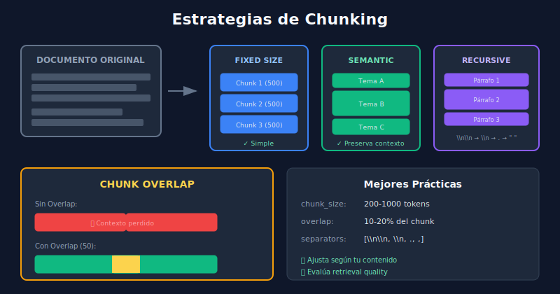

# ⚡ Optimización de RAG



## 🎯 Objetivos de Aprendizaje

- Dominar estrategias de chunking efectivas
- Implementar reranking para mejorar precisión
- Conocer técnicas de hybrid search
- Evaluar y mejorar sistemas RAG

---

## 📋 Contenido

### 1. Estrategias de Chunking

El **chunking** es crucial: chunks muy grandes pierden especificidad, muy pequeños pierden contexto.

```
┌─────────────────────────────────────────────────────────────────┐
│                    ESTRATEGIAS DE CHUNKING                      │
├─────────────────────────────────────────────────────────────────┤
│                                                                 │
│   FIXED SIZE                    SEMANTIC                        │
│   ──────────                    ────────                        │
│   ┌──────────┐                  ┌──────────┐                    │
│   │ 500 char │                  │ Párrafo 1│                    │
│   ├──────────┤                  ├──────────┤                    │
│   │ 500 char │                  │ Párrafo 2│ ← Tamaño variable  │
│   ├──────────┤                  │          │                    │
│   │ 500 char │                  ├──────────┤                    │
│   └──────────┘                  │ Párrafo 3│                    │
│                                 └──────────┘                    │
│   ✅ Simple                     ✅ Preserva contexto            │
│   ❌ Corta oraciones            ❌ Tamaños irregulares          │
│                                                                 │
└─────────────────────────────────────────────────────────────────┘
```

#### Recursive Character Splitting

```python
from langchain.text_splitter import RecursiveCharacterTextSplitter

splitter = RecursiveCharacterTextSplitter(
    chunk_size=500,
    chunk_overlap=50,
    separators=["\n\n", "\n", ". ", " ", ""],
    length_function=len
)

# Intenta dividir por párrafos, luego líneas, luego oraciones...
chunks = splitter.split_text(document)
```

#### Semantic Chunking

```python
from langchain_experimental.text_splitter import SemanticChunker
from langchain.embeddings import HuggingFaceEmbeddings

embeddings = HuggingFaceEmbeddings(model_name="all-MiniLM-L6-v2")

# Divide cuando el significado cambia significativamente
splitter = SemanticChunker(
    embeddings=embeddings,
    breakpoint_threshold_type="percentile",
    breakpoint_threshold_amount=95
)

chunks = splitter.split_text(document)
```

#### Chunking por Estructura

```python
# Para Markdown
from langchain.text_splitter import MarkdownTextSplitter

md_splitter = MarkdownTextSplitter(
    chunk_size=500,
    chunk_overlap=50
)

# Para código
from langchain.text_splitter import Language, RecursiveCharacterTextSplitter

code_splitter = RecursiveCharacterTextSplitter.from_language(
    language=Language.PYTHON,
    chunk_size=500,
    chunk_overlap=50
)
```

### 2. Overlap y Contexto

El **overlap** previene pérdida de información en los bordes:

```
Sin Overlap:
[Chunk 1: "El gato saltó sobre"] [Chunk 2: "la cerca del jardín"]
         ↑ Contexto perdido ↑

Con Overlap (50 chars):
[Chunk 1: "El gato saltó sobre la cerca"]
              [Chunk 2: "sobre la cerca del jardín"]
                    ↑ Contexto preservado ↑
```

### 3. Reranking

El **reranking** es un segundo paso que reordena resultados para mayor precisión:

```
┌─────────────────────────────────────────────────────────────────┐
│                    PIPELINE CON RERANKING                       │
├─────────────────────────────────────────────────────────────────┤
│                                                                 │
│   Query ──▶ Vector Search ──▶ Top 20 ──▶ Reranker ──▶ Top 5    │
│             (rápido, ~95%     docs       (lento,      docs     │
│              precisión)                   ~99%                  │
│                                           precisión)            │
│                                                                 │
└─────────────────────────────────────────────────────────────────┘
```

```python
from sentence_transformers import CrossEncoder

# Modelo de reranking
reranker = CrossEncoder('cross-encoder/ms-marco-MiniLM-L-6-v2')

def rerank_results(query: str, documents: list[str], top_k: int = 5):
    """Reordena documentos por relevancia."""
    # Crear pares (query, doc)
    pairs = [[query, doc] for doc in documents]
    
    # Calcular scores
    scores = reranker.predict(pairs)
    
    # Ordenar por score
    ranked = sorted(zip(documents, scores), key=lambda x: x[1], reverse=True)
    
    return ranked[:top_k]


# Uso
initial_results = vector_db.query(query, n_results=20)
reranked = rerank_results(query, initial_results['documents'][0], top_k=5)
```

### 4. Hybrid Search

Combina búsqueda **semántica** (vectores) con **keyword** (BM25):

```
┌─────────────────────────────────────────────────────────────────┐
│                    HYBRID SEARCH                                │
├─────────────────────────────────────────────────────────────────┤
│                                                                 │
│   Query: "error 404 en producción"                              │
│                     │                                           │
│          ┌─────────┴─────────┐                                  │
│          ▼                   ▼                                  │
│   ┌─────────────┐     ┌─────────────┐                           │
│   │   SEMANTIC  │     │   KEYWORD   │                           │
│   │  (vectores) │     │   (BM25)    │                           │
│   └──────┬──────┘     └──────┬──────┘                           │
│          │                   │                                  │
│   "problemas de     "error 404" literal                         │
│    servidor"                                                    │
│          │                   │                                  │
│          └─────────┬─────────┘                                  │
│                    ▼                                            │
│            ┌─────────────┐                                      │
│            │   FUSIÓN    │ (RRF, weighted)                      │
│            └──────┬──────┘                                      │
│                   ▼                                             │
│           Resultados combinados                                 │
│                                                                 │
└─────────────────────────────────────────────────────────────────┘
```

```python
from rank_bm25 import BM25Okapi

class HybridSearch:
    def __init__(self, documents: list[str], embeddings):
        self.documents = documents
        self.embeddings = embeddings
        
        # Índice BM25
        tokenized = [doc.lower().split() for doc in documents]
        self.bm25 = BM25Okapi(tokenized)
        
        # Embeddings
        self.doc_embeddings = embeddings.encode(documents)
    
    def search(self, query: str, top_k: int = 5, alpha: float = 0.5):
        """
        Búsqueda híbrida.
        alpha: peso para semántico (1-alpha para keyword)
        """
        # Búsqueda semántica
        query_emb = self.embeddings.encode(query)
        semantic_scores = cosine_similarity([query_emb], self.doc_embeddings)[0]
        
        # Búsqueda keyword
        keyword_scores = self.bm25.get_scores(query.lower().split())
        
        # Normalizar scores
        semantic_norm = (semantic_scores - semantic_scores.min()) / (semantic_scores.max() - semantic_scores.min() + 1e-6)
        keyword_norm = (keyword_scores - keyword_scores.min()) / (keyword_scores.max() - keyword_scores.min() + 1e-6)
        
        # Combinar
        combined = alpha * semantic_norm + (1 - alpha) * keyword_norm
        
        # Top-K
        top_indices = combined.argsort()[-top_k:][::-1]
        
        return [(self.documents[i], combined[i]) for i in top_indices]
```

### 5. Query Transformation

Mejorar la query antes de buscar:

```python
def expand_query(query: str, llm) -> list[str]:
    """Genera variaciones de la query."""
    prompt = f"""Genera 3 formas diferentes de preguntar lo mismo:
    
    Pregunta original: {query}
    
    Variaciones:"""
    
    response = llm.generate(prompt)
    variations = [query] + parse_variations(response)
    return variations


def hypothetical_document(query: str, llm) -> str:
    """HyDE: genera documento hipotético para buscar."""
    prompt = f"""Escribe un párrafo que respondería esta pregunta:
    
    Pregunta: {query}
    
    Respuesta (párrafo informativo):"""
    
    return llm.generate(prompt)
```

### 6. Evaluación de RAG

```python
class RAGEvaluator:
    """Evalúa calidad del sistema RAG."""
    
    def __init__(self, rag_system):
        self.rag = rag_system
    
    def evaluate_retrieval(self, test_cases: list[dict]) -> dict:
        """
        Evalúa calidad del retrieval.
        test_cases: [{"query": "...", "relevant_docs": ["id1", "id2"]}]
        """
        metrics = {"recall@3": [], "precision@3": [], "mrr": []}
        
        for case in test_cases:
            retrieved = self.rag.retrieve(case["query"], k=3)
            retrieved_ids = [doc.id for doc in retrieved]
            relevant_ids = set(case["relevant_docs"])
            
            # Recall@K
            hits = len(set(retrieved_ids) & relevant_ids)
            recall = hits / len(relevant_ids)
            metrics["recall@3"].append(recall)
            
            # Precision@K
            precision = hits / len(retrieved_ids)
            metrics["precision@3"].append(precision)
            
            # MRR
            for i, doc_id in enumerate(retrieved_ids):
                if doc_id in relevant_ids:
                    metrics["mrr"].append(1 / (i + 1))
                    break
            else:
                metrics["mrr"].append(0)
        
        return {k: sum(v)/len(v) for k, v in metrics.items()}
```

### 7. Optimizaciones Prácticas

| Técnica | Cuándo usar | Impacto |
|---------|-------------|---------|
| Chunk overlap | Siempre | Preserva contexto |
| Reranking | Alta precisión crítica | +10-15% precisión |
| Hybrid search | Keywords importantes | Mejor para términos técnicos |
| Query expansion | Queries ambiguas | Mejor recall |
| Caching embeddings | Queries repetidas | Menor latencia |

---

## 🔑 Puntos Clave

1. **Chunking** afecta enormemente la calidad
2. **Reranking** mejora precisión significativamente
3. **Hybrid search** combina lo mejor de ambos mundos
4. **Evalúa** antes de optimizar ciegamente

---

## ✅ Checklist de Verificación

- [ ] Entiendo las estrategias de chunking
- [ ] Sé implementar reranking
- [ ] Comprendo hybrid search
- [ ] Puedo evaluar un sistema RAG
