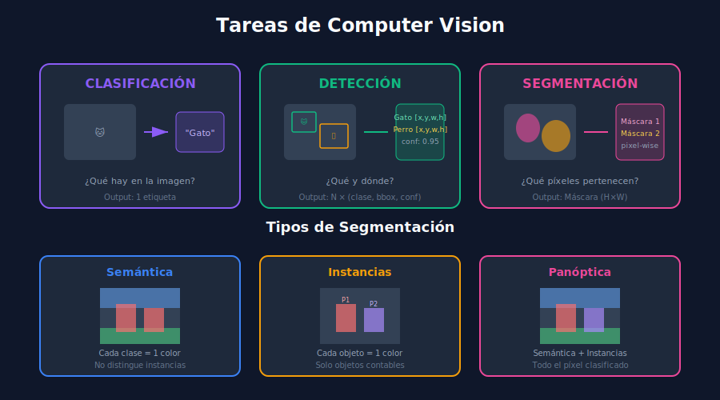

# 👁️ Introducción a Computer Vision



## 🎯 Objetivos de Aprendizaje

- Entender qué es Computer Vision y sus aplicaciones
- Conocer las tareas principales: clasificación, detección, segmentación
- Comprender la evolución de las técnicas de CV
- Identificar casos de uso en la industria

---

## 📋 Contenido

### 1. ¿Qué es Computer Vision?

**Computer Vision** es un campo de la IA que permite a las computadoras "ver" y entender imágenes y videos.

```
┌─────────────────────────────────────────────────────────────────┐
│                    COMPUTER VISION                              │
├─────────────────────────────────────────────────────────────────┤
│                                                                 │
│   Imagen/Video  ──▶  Modelo CV  ──▶  Comprensión                │
│                                                                 │
│   [🖼️ Foto]     ──▶  [🧠 CNN]   ──▶  "Un gato en un sofá"       │
│                                                                 │
└─────────────────────────────────────────────────────────────────┘
```

### 2. Tareas Principales de CV

#### 2.1 Clasificación de Imágenes

**Pregunta**: ¿Qué hay en esta imagen?

```python
# Clasificación: una etiqueta por imagen
from torchvision import models, transforms
from PIL import Image

model = models.resnet50(pretrained=True)
model.eval()

# Preprocesar imagen
transform = transforms.Compose([
    transforms.Resize(256),
    transforms.CenterCrop(224),
    transforms.ToTensor(),
    transforms.Normalize(
        mean=[0.485, 0.456, 0.406],
        std=[0.229, 0.224, 0.225]
    )
])

image = Image.open("cat.jpg")
input_tensor = transform(image).unsqueeze(0)

# Predecir
with torch.no_grad():
    output = model(input_tensor)
    _, predicted = output.max(1)
    
# Resultado: "tabby cat" (clase 281)
```

#### 2.2 Detección de Objetos

**Pregunta**: ¿Qué objetos hay y dónde están?

```
┌─────────────────────────────────────────────────────────────────┐
│                    DETECCIÓN DE OBJETOS                         │
├─────────────────────────────────────────────────────────────────┤
│                                                                 │
│   Input: Imagen                                                 │
│   Output: Lista de (clase, bbox, confianza)                     │
│                                                                 │
│   ┌─────────────────────────────────┐                           │
│   │  ┌─────────┐   ┌─────────┐      │                           │
│   │  │  Perro  │   │  Gato   │      │                           │
│   │  │  0.95   │   │  0.87   │      │                           │
│   │  └─────────┘   └─────────┘      │                           │
│   │         ┌─────────┐             │                           │
│   │         │ Persona │             │                           │
│   │         │  0.92   │             │                           │
│   │         └─────────┘             │                           │
│   └─────────────────────────────────┘                           │
│                                                                 │
└─────────────────────────────────────────────────────────────────┘
```

**Bounding Box (bbox)**: `[x_min, y_min, x_max, y_max]` o `[x_center, y_center, width, height]`

#### 2.3 Segmentación

**Pregunta**: ¿Qué píxeles pertenecen a cada objeto?

| Tipo | Descripción | Ejemplo |
|------|-------------|---------|
| **Semántica** | Clasifica cada píxel en una categoría | Todos los píxeles de "calle" en azul |
| **Instancias** | Distingue objetos individuales | Persona 1, Persona 2, Persona 3 |
| **Panóptica** | Combina semántica + instancias | Cielo + Persona 1 + Coche 1 |

### 3. Evolución de Computer Vision

```
┌─────────────────────────────────────────────────────────────────┐
│                    EVOLUCIÓN DE CV                              │
├─────────────────────────────────────────────────────────────────┤
│                                                                 │
│  2012: AlexNet - Revolución Deep Learning en ImageNet           │
│    │                                                            │
│    ▼                                                            │
│  2014: VGG, GoogLeNet - Redes más profundas                     │
│    │                                                            │
│    ▼                                                            │
│  2015: ResNet - Skip connections, 152 capas                     │
│    │                                                            │
│    ▼                                                            │
│  2015: Faster R-CNN - Detección de objetos moderna              │
│    │                                                            │
│    ▼                                                            │
│  2016: YOLO - Detección en tiempo real                          │
│    │                                                            │
│    ▼                                                            │
│  2017: Mask R-CNN - Segmentación de instancias                  │
│    │                                                            │
│    ▼                                                            │
│  2020: Vision Transformers (ViT)                                │
│    │                                                            │
│    ▼                                                            │
│  2023: SAM (Segment Anything Model)                             │
│                                                                 │
└─────────────────────────────────────────────────────────────────┘
```

### 4. Aplicaciones en la Industria

| Sector | Aplicación | Tecnología |
|--------|------------|------------|
| **Automotriz** | Conducción autónoma | Detección de peatones, señales |
| **Retail** | Checkout sin cajero | Detección de productos |
| **Medicina** | Diagnóstico por imagen | Segmentación de tumores |
| **Seguridad** | Videovigilancia | Detección de personas |
| **Agricultura** | Análisis de cultivos | Detección de enfermedades |
| **Manufactura** | Control de calidad | Detección de defectos |

### 5. Datasets Importantes

```python
# COCO (Common Objects in Context)
# 80 clases, 330K imágenes, detección + segmentación
coco_classes = [
    "person", "bicycle", "car", "motorcycle", "airplane",
    "bus", "train", "truck", "boat", "traffic light",
    "fire hydrant", "stop sign", "parking meter", "bench",
    "bird", "cat", "dog", "horse", "sheep", "cow",
    # ... 80 clases en total
]

# ImageNet
# 1000 clases, 1.2M imágenes, clasificación

# Pascal VOC
# 20 clases, detección y segmentación

# Open Images
# 600+ clases, 9M imágenes
```

### 6. Métricas de Evaluación

#### Precisión y Recall

```python
# Para detección de objetos
precision = TP / (TP + FP)  # ¿Cuántas detecciones son correctas?
recall = TP / (TP + FN)     # ¿Cuántos objetos reales encontramos?

# Ejemplo:
# - Hay 10 gatos en la imagen
# - Modelo detecta 8 gatos (6 correctos, 2 falsos positivos)
# Precision = 6/8 = 0.75
# Recall = 6/10 = 0.60
```

#### IoU (Intersection over Union)

```python
def calculate_iou(box1: list, box2: list) -> float:
    """
    Calcula IoU entre dos bounding boxes.
    
    Boxes en formato [x1, y1, x2, y2]
    """
    # Coordenadas de intersección
    x1 = max(box1[0], box2[0])
    y1 = max(box1[1], box2[1])
    x2 = min(box1[2], box2[2])
    y2 = min(box1[3], box2[3])
    
    # Área de intersección
    intersection = max(0, x2 - x1) * max(0, y2 - y1)
    
    # Áreas individuales
    area1 = (box1[2] - box1[0]) * (box1[3] - box1[1])
    area2 = (box2[2] - box2[0]) * (box2[3] - box2[1])
    
    # Union
    union = area1 + area2 - intersection
    
    return intersection / union if union > 0 else 0

# IoU > 0.5 típicamente se considera "match"
```

#### mAP (mean Average Precision)

```
mAP = promedio de AP sobre todas las clases

AP por clase:
1. Ordenar detecciones por confianza
2. Calcular precision-recall en cada umbral
3. Calcular área bajo la curva PR

mAP@0.5: IoU threshold = 0.5
mAP@0.5:0.95: Promedio de mAP con IoU de 0.5 a 0.95
```

### 7. Pipeline Típico de CV

```python
# Pipeline de detección de objetos
from PIL import Image
import torch

class ObjectDetectionPipeline:
    """Pipeline básico de detección."""
    
    def __init__(self, model, transform, class_names):
        self.model = model
        self.transform = transform
        self.class_names = class_names
    
    def preprocess(self, image_path: str) -> torch.Tensor:
        """Preprocesa imagen para el modelo."""
        image = Image.open(image_path).convert('RGB')
        return self.transform(image).unsqueeze(0)
    
    def predict(self, image_tensor: torch.Tensor) -> list:
        """Ejecuta inferencia."""
        self.model.eval()
        with torch.no_grad():
            predictions = self.model(image_tensor)
        return predictions
    
    def postprocess(
        self, 
        predictions: list, 
        conf_threshold: float = 0.5
    ) -> list:
        """Filtra predicciones por confianza."""
        results = []
        for pred in predictions:
            boxes = pred['boxes']
            scores = pred['scores']
            labels = pred['labels']
            
            # Filtrar por confianza
            mask = scores > conf_threshold
            for box, score, label in zip(
                boxes[mask], scores[mask], labels[mask]
            ):
                results.append({
                    'box': box.tolist(),
                    'score': score.item(),
                    'class': self.class_names[label]
                })
        return results
```

---

## ✅ Checklist de Verificación

- [ ] Entiendo las diferencias entre clasificación, detección y segmentación
- [ ] Conozco los datasets principales (COCO, ImageNet)
- [ ] Comprendo las métricas IoU y mAP
- [ ] Identifico aplicaciones de CV en la industria

---

## 🔗 Navegación

| ⬅️ Semana anterior | 🏠 Inicio | Siguiente ➡️ |
|--------------------|-----------|--------------|
| [Week 32](../../week-32/README.md) | [README](../README.md) | [02-deteccion-objetos](02-deteccion-objetos.md) |
