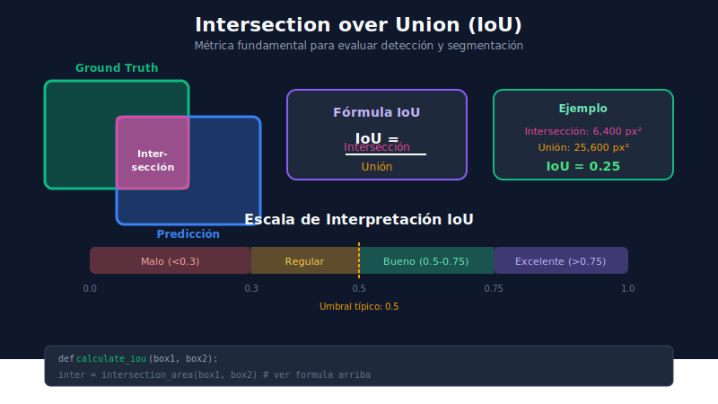

# 🎯 Detección de Objetos



## 🎯 Objetivos de Aprendizaje

- Entender cómo funcionan los detectores de objetos
- Conocer las arquitecturas principales (R-CNN family, YOLO, SSD)
- Comprender anchor boxes y NMS
- Implementar detección básica con modelos pre-entrenados

---

## 📋 Contenido

### 1. ¿Qué es Detección de Objetos?

La **detección de objetos** localiza y clasifica múltiples objetos en una imagen simultáneamente.

```
┌─────────────────────────────────────────────────────────────────┐
│                OUTPUT DE DETECCIÓN                              │
├─────────────────────────────────────────────────────────────────┤
│                                                                 │
│   Para cada objeto detectado:                                   │
│   ┌─────────────────────────────────────────┐                   │
│   │  • Clase: "perro"                       │                   │
│   │  • Bounding Box: [100, 50, 300, 250]    │                   │
│   │  • Confianza: 0.95                      │                   │
│   └─────────────────────────────────────────┘                   │
│                                                                 │
│   Formato bbox: [x_min, y_min, x_max, y_max]                    │
│   o: [x_center, y_center, width, height]                        │
│                                                                 │
└─────────────────────────────────────────────────────────────────┘
```

### 2. Familias de Detectores

#### 2.1 Two-Stage Detectors (R-CNN Family)

**Proceso en dos etapas:**
1. Proponer regiones candidatas (RPN)
2. Clasificar y refinar cada región

```
┌─────────────────────────────────────────────────────────────────┐
│                    R-CNN EVOLUTION                              │
├─────────────────────────────────────────────────────────────────┤
│                                                                 │
│  R-CNN (2014)                                                   │
│    • Selective Search → 2000 regiones                           │
│    • CNN por cada región                                        │
│    • Muy lento (~47s/imagen)                                    │
│                                                                 │
│  Fast R-CNN (2015)                                              │
│    • Una pasada CNN para toda la imagen                         │
│    • RoI Pooling para extraer features                          │
│    • ~2s/imagen                                                 │
│                                                                 │
│  Faster R-CNN (2015)                                            │
│    • Region Proposal Network (RPN) integrado                    │
│    • End-to-end trainable                                       │
│    • ~0.2s/imagen                                               │
│                                                                 │
└─────────────────────────────────────────────────────────────────┘
```

#### 2.2 One-Stage Detectors (YOLO, SSD)

**Proceso en una etapa:**
- Predicción directa de boxes y clases
- Más rápido, ideal para tiempo real

```
┌─────────────────────────────────────────────────────────────────┐
│                    ONE-STAGE vs TWO-STAGE                       │
├─────────────────────────────────────────────────────────────────┤
│                                                                 │
│   Two-Stage (Faster R-CNN):                                     │
│   Imagen → Features → RPN → Proposals → Classify → Detections   │
│                                ↓                                │
│                         Mayor precisión                         │
│                         Más lento                               │
│                                                                 │
│   One-Stage (YOLO):                                             │
│   Imagen → Features → Grid Predictions → NMS → Detections       │
│                                ↓                                │
│                         Más rápido                              │
│                         Tiempo real                             │
│                                                                 │
└─────────────────────────────────────────────────────────────────┘
```

### 3. Conceptos Clave

#### 3.1 Anchor Boxes

Los **anchor boxes** son cajas predefinidas de diferentes tamaños y aspect ratios que sirven como referencia.

```python
# Definición de anchors (ejemplo)
anchor_sizes = [32, 64, 128, 256, 512]  # Tamaños en píxeles
aspect_ratios = [0.5, 1.0, 2.0]          # Alto/Ancho

# Para cada punto del feature map:
# - Se generan len(sizes) * len(ratios) anchors
# - El modelo predice offsets respecto a los anchors

# Ejemplo de anchors para un punto:
# [32x64, 32x32, 64x32,    # size=32, ratios=[0.5, 1.0, 2.0]
#  64x128, 64x64, 128x64,  # size=64
#  ...]
```

#### 3.2 Non-Maximum Suppression (NMS)

**NMS** elimina detecciones redundantes manteniendo solo la mejor.

```python
import numpy as np

def nms(
    boxes: np.ndarray, 
    scores: np.ndarray, 
    iou_threshold: float = 0.5
) -> list[int]:
    """
    Non-Maximum Suppression.
    
    Args:
        boxes: Array de shape (N, 4) con [x1, y1, x2, y2]
        scores: Array de shape (N,) con confianzas
        iou_threshold: Umbral de IoU para suprimir
        
    Returns:
        Índices de boxes a mantener
    """
    # Ordenar por score (descendente)
    order = scores.argsort()[::-1]
    
    keep = []
    
    while order.size > 0:
        # Tomar el de mayor score
        i = order[0]
        keep.append(i)
        
        if order.size == 1:
            break
        
        # Calcular IoU con el resto
        ious = calculate_iou_batch(boxes[i], boxes[order[1:]])
        
        # Mantener los que tienen IoU bajo
        mask = ious <= iou_threshold
        order = order[1:][mask]
    
    return keep

# Ejemplo:
# Detecciones: 5 boxes para "perro" con scores [0.9, 0.85, 0.7, 0.6, 0.5]
# Si boxes 0, 1, 2 se solapan mucho → NMS mantiene solo box 0
```

#### 3.3 Feature Pyramid Network (FPN)

**FPN** permite detectar objetos de diferentes tamaños combinando features de múltiples escalas.

```
┌─────────────────────────────────────────────────────────────────┐
│                    FEATURE PYRAMID NETWORK                      │
├─────────────────────────────────────────────────────────────────┤
│                                                                 │
│   Bottom-up        Top-down + Lateral                           │
│                                                                 │
│   ┌─────┐         ┌─────┐                                       │
│   │ C5  │ ──────▶ │ P5  │ → Objetos grandes                     │
│   └──┬──┘         └──┬──┘                                       │
│      │      ↗        │                                          │
│   ┌──▼──┐  │      ┌──▼──┐                                       │
│   │ C4  │──┘      │ P4  │ → Objetos medianos                    │
│   └──┬──┘         └──┬──┘                                       │
│      │      ↗        │                                          │
│   ┌──▼──┐  │      ┌──▼──┐                                       │
│   │ C3  │──┘      │ P3  │ → Objetos pequeños                    │
│   └─────┘         └─────┘                                       │
│                                                                 │
└─────────────────────────────────────────────────────────────────┘
```

### 4. Detección con PyTorch

```python
import torch
import torchvision
from torchvision.models.detection import fasterrcnn_resnet50_fpn
from PIL import Image
import matplotlib.pyplot as plt
import matplotlib.patches as patches

# COCO classes
COCO_CLASSES = [
    '__background__', 'person', 'bicycle', 'car', 'motorcycle',
    'airplane', 'bus', 'train', 'truck', 'boat', 'traffic light',
    'fire hydrant', 'N/A', 'stop sign', 'parking meter', 'bench',
    'bird', 'cat', 'dog', 'horse', 'sheep', 'cow', 'elephant',
    'bear', 'zebra', 'giraffe', 'N/A', 'backpack', 'umbrella',
    # ... más clases
]

def load_model():
    """Carga Faster R-CNN pre-entrenado."""
    model = fasterrcnn_resnet50_fpn(pretrained=True)
    model.eval()
    return model

def detect_objects(
    model, 
    image_path: str, 
    threshold: float = 0.5
) -> dict:
    """
    Detecta objetos en una imagen.
    
    Returns:
        Dict con boxes, labels, scores
    """
    # Cargar y transformar imagen
    image = Image.open(image_path).convert('RGB')
    transform = torchvision.transforms.ToTensor()
    image_tensor = transform(image).unsqueeze(0)
    
    # Inferencia
    with torch.no_grad():
        predictions = model(image_tensor)[0]
    
    # Filtrar por confianza
    mask = predictions['scores'] > threshold
    
    return {
        'boxes': predictions['boxes'][mask].numpy(),
        'labels': predictions['labels'][mask].numpy(),
        'scores': predictions['scores'][mask].numpy()
    }

def visualize_detections(
    image_path: str,
    detections: dict,
    class_names: list = COCO_CLASSES
):
    """Visualiza detecciones en la imagen."""
    image = Image.open(image_path)
    fig, ax = plt.subplots(1, figsize=(12, 8))
    ax.imshow(image)
    
    colors = plt.cm.hsv(
        np.linspace(0, 1, len(class_names))
    )
    
    for box, label, score in zip(
        detections['boxes'],
        detections['labels'],
        detections['scores']
    ):
        x1, y1, x2, y2 = box
        
        # Dibujar box
        rect = patches.Rectangle(
            (x1, y1), x2 - x1, y2 - y1,
            linewidth=2,
            edgecolor=colors[label],
            facecolor='none'
        )
        ax.add_patch(rect)
        
        # Añadir label
        ax.text(
            x1, y1 - 5,
            f'{class_names[label]}: {score:.2f}',
            color='white',
            fontsize=10,
            bbox=dict(boxstyle='round', facecolor=colors[label])
        )
    
    ax.axis('off')
    plt.tight_layout()
    plt.show()
```

### 5. Formato de Anotaciones

#### COCO Format

```json
{
    "images": [
        {
            "id": 1,
            "file_name": "image1.jpg",
            "width": 640,
            "height": 480
        }
    ],
    "annotations": [
        {
            "id": 1,
            "image_id": 1,
            "category_id": 1,
            "bbox": [100, 50, 200, 150],
            "area": 30000,
            "iscrowd": 0
        }
    ],
    "categories": [
        {"id": 1, "name": "person"},
        {"id": 2, "name": "car"}
    ]
}
```

#### YOLO Format

```
# Archivo: image1.txt
# class_id x_center y_center width height (normalizado 0-1)
0 0.5 0.4 0.3 0.5
1 0.7 0.6 0.2 0.3
```

### 6. Entrenamiento Básico

```python
import torch
from torch.utils.data import DataLoader
from torchvision.models.detection import fasterrcnn_resnet50_fpn

def train_detector(
    model,
    train_loader: DataLoader,
    num_epochs: int = 10,
    lr: float = 0.005
):
    """Entrena un detector de objetos."""
    
    device = torch.device('cuda' if torch.cuda.is_available() else 'cpu')
    model.to(device)
    
    # Optimizer
    params = [p for p in model.parameters() if p.requires_grad]
    optimizer = torch.optim.SGD(
        params, lr=lr, momentum=0.9, weight_decay=0.0005
    )
    
    # Learning rate scheduler
    scheduler = torch.optim.lr_scheduler.StepLR(
        optimizer, step_size=3, gamma=0.1
    )
    
    for epoch in range(num_epochs):
        model.train()
        epoch_loss = 0
        
        for images, targets in train_loader:
            images = [img.to(device) for img in images]
            targets = [{k: v.to(device) for k, v in t.items()} 
                      for t in targets]
            
            # Forward
            loss_dict = model(images, targets)
            losses = sum(loss for loss in loss_dict.values())
            
            # Backward
            optimizer.zero_grad()
            losses.backward()
            optimizer.step()
            
            epoch_loss += losses.item()
        
        scheduler.step()
        print(f'Epoch {epoch+1}/{num_epochs}, Loss: {epoch_loss:.4f}')
    
    return model
```

### 7. Evaluación con mAP

```python
from torchvision.ops import box_iou

def evaluate_detections(
    predictions: list[dict],
    ground_truths: list[dict],
    iou_threshold: float = 0.5
) -> dict:
    """
    Evalúa detecciones contra ground truth.
    
    Returns:
        Dict con precision, recall, AP por clase
    """
    all_detections = []
    all_gt = []
    
    for pred, gt in zip(predictions, ground_truths):
        # Calcular IoU entre predicciones y GT
        if len(pred['boxes']) > 0 and len(gt['boxes']) > 0:
            ious = box_iou(
                torch.tensor(pred['boxes']),
                torch.tensor(gt['boxes'])
            )
            
            # Asignar detecciones a GT
            # ... lógica de matching
    
    # Calcular AP
    # ... curva precision-recall
    
    return {
        'mAP': 0.0,  # Calcular
        'precision': 0.0,
        'recall': 0.0
    }
```

---

## ✅ Checklist de Verificación

- [ ] Entiendo la diferencia entre two-stage y one-stage detectors
- [ ] Comprendo qué son anchor boxes y para qué sirven
- [ ] Sé aplicar NMS para eliminar detecciones redundantes
- [ ] Puedo usar un detector pre-entrenado para inferencia

---

## 🔗 Navegación

| ⬅️ Anterior | 🏠 Inicio | Siguiente ➡️ |
|-------------|-----------|--------------|
| [01-introduccion-cv](01-introduccion-cv.md) | [README](../README.md) | [03-yolo-ultralytics](03-yolo-ultralytics.md) |
