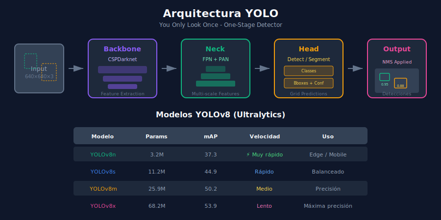

# 🚀 YOLO con Ultralytics



## 🎯 Objetivos de Aprendizaje

- Dominar la biblioteca Ultralytics para YOLO
- Realizar detección, segmentación y clasificación con YOLOv8
- Entrenar modelos custom con datasets propios
- Exportar modelos para producción

---

## 📋 Contenido

### 1. ¿Qué es YOLO?

**YOLO (You Only Look Once)** es una familia de detectores de objetos en tiempo real que procesan la imagen completa en una sola pasada.

```
┌─────────────────────────────────────────────────────────────────┐
│                    YOLO: You Only Look Once                     │
├─────────────────────────────────────────────────────────────────┤
│                                                                 │
│   Imagen (640x640)                                              │
│        │                                                        │
│        ▼                                                        │
│   ┌─────────────────┐                                           │
│   │    Backbone     │  CSPDarknet / EfficientNet                │
│   │    (Features)   │                                           │
│   └────────┬────────┘                                           │
│            │                                                    │
│            ▼                                                    │
│   ┌─────────────────┐                                           │
│   │      Neck       │  FPN + PAN                                │
│   │   (Multi-scale) │                                           │
│   └────────┬────────┘                                           │
│            │                                                    │
│            ▼                                                    │
│   ┌─────────────────┐                                           │
│   │      Head       │  Detect / Segment / Classify              │
│   │  (Predictions)  │                                           │
│   └────────┬────────┘                                           │
│            │                                                    │
│            ▼                                                    │
│   Detecciones: [(clase, bbox, conf), ...]                       │
│                                                                 │
└─────────────────────────────────────────────────────────────────┘
```

### 2. Instalación y Setup

```bash
# Instalar ultralytics
pip install ultralytics

# Verificar instalación
yolo version
```

```python
from ultralytics import YOLO

# Verificar GPU
import torch
print(f"CUDA disponible: {torch.cuda.is_available()}")
print(f"GPU: {torch.cuda.get_device_name(0) if torch.cuda.is_available() else 'N/A'}")
```

### 3. Modelos Disponibles

| Modelo | Tamaño | mAP | Velocidad | Uso |
|--------|--------|-----|-----------|-----|
| YOLOv8n | 3.2M | 37.3 | Muy rápido | Edge/Mobile |
| YOLOv8s | 11.2M | 44.9 | Rápido | Balanceado |
| YOLOv8m | 25.9M | 50.2 | Medio | Precisión |
| YOLOv8l | 43.7M | 52.9 | Lento | Alta precisión |
| YOLOv8x | 68.2M | 53.9 | Muy lento | Máxima precisión |

```python
# Sufijos para diferentes tareas
# - detect: detección de objetos (default)
# - seg: segmentación de instancias
# - cls: clasificación de imágenes
# - pose: estimación de pose

# Ejemplos:
model_detect = YOLO('yolov8n.pt')      # Detección
model_seg = YOLO('yolov8n-seg.pt')     # Segmentación
model_cls = YOLO('yolov8n-cls.pt')     # Clasificación
model_pose = YOLO('yolov8n-pose.pt')   # Pose
```

### 4. Detección de Objetos

#### 4.1 Inferencia Básica

```python
from ultralytics import YOLO
from PIL import Image

# Cargar modelo pre-entrenado en COCO
model = YOLO('yolov8n.pt')

# Inferencia en imagen
results = model('image.jpg')

# Procesar resultados
for result in results:
    # Boxes
    boxes = result.boxes
    print(f"Detecciones: {len(boxes)}")
    
    for box in boxes:
        # Coordenadas
        x1, y1, x2, y2 = box.xyxy[0].tolist()
        
        # Clase y confianza
        cls = int(box.cls[0])
        conf = float(box.conf[0])
        name = model.names[cls]
        
        print(f"  {name}: {conf:.2f} at [{x1:.0f}, {y1:.0f}, {x2:.0f}, {y2:.0f}]")
```

#### 4.2 Opciones de Inferencia

```python
# Inferencia con opciones
results = model.predict(
    source='image.jpg',      # Imagen, video, directorio, URL
    conf=0.5,                # Umbral de confianza
    iou=0.7,                 # Umbral NMS
    imgsz=640,               # Tamaño de imagen
    device='cuda',           # 'cpu', 'cuda', '0', '0,1'
    save=True,               # Guardar resultados
    save_txt=True,           # Guardar labels
    save_conf=True,          # Incluir confianza en labels
    classes=[0, 2, 5],       # Filtrar clases (persona, coche, bus)
    verbose=False            # Silenciar output
)

# Múltiples fuentes
model('folder/')             # Directorio de imágenes
model('video.mp4')           # Video
model('https://...')         # URL
model(0)                     # Webcam
```

#### 4.3 Acceder a Resultados

```python
result = results[0]  # Primer resultado

# Boxes (detección)
boxes = result.boxes
print(f"xyxy: {boxes.xyxy}")      # [x1, y1, x2, y2]
print(f"xywh: {boxes.xywh}")      # [x_center, y_center, w, h]
print(f"conf: {boxes.conf}")      # Confianzas
print(f"cls: {boxes.cls}")        # Clases
print(f"data: {boxes.data}")      # Todo junto

# Convertir a numpy
boxes_np = boxes.xyxy.cpu().numpy()

# Guardar imagen con detecciones
result.save('output.jpg')

# Plotear en notebook
result.plot()
```

### 5. Segmentación de Instancias

```python
# Cargar modelo de segmentación
model_seg = YOLO('yolov8n-seg.pt')

# Inferencia
results = model_seg('image.jpg')

for result in results:
    # Masks de segmentación
    if result.masks is not None:
        masks = result.masks
        
        # Máscara binaria por objeto
        for i, mask in enumerate(masks.data):
            mask_np = mask.cpu().numpy()  # Shape: (H, W)
            
            # Información del objeto
            cls = int(result.boxes.cls[i])
            name = model_seg.names[cls]
            
            print(f"Mask {i}: {name}, pixels: {mask_np.sum()}")
        
        # Máscara combinada
        combined_mask = masks.data.sum(dim=0).cpu().numpy()
```

### 6. Clasificación de Imágenes

```python
# Cargar modelo de clasificación
model_cls = YOLO('yolov8n-cls.pt')

# Inferencia
results = model_cls('image.jpg')

for result in results:
    # Top-5 predicciones
    probs = result.probs
    
    top5_indices = probs.top5
    top5_confs = probs.top5conf
    
    print("Top 5 predicciones:")
    for idx, conf in zip(top5_indices, top5_confs):
        name = model_cls.names[idx]
        print(f"  {name}: {conf:.2%}")
```

### 7. Entrenamiento Custom

#### 7.1 Preparar Dataset

```yaml
# dataset.yaml
path: /path/to/dataset
train: images/train
val: images/val
test: images/test  # opcional

# Clases
names:
  0: person
  1: car
  2: dog
  3: cat

# Número de clases
nc: 4
```

**Estructura de carpetas:**
```
dataset/
├── images/
│   ├── train/
│   │   ├── img001.jpg
│   │   └── img002.jpg
│   └── val/
│       ├── img003.jpg
│       └── img004.jpg
├── labels/
│   ├── train/
│   │   ├── img001.txt
│   │   └── img002.txt
│   └── val/
│       ├── img003.txt
│       └── img004.txt
└── dataset.yaml
```

**Formato de labels (YOLO):**
```
# img001.txt
# class_id x_center y_center width height (normalizado 0-1)
0 0.5 0.4 0.3 0.5
1 0.7 0.6 0.2 0.3
```

#### 7.2 Entrenar Modelo

```python
from ultralytics import YOLO

# Cargar modelo base
model = YOLO('yolov8n.pt')

# Entrenar
results = model.train(
    data='dataset.yaml',
    epochs=100,
    imgsz=640,
    batch=16,
    device='cuda',
    workers=8,
    patience=50,        # Early stopping
    save=True,
    project='runs/train',
    name='my_model',
    pretrained=True,
    optimizer='auto',   # SGD, Adam, AdamW
    lr0=0.01,           # Learning rate inicial
    lrf=0.01,           # Learning rate final
    momentum=0.937,
    weight_decay=0.0005,
    warmup_epochs=3,
    augment=True,       # Augmentation
    mosaic=1.0,         # Mosaic augmentation
    mixup=0.0,          # Mixup augmentation
    hsv_h=0.015,        # HSV-Hue augmentation
    hsv_s=0.7,          # HSV-Saturation
    hsv_v=0.4,          # HSV-Value
    degrees=0.0,        # Rotation
    translate=0.1,      # Translation
    scale=0.5,          # Scale
    fliplr=0.5,         # Horizontal flip
    flipud=0.0,         # Vertical flip
)

print(f"Best model: {results.best}")
```

#### 7.3 Validar Modelo

```python
# Validar en conjunto de validación
metrics = model.val(data='dataset.yaml')

print(f"mAP50: {metrics.box.map50:.4f}")
print(f"mAP50-95: {metrics.box.map:.4f}")
print(f"Precision: {metrics.box.mp:.4f}")
print(f"Recall: {metrics.box.mr:.4f}")
```

### 8. Exportar Modelos

```python
# Exportar a diferentes formatos
model = YOLO('best.pt')

# ONNX (interoperabilidad)
model.export(format='onnx', dynamic=True)

# TensorRT (NVIDIA, muy rápido)
model.export(format='engine', device='cuda')

# CoreML (Apple)
model.export(format='coreml')

# TFLite (Mobile)
model.export(format='tflite')

# OpenVINO (Intel)
model.export(format='openvino')

# Formatos disponibles:
formats = ['torchscript', 'onnx', 'openvino', 'engine', 
           'coreml', 'saved_model', 'pb', 'tflite', 
           'edgetpu', 'tfjs', 'paddle', 'ncnn']
```

### 9. Tracking de Objetos

```python
from ultralytics import YOLO

model = YOLO('yolov8n.pt')

# Tracking en video
results = model.track(
    source='video.mp4',
    tracker='bytetrack.yaml',  # o 'botsort.yaml'
    persist=True,              # Mantener tracks entre frames
    conf=0.5,
    iou=0.5,
    show=True                  # Mostrar en vivo
)

# Acceder a track IDs
for result in results:
    boxes = result.boxes
    if boxes.id is not None:
        track_ids = boxes.id.int().cpu().tolist()
        for box, track_id in zip(boxes, track_ids):
            print(f"Track {track_id}: {box.xyxy}")
```

### 10. Procesamiento en Tiempo Real

```python
import cv2
from ultralytics import YOLO

model = YOLO('yolov8n.pt')

# Abrir webcam
cap = cv2.VideoCapture(0)

while cap.isOpened():
    ret, frame = cap.read()
    if not ret:
        break
    
    # Inferencia
    results = model(frame, verbose=False)
    
    # Visualizar
    annotated_frame = results[0].plot()
    
    # Mostrar FPS
    # ... 
    
    cv2.imshow('YOLO', annotated_frame)
    
    if cv2.waitKey(1) & 0xFF == ord('q'):
        break

cap.release()
cv2.destroyAllWindows()
```

### 11. Tips y Mejores Prácticas

```python
# 1. Usar batch inference para múltiples imágenes
images = ['img1.jpg', 'img2.jpg', 'img3.jpg']
results = model(images, batch=3)

# 2. Usar half precision para GPU
results = model(image, half=True)  # FP16

# 3. Caché de dataset para entrenamiento más rápido
model.train(data='data.yaml', cache='ram')  # o 'disk'

# 4. Usar validación durante entrenamiento
model.train(data='data.yaml', val=True)

# 5. Resume training
model.train(data='data.yaml', resume=True)

# 6. Multi-GPU training
model.train(data='data.yaml', device='0,1,2,3')
```

---

## ✅ Checklist de Verificación

- [ ] Sé instalar y configurar Ultralytics
- [ ] Puedo realizar detección con modelos pre-entrenados
- [ ] Entiendo cómo preparar un dataset custom
- [ ] Puedo entrenar y validar modelos
- [ ] Sé exportar modelos a diferentes formatos

---

## 🔗 Navegación

| ⬅️ Anterior | 🏠 Inicio | Siguiente ➡️ |
|-------------|-----------|--------------|
| [02-deteccion-objetos](02-deteccion-objetos.md) | [README](../README.md) | [04-segmentacion](04-segmentacion.md) |
