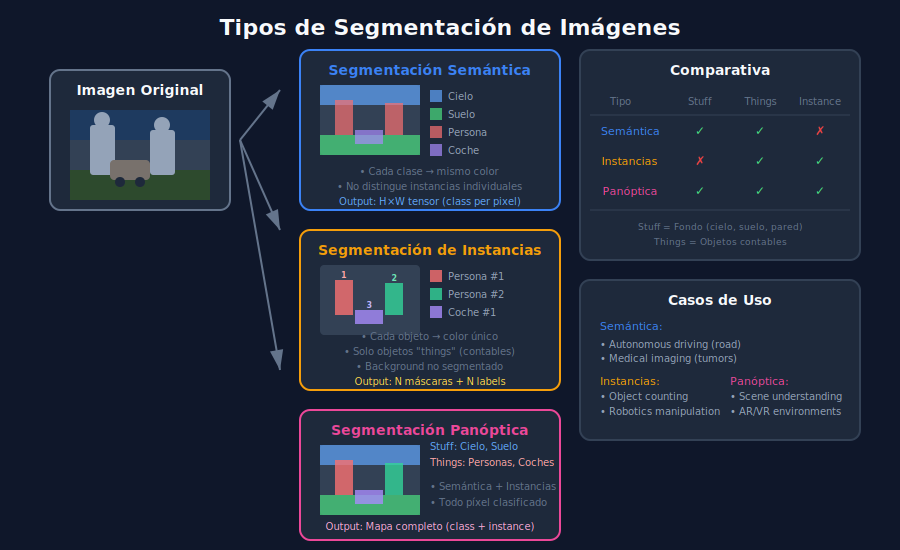

# 🎨 Segmentación de Imágenes



## 🎯 Objetivos de Aprendizaje

- Entender los tipos de segmentación (semántica, instancias, panóptica)
- Implementar segmentación con modelos pre-entrenados
- Conocer arquitecturas clave (U-Net, Mask R-CNN, SAM)
- Aplicar segmentación a casos de uso reales

---

## 📋 Contenido

### 1. Tipos de Segmentación

```
┌─────────────────────────────────────────────────────────────────┐
│                    TIPOS DE SEGMENTACIÓN                        │
├─────────────────────────────────────────────────────────────────┤
│                                                                 │
│   SEMÁNTICA           INSTANCIAS          PANÓPTICA             │
│   ┌─────────┐         ┌─────────┐         ┌─────────┐           │
│   │ ■■■■■■■ │         │ ■1■■2■■ │         │ ■1■■2■■ │           │
│   │ ■■■■■■■ │         │ ■1■■2■■ │         │ ■1■■2■■ │           │
│   │ □□□□□□□ │         │ □□□□□□□ │         │ ░░░░░░░ │           │
│   │ □□□□□□□ │         │ □□□□□□□ │         │ ░░░░░░░ │           │
│   └─────────┘         └─────────┘         └─────────┘           │
│   ■=persona           ■1=persona1         ■1=persona1           │
│   □=fondo             ■2=persona2         ░=cielo               │
│                       □=fondo                                   │
│                                                                 │
│   "Todos los píxeles  "Cada persona       "Todo clasificado     │
│    de persona"        es distinta"        + instancias"         │
│                                                                 │
└─────────────────────────────────────────────────────────────────┘
```

| Tipo | Pregunta | Output | Uso |
|------|----------|--------|-----|
| **Semántica** | ¿Qué clase es cada píxel? | Máscara de clases | Conducción autónoma (calle, acera) |
| **Instancias** | ¿Qué objeto es cada píxel? | Máscara por objeto | Contar objetos, tracking |
| **Panóptica** | ¿Clase + instancia? | Ambas combinadas | Escenas complejas |

### 2. Arquitectura U-Net

**U-Net** es la arquitectura clásica para segmentación semántica, especialmente en imágenes médicas.

```
┌─────────────────────────────────────────────────────────────────┐
│                    U-NET ARCHITECTURE                           │
├─────────────────────────────────────────────────────────────────┤
│                                                                 │
│   Input                                              Output     │
│   572x572                                            388x388    │
│      │                                                  ▲       │
│      ▼                                                  │       │
│   ┌──────┐                                         ┌──────┐    │
│   │ 64   │────────────────────────────────────────▶│ 64   │    │
│   └──┬───┘                                         └──┬───┘    │
│      │ Pool                                     UpConv │        │
│      ▼                                                 │        │
│   ┌──────┐                                         ┌──────┐    │
│   │ 128  │────────────────────────────────────────▶│ 128  │    │
│   └──┬───┘                                         └──┬───┘    │
│      │ Pool                                     UpConv │        │
│      ▼                                                 │        │
│   ┌──────┐                                         ┌──────┐    │
│   │ 256  │────────────────────────────────────────▶│ 256  │    │
│   └──┬───┘                                         └──┬───┘    │
│      │ Pool                                     UpConv │        │
│      ▼                                                 │        │
│   ┌──────┐                                         ┌──────┐    │
│   │ 512  │────────────────────────────────────────▶│ 512  │    │
│   └──┬───┘                                         └──┬───┘    │
│      │ Pool                                     UpConv │        │
│      ▼                                                 │        │
│   ┌──────┐                                              │        │
│   │ 1024 │──────────────────────────────────────────────┘        │
│   └──────┘                                                      │
│   Bottleneck                                                    │
│                                                                 │
│   ────▶ Skip connections (concatenation)                        │
│                                                                 │
└─────────────────────────────────────────────────────────────────┘
```

```python
import torch
import torch.nn as nn

class UNet(nn.Module):
    """U-Net simplificado."""
    
    def __init__(self, in_channels: int = 3, num_classes: int = 2):
        super().__init__()
        
        # Encoder
        self.enc1 = self._conv_block(in_channels, 64)
        self.enc2 = self._conv_block(64, 128)
        self.enc3 = self._conv_block(128, 256)
        self.enc4 = self._conv_block(256, 512)
        
        # Bottleneck
        self.bottleneck = self._conv_block(512, 1024)
        
        # Decoder
        self.upconv4 = nn.ConvTranspose2d(1024, 512, 2, 2)
        self.dec4 = self._conv_block(1024, 512)
        
        self.upconv3 = nn.ConvTranspose2d(512, 256, 2, 2)
        self.dec3 = self._conv_block(512, 256)
        
        self.upconv2 = nn.ConvTranspose2d(256, 128, 2, 2)
        self.dec2 = self._conv_block(256, 128)
        
        self.upconv1 = nn.ConvTranspose2d(128, 64, 2, 2)
        self.dec1 = self._conv_block(128, 64)
        
        # Output
        self.out = nn.Conv2d(64, num_classes, 1)
        
        self.pool = nn.MaxPool2d(2)
    
    def _conv_block(self, in_ch: int, out_ch: int) -> nn.Sequential:
        return nn.Sequential(
            nn.Conv2d(in_ch, out_ch, 3, padding=1),
            nn.BatchNorm2d(out_ch),
            nn.ReLU(inplace=True),
            nn.Conv2d(out_ch, out_ch, 3, padding=1),
            nn.BatchNorm2d(out_ch),
            nn.ReLU(inplace=True)
        )
    
    def forward(self, x: torch.Tensor) -> torch.Tensor:
        # Encoder
        e1 = self.enc1(x)
        e2 = self.enc2(self.pool(e1))
        e3 = self.enc3(self.pool(e2))
        e4 = self.enc4(self.pool(e3))
        
        # Bottleneck
        b = self.bottleneck(self.pool(e4))
        
        # Decoder with skip connections
        d4 = self.dec4(torch.cat([self.upconv4(b), e4], dim=1))
        d3 = self.dec3(torch.cat([self.upconv3(d4), e3], dim=1))
        d2 = self.dec2(torch.cat([self.upconv2(d3), e2], dim=1))
        d1 = self.dec1(torch.cat([self.upconv1(d2), e1], dim=1))
        
        return self.out(d1)
```

### 3. Segmentación Semántica con DeepLab

```python
import torch
from torchvision.models.segmentation import deeplabv3_resnet50

# Cargar modelo pre-entrenado
model = deeplabv3_resnet50(pretrained=True)
model.eval()

# Preprocesar imagen
from torchvision import transforms
from PIL import Image

transform = transforms.Compose([
    transforms.ToTensor(),
    transforms.Normalize(
        mean=[0.485, 0.456, 0.406],
        std=[0.229, 0.224, 0.225]
    )
])

image = Image.open('image.jpg')
input_tensor = transform(image).unsqueeze(0)

# Inferencia
with torch.no_grad():
    output = model(input_tensor)['out']

# Output shape: (1, num_classes, H, W)
# Para Pascal VOC: 21 clases
predictions = output.argmax(dim=1)  # (1, H, W)

# Visualizar
import matplotlib.pyplot as plt
plt.imshow(predictions[0].cpu().numpy())
plt.colorbar()
plt.show()
```

### 4. Segmentación de Instancias con YOLO

```python
from ultralytics import YOLO
import numpy as np
import cv2

# Cargar modelo de segmentación
model = YOLO('yolov8n-seg.pt')

# Inferencia
results = model('image.jpg')

for result in results:
    # Original image
    img = result.orig_img
    
    if result.masks is not None:
        masks = result.masks.data.cpu().numpy()
        boxes = result.boxes
        
        # Crear overlay de colores
        overlay = img.copy()
        
        for i, (mask, box) in enumerate(zip(masks, boxes)):
            # Color único por instancia
            color = np.random.randint(0, 255, 3).tolist()
            
            # Aplicar máscara
            mask_bool = mask > 0.5
            overlay[mask_bool] = color
            
            # Info
            cls = int(box.cls[0])
            conf = float(box.conf[0])
            name = model.names[cls]
            print(f"Instancia {i}: {name} ({conf:.2f})")
        
        # Blend
        output = cv2.addWeighted(img, 0.5, overlay, 0.5, 0)
        
        cv2.imwrite('segmented.jpg', output)
```

### 5. Segment Anything Model (SAM)

**SAM** de Meta es un modelo de segmentación zero-shot que puede segmentar cualquier objeto.

```python
from segment_anything import SamPredictor, sam_model_registry
import cv2
import numpy as np

# Cargar modelo SAM
sam = sam_model_registry["vit_h"](checkpoint="sam_vit_h.pth")
sam.to('cuda')

predictor = SamPredictor(sam)

# Cargar imagen
image = cv2.imread('image.jpg')
image_rgb = cv2.cvtColor(image, cv2.COLOR_BGR2RGB)

# Set image
predictor.set_image(image_rgb)

# Segmentar con punto
input_point = np.array([[500, 375]])  # (x, y)
input_label = np.array([1])  # 1 = foreground

masks, scores, logits = predictor.predict(
    point_coords=input_point,
    point_labels=input_label,
    multimask_output=True
)

# masks shape: (num_masks, H, W)
# Seleccionar mejor máscara
best_mask = masks[scores.argmax()]

# Segmentar con box
input_box = np.array([100, 100, 400, 400])  # [x1, y1, x2, y2]

masks, scores, logits = predictor.predict(
    box=input_box,
    multimask_output=False
)
```

### 6. Métricas de Segmentación

#### IoU (Intersection over Union)

```python
def calculate_iou(
    pred_mask: np.ndarray, 
    gt_mask: np.ndarray
) -> float:
    """
    Calcula IoU entre máscaras predicha y ground truth.
    
    Args:
        pred_mask: Máscara predicha (binaria)
        gt_mask: Máscara ground truth (binaria)
    
    Returns:
        IoU score
    """
    intersection = np.logical_and(pred_mask, gt_mask).sum()
    union = np.logical_or(pred_mask, gt_mask).sum()
    
    if union == 0:
        return 0.0
    
    return intersection / union
```

#### Mean IoU (mIoU)

```python
def calculate_miou(
    predictions: np.ndarray,
    ground_truths: np.ndarray,
    num_classes: int
) -> float:
    """
    Calcula mean IoU sobre todas las clases.
    
    Args:
        predictions: Array de predicciones (N, H, W)
        ground_truths: Array de GT (N, H, W)
        num_classes: Número de clases
    
    Returns:
        mIoU score
    """
    ious = []
    
    for cls in range(num_classes):
        pred_cls = (predictions == cls)
        gt_cls = (ground_truths == cls)
        
        intersection = np.logical_and(pred_cls, gt_cls).sum()
        union = np.logical_or(pred_cls, gt_cls).sum()
        
        if union > 0:
            ious.append(intersection / union)
    
    return np.mean(ious) if ious else 0.0
```

#### Dice Coefficient

```python
def dice_coefficient(
    pred_mask: np.ndarray, 
    gt_mask: np.ndarray
) -> float:
    """
    Calcula Dice coefficient (F1 para segmentación).
    
    Dice = 2 * |A ∩ B| / (|A| + |B|)
    """
    intersection = np.logical_and(pred_mask, gt_mask).sum()
    total = pred_mask.sum() + gt_mask.sum()
    
    if total == 0:
        return 1.0
    
    return 2 * intersection / total
```

### 7. Entrenamiento de Segmentación

```python
import torch
import torch.nn as nn
from torch.utils.data import Dataset, DataLoader
from torchvision import transforms
from PIL import Image
import os

class SegmentationDataset(Dataset):
    """Dataset para segmentación semántica."""
    
    def __init__(
        self, 
        images_dir: str, 
        masks_dir: str,
        transform=None
    ):
        self.images_dir = images_dir
        self.masks_dir = masks_dir
        self.transform = transform
        self.images = sorted(os.listdir(images_dir))
    
    def __len__(self):
        return len(self.images)
    
    def __getitem__(self, idx):
        # Cargar imagen
        img_path = os.path.join(self.images_dir, self.images[idx])
        image = Image.open(img_path).convert('RGB')
        
        # Cargar máscara
        mask_name = self.images[idx].replace('.jpg', '.png')
        mask_path = os.path.join(self.masks_dir, mask_name)
        mask = Image.open(mask_path)
        
        if self.transform:
            image = self.transform(image)
            mask = torch.tensor(np.array(mask), dtype=torch.long)
        
        return image, mask


def train_segmentation(
    model: nn.Module,
    train_loader: DataLoader,
    num_epochs: int = 50,
    lr: float = 1e-4
):
    """Entrena modelo de segmentación."""
    
    device = torch.device('cuda' if torch.cuda.is_available() else 'cpu')
    model.to(device)
    
    criterion = nn.CrossEntropyLoss()
    optimizer = torch.optim.Adam(model.parameters(), lr=lr)
    
    for epoch in range(num_epochs):
        model.train()
        epoch_loss = 0
        
        for images, masks in train_loader:
            images = images.to(device)
            masks = masks.to(device)
            
            # Forward
            outputs = model(images)
            if isinstance(outputs, dict):
                outputs = outputs['out']
            
            loss = criterion(outputs, masks)
            
            # Backward
            optimizer.zero_grad()
            loss.backward()
            optimizer.step()
            
            epoch_loss += loss.item()
        
        avg_loss = epoch_loss / len(train_loader)
        print(f'Epoch {epoch+1}/{num_epochs}, Loss: {avg_loss:.4f}')
```

### 8. Post-procesamiento

```python
import cv2
import numpy as np
from scipy import ndimage

def refine_mask(mask: np.ndarray) -> np.ndarray:
    """
    Refina una máscara de segmentación.
    """
    # 1. Eliminar ruido pequeño
    kernel = np.ones((5, 5), np.uint8)
    mask = cv2.morphologyEx(mask, cv2.MORPH_OPEN, kernel)
    
    # 2. Cerrar huecos
    mask = cv2.morphologyEx(mask, cv2.MORPH_CLOSE, kernel)
    
    # 3. Suavizar bordes
    mask = cv2.GaussianBlur(mask.astype(np.float32), (5, 5), 0)
    mask = (mask > 0.5).astype(np.uint8)
    
    return mask


def extract_largest_component(mask: np.ndarray) -> np.ndarray:
    """Extrae el componente conectado más grande."""
    labeled, num_features = ndimage.label(mask)
    
    if num_features == 0:
        return mask
    
    # Encontrar el más grande
    sizes = ndimage.sum(mask, labeled, range(1, num_features + 1))
    largest_label = np.argmax(sizes) + 1
    
    return (labeled == largest_label).astype(np.uint8)
```

---

## ✅ Checklist de Verificación

- [ ] Distingo entre segmentación semántica, de instancias y panóptica
- [ ] Entiendo la arquitectura U-Net
- [ ] Puedo usar modelos pre-entrenados para segmentación
- [ ] Sé calcular métricas IoU y Dice

---

## 🔗 Navegación

| ⬅️ Anterior | 🏠 Inicio | Siguiente ➡️ |
|-------------|-----------|--------------|
| [03-yolo-ultralytics](03-yolo-ultralytics.md) | [README](../README.md) | [Prácticas](../2-practicas/) |
