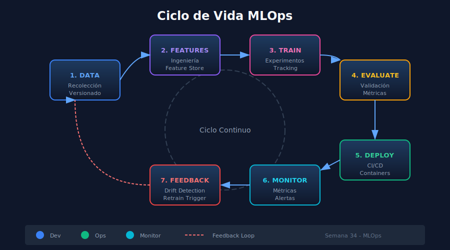

# 🚀 Introducción a MLOps

## 🎯 Objetivos de Aprendizaje

- Comprender qué es MLOps y por qué es esencial
- Conocer el ciclo de vida de modelos ML en producción
- Identificar los componentes clave de una infraestructura MLOps
- Entender los desafíos del deployment de modelos

---

## 1. ¿Qué es MLOps?

**MLOps** (Machine Learning Operations) es un conjunto de prácticas que combina Machine Learning, DevOps e Ingeniería de Datos para desplegar y mantener sistemas ML en producción de manera confiable y eficiente.

### 1.1 El Problema que Resuelve

```
┌─────────────────────────────────────────────────────────────┐
│                    SIN MLOps                                │
├─────────────────────────────────────────────────────────────┤
│  🔬 Data Scientist                    🖥️ Producción         │
│  ┌─────────────┐                     ┌─────────────┐       │
│  │  Jupyter    │    ❓ ¿Cómo?        │   Servidor  │       │
│  │  Notebook   │ ──────────────────▶ │   Web       │       │
│  │  model.pkl  │                     │             │       │
│  └─────────────┘                     └─────────────┘       │
│                                                             │
│  Problemas:                                                 │
│  • "Funciona en mi máquina"                                │
│  • Modelos no reproducibles                                │
│  • Sin monitoreo ni alertas                                │
│  • Actualizaciones manuales y riesgosas                    │
└─────────────────────────────────────────────────────────────┘
```

### 1.2 La Solución MLOps

```
┌─────────────────────────────────────────────────────────────┐
│                    CON MLOps                                │
├─────────────────────────────────────────────────────────────┤
│                                                             │
│  ┌──────┐   ┌──────┐   ┌──────┐   ┌──────┐   ┌──────┐     │
│  │ Data │──▶│Train │──▶│ Test │──▶│Deploy│──▶│Monitor│    │
│  └──────┘   └──────┘   └──────┘   └──────┘   └──────┘     │
│      │                                            │        │
│      └────────────────────────────────────────────┘        │
│                    Feedback Loop                           │
│                                                             │
│  Beneficios:                                               │
│  ✅ Reproducibilidad garantizada                           │
│  ✅ Deployment automatizado                                │
│  ✅ Monitoreo continuo                                     │
│  ✅ Rollback instantáneo                                   │
└─────────────────────────────────────────────────────────────┘
```

---

## 2. Ciclo de Vida MLOps



### 2.1 Fases del Ciclo

| Fase | Descripción | Herramientas |
|------|-------------|--------------|
| **1. Data** | Recolección, limpieza, versionado | DVC, Delta Lake |
| **2. Feature** | Ingeniería y almacén de features | Feast, Tecton |
| **3. Train** | Entrenamiento y experimentación | MLflow, W&B |
| **4. Evaluate** | Validación y métricas | pytest, Great Expectations |
| **5. Deploy** | Empaquetado y serving | Docker, FastAPI, K8s |
| **6. Monitor** | Observabilidad y alertas | Prometheus, Grafana |

### 2.2 Niveles de Madurez MLOps

```python
# Nivel 0: Manual
# - Notebooks en local
# - Deployment manual
# - Sin monitoreo

# Nivel 1: ML Pipeline
# - Pipeline automatizado
# - Entrenamiento reproducible
# - CI/CD básico

# Nivel 2: CI/CD ML
# - Automatización completa
# - A/B testing
# - Monitoreo avanzado

# Nivel 3: MLOps Completo
# - Auto-retraining
# - Feature store
# - Model governance
```

---

## 3. Componentes Clave

### 3.1 Model Serving

Exponer el modelo para que reciba predicciones:

```python
# Tipos de serving
serving_types = {
    "batch": "Predicciones en lotes programados",
    "online": "Predicciones en tiempo real via API",
    "streaming": "Predicciones sobre flujos de datos",
    "edge": "Predicciones en dispositivos locales"
}

# Esta semana nos enfocamos en Online Serving con FastAPI
```

### 3.2 Containerización

Empaquetar el modelo y sus dependencias:

```dockerfile
# Dockerfile simplificado
FROM python:3.11-slim
WORKDIR /app
COPY requirements.txt .
RUN pip install -r requirements.txt
COPY . .
CMD ["uvicorn", "main:app", "--host", "0.0.0.0"]
```

### 3.3 Monitoreo

Observar el comportamiento del modelo en producción:

```python
# Métricas clave a monitorear
monitoring_metrics = {
    # Métricas de infraestructura
    "latency_p99": "Tiempo de respuesta percentil 99",
    "requests_per_second": "Throughput del servicio",
    "error_rate": "Porcentaje de errores",
    
    # Métricas de modelo
    "prediction_distribution": "Distribución de predicciones",
    "feature_drift": "Cambios en datos de entrada",
    "model_accuracy": "Precisión en producción"
}
```

---

## 4. Stack Tecnológico de la Semana

### 4.1 Arquitectura de Referencia

```
┌─────────────────────────────────────────────────────────────┐
│                    ARQUITECTURA MLOPS                       │
├─────────────────────────────────────────────────────────────┤
│                                                             │
│   Cliente                    API Gateway                    │
│   ┌──────┐                  ┌──────────┐                   │
│   │ App  │ ──── HTTPS ────▶ │  Nginx   │                   │
│   └──────┘                  └────┬─────┘                   │
│                                  │                          │
│                                  ▼                          │
│   ┌─────────────────────────────────────────────────┐      │
│   │              Docker Container                    │      │
│   │  ┌─────────────────────────────────────────┐   │      │
│   │  │            FastAPI + Uvicorn             │   │      │
│   │  │  ┌─────────┐  ┌─────────┐  ┌─────────┐  │   │      │
│   │  │  │ /predict│  │ /health │  │/metrics │  │   │      │
│   │  │  └────┬────┘  └─────────┘  └────┬────┘  │   │      │
│   │  │       │                         │       │   │      │
│   │  │       ▼                         ▼       │   │      │
│   │  │  ┌─────────┐            ┌───────────┐  │   │      │
│   │  │  │  Model  │            │Prometheus │  │   │      │
│   │  │  │  .pkl   │            │  Client   │  │   │      │
│   │  │  └─────────┘            └───────────┘  │   │      │
│   │  └─────────────────────────────────────────┘   │      │
│   └─────────────────────────────────────────────────┘      │
│                                                             │
│   ┌─────────────┐         ┌─────────────────────────┐      │
│   │ Prometheus  │ ◀────── │ Scrape metrics          │      │
│   └──────┬──────┘         └─────────────────────────┘      │
│          │                                                  │
│          ▼                                                  │
│   ┌─────────────┐                                          │
│   │   Grafana   │  ──────▶  Dashboards y Alertas           │
│   └─────────────┘                                          │
└─────────────────────────────────────────────────────────────┘
```

### 4.2 Tecnologías que Aprenderemos

| Tecnología | Propósito | Por qué la usamos |
|------------|-----------|-------------------|
| **FastAPI** | API REST | Rápido, async, validación automática |
| **Pydantic** | Validación | Type hints, serialización |
| **Uvicorn** | Servidor ASGI | Alto rendimiento, async |
| **Docker** | Containerización | Portabilidad, reproducibilidad |
| **Docker Compose** | Orquestación local | Multi-contenedor fácil |
| **Prometheus** | Métricas | Estándar de la industria |
| **Grafana** | Dashboards | Visualización potente |

---

## 5. De Notebook a Producción

### 5.1 El Viaje del Modelo

```python
# === FASE 1: Desarrollo (Notebook) ===
# train_model.ipynb
import pandas as pd
from sklearn.ensemble import RandomForestClassifier
import joblib

# Entrenar
df = pd.read_csv('data.csv')
X, y = df.drop('target', axis=1), df['target']
model = RandomForestClassifier(n_estimators=100)
model.fit(X, y)

# Guardar
joblib.dump(model, 'model.pkl')


# === FASE 2: API (FastAPI) ===
# main.py
from fastapi import FastAPI
import joblib

app = FastAPI()
model = joblib.load('model.pkl')

@app.post("/predict")
def predict(features: dict):
    prediction = model.predict([list(features.values())])
    return {"prediction": int(prediction[0])}


# === FASE 3: Container (Docker) ===
# Dockerfile
# FROM python:3.11-slim
# COPY . /app
# RUN pip install -r requirements.txt
# CMD ["uvicorn", "main:app", "--host", "0.0.0.0"]


# === FASE 4: Producción (docker-compose) ===
# docker-compose.yml
# services:
#   api:
#     build: .
#     ports: ["8000:8000"]
#   prometheus:
#     image: prom/prometheus
#   grafana:
#     image: grafana/grafana
```

### 5.2 Checklist de Producción

```python
production_checklist = {
    "api": {
        "endpoints": ["/predict", "/health", "/metrics"],
        "validation": "Pydantic models",
        "documentation": "OpenAPI/Swagger automático",
        "error_handling": "Excepciones personalizadas"
    },
    "container": {
        "base_image": "python:3.11-slim",
        "multi_stage": "Reducir tamaño de imagen",
        "non_root": "Usuario sin privilegios",
        "health_check": "Docker HEALTHCHECK"
    },
    "monitoring": {
        "metrics": "Latencia, throughput, errores",
        "logging": "Estructurado (JSON)",
        "tracing": "Request IDs",
        "alerting": "Umbrales definidos"
    }
}
```

---

## 6. Patrones de Deployment

### 6.1 Estrategias Comunes

```
┌─────────────────────────────────────────────────────────────┐
│              ESTRATEGIAS DE DEPLOYMENT                      │
├─────────────────────────────────────────────────────────────┤
│                                                             │
│  1. RECREATE (Simple)                                       │
│     v1 ████████████ → ░░░░░░░░░░░░ → v2 ████████████       │
│     Downtime durante actualización                         │
│                                                             │
│  2. ROLLING UPDATE (Gradual)                               │
│     v1 ████████████ → v1 ████ v2 ████ → v2 ████████████    │
│     Sin downtime, actualización progresiva                 │
│                                                             │
│  3. BLUE-GREEN (Instantáneo)                               │
│     Blue (v1) ████ ──┐                                     │
│                      ├── Switch ──▶ Green (v2) ████        │
│     Green (v2) ████ ─┘                                     │
│     Rollback instantáneo posible                           │
│                                                             │
│  4. CANARY (Progresivo)                                    │
│     v1 ████████████ (90%) ──┐                              │
│                             ├── Monitorear                 │
│     v2 ██ (10%)  ───────────┘                              │
│     Detectar problemas con bajo impacto                    │
│                                                             │
└─────────────────────────────────────────────────────────────┘
```

### 6.2 Shadow Mode para ML

```python
# Shadow deployment: nueva versión en paralelo sin afectar usuarios
class ShadowPredictor:
    def __init__(self, primary_model, shadow_model):
        self.primary = primary_model
        self.shadow = shadow_model
    
    async def predict(self, features):
        # Predicción principal (la que se retorna)
        primary_result = self.primary.predict(features)
        
        # Predicción shadow (solo para comparar)
        shadow_result = self.shadow.predict(features)
        
        # Log para análisis posterior
        log_comparison(primary_result, shadow_result)
        
        return primary_result  # Solo retornamos la principal
```

---

## 7. Desafíos en Producción

### 7.1 Problemas Comunes

| Desafío | Descripción | Solución |
|---------|-------------|----------|
| **Data Drift** | Datos de entrada cambian | Monitoreo de distribución |
| **Model Decay** | Precisión degrada | Re-entrenamiento automático |
| **Latency** | Respuestas lentas | Optimización, caching |
| **Scalability** | Picos de tráfico | Auto-scaling, load balancing |
| **Versioning** | Múltiples versiones | Model registry |

### 7.2 Model Drift

```python
# Detectar drift en las predicciones
from scipy import stats

def detect_drift(baseline_predictions, current_predictions, threshold=0.05):
    """
    Detecta si hay drift significativo usando test KS.
    
    Args:
        baseline_predictions: Predicciones históricas (referencia)
        current_predictions: Predicciones recientes
        threshold: Nivel de significancia (p-value)
    
    Returns:
        bool: True si hay drift detectado
    """
    statistic, p_value = stats.ks_2samp(
        baseline_predictions, 
        current_predictions
    )
    
    drift_detected = p_value < threshold
    
    if drift_detected:
        print(f"⚠️ Drift detectado! p-value: {p_value:.4f}")
    
    return drift_detected
```

---

## 📚 Recursos Adicionales

### Documentación Oficial
- [MLOps Principles](https://ml-ops.org/)
- [Google MLOps Guide](https://cloud.google.com/architecture/mlops-continuous-delivery-and-automation-pipelines-in-machine-learning)

### Papers Fundamentales
- "Hidden Technical Debt in ML Systems" (Google, 2015)
- "Continuous Delivery for Machine Learning" (ThoughtWorks)

---

## ✅ Checklist de Verificación

Antes de continuar, asegúrate de entender:

- [ ] Qué es MLOps y por qué es necesario
- [ ] Las fases del ciclo de vida ML en producción
- [ ] Los componentes principales (serving, containers, monitoring)
- [ ] El stack tecnológico de la semana
- [ ] Los desafíos comunes en producción

---

## 🔗 Navegación

| Anterior | Índice | Siguiente |
|----------|--------|-----------|
| [README](../README.md) | [Semana 34](../README.md) | [FastAPI ML](02-fastapi-ml.md) |
