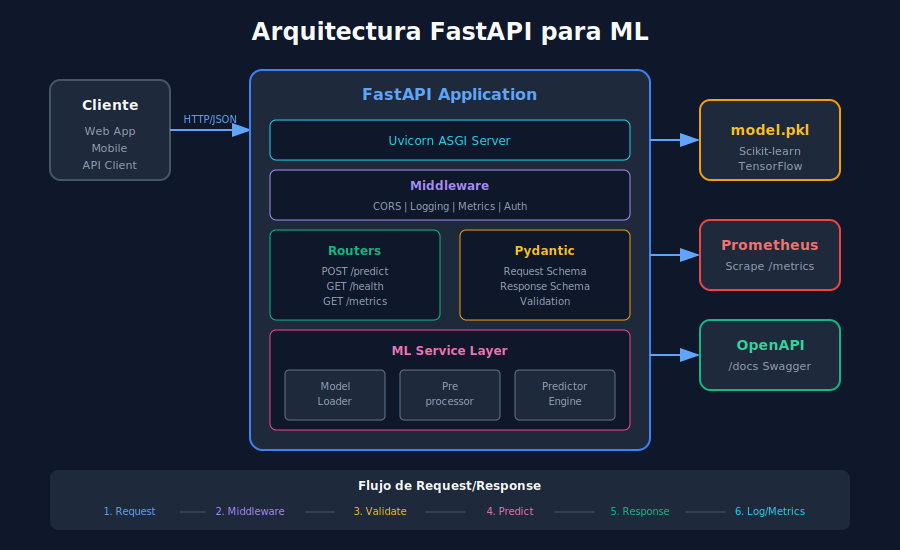

# ⚡ FastAPI para Machine Learning

## 🎯 Objetivos de Aprendizaje

- Crear APIs REST con FastAPI para servir modelos ML
- Implementar validación de datos con Pydantic
- Manejar errores y excepciones correctamente
- Documentar endpoints automáticamente con OpenAPI

---

## 1. Introducción a FastAPI

**FastAPI** es un framework web moderno y de alto rendimiento para construir APIs con Python, basado en type hints.

### 1.1 ¿Por qué FastAPI para ML?

| Característica | Beneficio para ML |
|----------------|-------------------|
| **Async nativo** | Manejo eficiente de múltiples requests |
| **Validación automática** | Datos de entrada siempre correctos |
| **Documentación auto-generada** | Swagger UI incluido |
| **Type hints** | Detección de errores temprana |
| **Alto rendimiento** | Similar a Node.js y Go |

### 1.2 Arquitectura de una API ML



```python
# Estructura típica de proyecto
"""
ml-api/
├── app/
│   ├── __init__.py
│   ├── main.py           # Punto de entrada FastAPI
│   ├── models/
│   │   ├── __init__.py
│   │   └── schemas.py    # Pydantic models
│   ├── routers/
│   │   ├── __init__.py
│   │   └── predict.py    # Endpoints de predicción
│   ├── services/
│   │   ├── __init__.py
│   │   └── ml_model.py   # Lógica del modelo
│   └── utils/
│       ├── __init__.py
│       └── logger.py     # Logging configurado
├── models/
│   └── model.pkl         # Modelo entrenado
├── tests/
│   └── test_api.py
├── requirements.txt
└── Dockerfile
"""
```

---

## 2. Fundamentos de FastAPI

### 2.1 Hello World

```python
# main.py
from fastapi import FastAPI

# Crear instancia de la aplicación
app = FastAPI(
    title="ML API",
    description="API para predicciones de Machine Learning",
    version="1.0.0"
)

# Endpoint básico
@app.get("/")
def root():
    """Endpoint raíz - verificación de que la API está activa."""
    return {"message": "ML API is running", "status": "healthy"}

# Health check
@app.get("/health")
def health_check():
    """Health check para load balancers y monitoring."""
    return {"status": "ok"}
```

### 2.2 Ejecutar con Uvicorn

```bash
# Desarrollo (con reload automático)
uvicorn app.main:app --reload --host 0.0.0.0 --port 8000

# Producción
uvicorn app.main:app --host 0.0.0.0 --port 8000 --workers 4
```

### 2.3 Documentación Automática

```python
# FastAPI genera automáticamente:
# - Swagger UI: http://localhost:8000/docs
# - ReDoc: http://localhost:8000/redoc
# - OpenAPI JSON: http://localhost:8000/openapi.json

# Personalizar documentación
app = FastAPI(
    title="Iris Classifier API",
    description="""
    ## API de Clasificación de Flores Iris
    
    Esta API permite clasificar flores Iris basándose en sus características:
    - Sepal length (cm)
    - Sepal width (cm)
    - Petal length (cm)
    - Petal width (cm)
    
    ### Endpoints disponibles:
    - `/predict` - Realizar predicción
    - `/health` - Estado del servicio
    - `/metrics` - Métricas Prometheus
    """,
    version="1.0.0",
    contact={
        "name": "ML Team",
        "email": "ml-team@example.com"
    }
)
```

---

## 3. Validación con Pydantic

### 3.1 Modelos de Entrada

```python
# schemas.py
from pydantic import BaseModel, Field, field_validator
from typing import List, Optional
from enum import Enum

class IrisSpecies(str, Enum):
    """Especies posibles de Iris."""
    SETOSA = "setosa"
    VERSICOLOR = "versicolor"
    VIRGINICA = "virginica"

class IrisFeatures(BaseModel):
    """Features de entrada para predicción de Iris."""
    
    sepal_length: float = Field(
        ...,  # Requerido
        gt=0,  # Mayor que 0
        lt=10,  # Menor que 10
        description="Longitud del sépalo en cm",
        examples=[5.1]
    )
    sepal_width: float = Field(
        ...,
        gt=0,
        lt=10,
        description="Ancho del sépalo en cm",
        examples=[3.5]
    )
    petal_length: float = Field(
        ...,
        gt=0,
        lt=10,
        description="Longitud del pétalo en cm",
        examples=[1.4]
    )
    petal_width: float = Field(
        ...,
        gt=0,
        lt=10,
        description="Ancho del pétalo en cm",
        examples=[0.2]
    )
    
    @field_validator('sepal_length', 'sepal_width', 'petal_length', 'petal_width')
    @classmethod
    def check_positive(cls, v: float, info) -> float:
        """Validar que los valores sean positivos."""
        if v <= 0:
            raise ValueError(f'{info.field_name} debe ser positivo')
        return round(v, 2)  # Redondear a 2 decimales
    
    model_config = {
        "json_schema_extra": {
            "examples": [
                {
                    "sepal_length": 5.1,
                    "sepal_width": 3.5,
                    "petal_length": 1.4,
                    "petal_width": 0.2
                }
            ]
        }
    }
```

### 3.2 Modelos de Respuesta

```python
# schemas.py (continuación)
from datetime import datetime

class PredictionResponse(BaseModel):
    """Respuesta de predicción."""
    
    prediction: IrisSpecies = Field(
        ...,
        description="Especie predicha"
    )
    confidence: float = Field(
        ...,
        ge=0,
        le=1,
        description="Confianza de la predicción (0-1)"
    )
    probabilities: dict[str, float] = Field(
        ...,
        description="Probabilidades por clase"
    )
    model_version: str = Field(
        default="1.0.0",
        description="Versión del modelo"
    )
    timestamp: datetime = Field(
        default_factory=datetime.utcnow,
        description="Timestamp de la predicción"
    )
    
    model_config = {
        "json_schema_extra": {
            "examples": [
                {
                    "prediction": "setosa",
                    "confidence": 0.95,
                    "probabilities": {
                        "setosa": 0.95,
                        "versicolor": 0.03,
                        "virginica": 0.02
                    },
                    "model_version": "1.0.0",
                    "timestamp": "2024-01-15T10:30:00Z"
                }
            ]
        }
    }

class BatchPredictionRequest(BaseModel):
    """Request para predicción en lote."""
    
    instances: List[IrisFeatures] = Field(
        ...,
        min_length=1,
        max_length=100,
        description="Lista de instancias a predecir (máx 100)"
    )

class BatchPredictionResponse(BaseModel):
    """Respuesta de predicción en lote."""
    
    predictions: List[PredictionResponse]
    total_instances: int
    processing_time_ms: float
```

---

## 4. Servir Modelos ML

### 4.1 Cargar Modelo al Inicio

```python
# ml_model.py
import joblib
import numpy as np
from pathlib import Path
from typing import List, Tuple
import logging

logger = logging.getLogger(__name__)

class MLModel:
    """Wrapper para el modelo de Machine Learning."""
    
    def __init__(self, model_path: str = "models/model.pkl"):
        self.model = None
        self.model_path = Path(model_path)
        self.version = "1.0.0"
        self.classes = ["setosa", "versicolor", "virginica"]
        
    def load(self) -> None:
        """Cargar modelo desde disco."""
        if not self.model_path.exists():
            raise FileNotFoundError(f"Modelo no encontrado: {self.model_path}")
        
        logger.info(f"Cargando modelo desde {self.model_path}")
        self.model = joblib.load(self.model_path)
        logger.info("Modelo cargado exitosamente")
    
    def predict(self, features: List[float]) -> Tuple[str, float, dict]:
        """
        Realizar predicción.
        
        Args:
            features: Lista de features [sepal_l, sepal_w, petal_l, petal_w]
            
        Returns:
            Tuple con (predicción, confianza, probabilidades)
        """
        if self.model is None:
            raise RuntimeError("Modelo no cargado")
        
        # Convertir a array 2D
        X = np.array(features).reshape(1, -1)
        
        # Predicción
        prediction_idx = self.model.predict(X)[0]
        prediction = self.classes[prediction_idx]
        
        # Probabilidades
        probabilities = self.model.predict_proba(X)[0]
        prob_dict = {
            cls: float(prob) 
            for cls, prob in zip(self.classes, probabilities)
        }
        
        # Confianza (probabilidad máxima)
        confidence = float(max(probabilities))
        
        return prediction, confidence, prob_dict
    
    def predict_batch(self, batch: List[List[float]]) -> List[Tuple[str, float, dict]]:
        """Predicción en lote."""
        return [self.predict(features) for features in batch]

# Singleton del modelo
ml_model = MLModel()
```

### 4.2 Eventos de Ciclo de Vida

```python
# main.py
from fastapi import FastAPI
from contextlib import asynccontextmanager
from app.services.ml_model import ml_model
import logging

logging.basicConfig(level=logging.INFO)
logger = logging.getLogger(__name__)

@asynccontextmanager
async def lifespan(app: FastAPI):
    """Manejar startup y shutdown de la aplicación."""
    # === STARTUP ===
    logger.info("Iniciando aplicación...")
    
    # Cargar modelo ML
    try:
        ml_model.load()
        logger.info("✅ Modelo ML cargado")
    except Exception as e:
        logger.error(f"❌ Error cargando modelo: {e}")
        raise
    
    yield  # La aplicación está corriendo
    
    # === SHUTDOWN ===
    logger.info("Apagando aplicación...")
    # Limpiar recursos si es necesario

app = FastAPI(
    title="ML API",
    lifespan=lifespan
)
```

### 4.3 Endpoint de Predicción

```python
# routers/predict.py
from fastapi import APIRouter, HTTPException, status
from app.models.schemas import (
    IrisFeatures, 
    PredictionResponse,
    BatchPredictionRequest,
    BatchPredictionResponse
)
from app.services.ml_model import ml_model
import time
import logging

router = APIRouter(prefix="/api/v1", tags=["predictions"])
logger = logging.getLogger(__name__)

@router.post(
    "/predict",
    response_model=PredictionResponse,
    summary="Realizar predicción",
    description="Predice la especie de Iris basándose en las características"
)
async def predict(features: IrisFeatures) -> PredictionResponse:
    """
    Endpoint de predicción individual.
    
    - **sepal_length**: Longitud del sépalo (cm)
    - **sepal_width**: Ancho del sépalo (cm)
    - **petal_length**: Longitud del pétalo (cm)
    - **petal_width**: Ancho del pétalo (cm)
    """
    try:
        # Convertir a lista de features
        feature_list = [
            features.sepal_length,
            features.sepal_width,
            features.petal_length,
            features.petal_width
        ]
        
        # Realizar predicción
        prediction, confidence, probabilities = ml_model.predict(feature_list)
        
        logger.info(f"Predicción: {prediction} (confianza: {confidence:.2f})")
        
        return PredictionResponse(
            prediction=prediction,
            confidence=confidence,
            probabilities=probabilities,
            model_version=ml_model.version
        )
        
    except Exception as e:
        logger.error(f"Error en predicción: {e}")
        raise HTTPException(
            status_code=status.HTTP_500_INTERNAL_SERVER_ERROR,
            detail=f"Error procesando predicción: {str(e)}"
        )

@router.post(
    "/predict/batch",
    response_model=BatchPredictionResponse,
    summary="Predicción en lote"
)
async def predict_batch(request: BatchPredictionRequest) -> BatchPredictionResponse:
    """Endpoint para predicciones múltiples."""
    start_time = time.time()
    
    predictions = []
    for instance in request.instances:
        feature_list = [
            instance.sepal_length,
            instance.sepal_width,
            instance.petal_length,
            instance.petal_width
        ]
        pred, conf, probs = ml_model.predict(feature_list)
        predictions.append(PredictionResponse(
            prediction=pred,
            confidence=conf,
            probabilities=probs,
            model_version=ml_model.version
        ))
    
    processing_time = (time.time() - start_time) * 1000
    
    return BatchPredictionResponse(
        predictions=predictions,
        total_instances=len(predictions),
        processing_time_ms=round(processing_time, 2)
    )
```

---

## 5. Manejo de Errores

### 5.1 Excepciones Personalizadas

```python
# exceptions.py
from fastapi import HTTPException, status

class ModelNotLoadedError(Exception):
    """El modelo no está cargado."""
    pass

class InvalidFeaturesError(Exception):
    """Features de entrada inválidas."""
    pass

class PredictionError(Exception):
    """Error durante la predicción."""
    pass

# handlers.py
from fastapi import Request
from fastapi.responses import JSONResponse
import logging

logger = logging.getLogger(__name__)

async def model_not_loaded_handler(request: Request, exc: ModelNotLoadedError):
    """Handler para modelo no cargado."""
    logger.error(f"Modelo no cargado: {exc}")
    return JSONResponse(
        status_code=status.HTTP_503_SERVICE_UNAVAILABLE,
        content={
            "error": "service_unavailable",
            "message": "El modelo no está disponible",
            "detail": str(exc)
        }
    )

async def invalid_features_handler(request: Request, exc: InvalidFeaturesError):
    """Handler para features inválidas."""
    logger.warning(f"Features inválidas: {exc}")
    return JSONResponse(
        status_code=status.HTTP_422_UNPROCESSABLE_ENTITY,
        content={
            "error": "invalid_features",
            "message": "Las características proporcionadas son inválidas",
            "detail": str(exc)
        }
    )

# Registrar handlers en main.py
# app.add_exception_handler(ModelNotLoadedError, model_not_loaded_handler)
# app.add_exception_handler(InvalidFeaturesError, invalid_features_handler)
```

### 5.2 Respuestas de Error Estandarizadas

```python
# schemas.py
class ErrorResponse(BaseModel):
    """Modelo estándar de respuesta de error."""
    
    error: str = Field(..., description="Código de error")
    message: str = Field(..., description="Mensaje legible")
    detail: Optional[str] = Field(None, description="Detalles adicionales")
    timestamp: datetime = Field(default_factory=datetime.utcnow)
    path: Optional[str] = Field(None, description="Path del request")
    
    model_config = {
        "json_schema_extra": {
            "examples": [
                {
                    "error": "validation_error",
                    "message": "Error de validación en los datos",
                    "detail": "sepal_length debe ser mayor que 0",
                    "timestamp": "2024-01-15T10:30:00Z",
                    "path": "/api/v1/predict"
                }
            ]
        }
    }
```

---

## 6. Configuración y Variables de Entorno

### 6.1 Settings con Pydantic

```python
# config.py
from pydantic_settings import BaseSettings
from pydantic import Field
from functools import lru_cache

class Settings(BaseSettings):
    """Configuración de la aplicación."""
    
    # API
    app_name: str = "ML API"
    app_version: str = "1.0.0"
    debug: bool = False
    
    # Server
    host: str = "0.0.0.0"
    port: int = 8000
    workers: int = 4
    
    # Model
    model_path: str = "models/model.pkl"
    model_version: str = "1.0.0"
    
    # Logging
    log_level: str = "INFO"
    
    # CORS
    allowed_origins: list[str] = ["*"]
    
    model_config = {
        "env_file": ".env",
        "env_file_encoding": "utf-8"
    }

@lru_cache()
def get_settings() -> Settings:
    """Obtener settings (cached)."""
    return Settings()
```

### 6.2 Archivo .env

```bash
# .env
APP_NAME="Iris Classifier API"
APP_VERSION="1.0.0"
DEBUG=false

HOST=0.0.0.0
PORT=8000
WORKERS=4

MODEL_PATH=models/model.pkl
MODEL_VERSION=1.0.0

LOG_LEVEL=INFO

ALLOWED_ORIGINS=["http://localhost:3000","https://myapp.com"]
```

### 6.3 Usar Settings en la Aplicación

```python
# main.py
from app.config import get_settings

settings = get_settings()

app = FastAPI(
    title=settings.app_name,
    version=settings.app_version,
    debug=settings.debug
)

# Usar en cualquier parte
@app.get("/info")
def get_info():
    settings = get_settings()
    return {
        "app_name": settings.app_name,
        "version": settings.app_version,
        "model_version": settings.model_version
    }
```

---

## 7. Testing de APIs

### 7.1 Tests con pytest

```python
# tests/test_api.py
import pytest
from fastapi.testclient import TestClient
from app.main import app

client = TestClient(app)

class TestHealthEndpoints:
    """Tests para endpoints de salud."""
    
    def test_root(self):
        """Test endpoint raíz."""
        response = client.get("/")
        assert response.status_code == 200
        assert "status" in response.json()
    
    def test_health(self):
        """Test health check."""
        response = client.get("/health")
        assert response.status_code == 200
        assert response.json()["status"] == "ok"

class TestPredictionEndpoints:
    """Tests para endpoints de predicción."""
    
    def test_predict_valid_input(self):
        """Test predicción con entrada válida."""
        payload = {
            "sepal_length": 5.1,
            "sepal_width": 3.5,
            "petal_length": 1.4,
            "petal_width": 0.2
        }
        response = client.post("/api/v1/predict", json=payload)
        assert response.status_code == 200
        
        data = response.json()
        assert "prediction" in data
        assert "confidence" in data
        assert data["prediction"] in ["setosa", "versicolor", "virginica"]
        assert 0 <= data["confidence"] <= 1
    
    def test_predict_invalid_input(self):
        """Test predicción con entrada inválida."""
        payload = {
            "sepal_length": -1,  # Valor negativo
            "sepal_width": 3.5,
            "petal_length": 1.4,
            "petal_width": 0.2
        }
        response = client.post("/api/v1/predict", json=payload)
        assert response.status_code == 422  # Validation error
    
    def test_predict_missing_fields(self):
        """Test predicción con campos faltantes."""
        payload = {
            "sepal_length": 5.1
            # Faltan otros campos
        }
        response = client.post("/api/v1/predict", json=payload)
        assert response.status_code == 422

class TestBatchPrediction:
    """Tests para predicción en lote."""
    
    def test_batch_predict(self):
        """Test predicción en lote."""
        payload = {
            "instances": [
                {"sepal_length": 5.1, "sepal_width": 3.5, "petal_length": 1.4, "petal_width": 0.2},
                {"sepal_length": 6.2, "sepal_width": 2.9, "petal_length": 4.3, "petal_width": 1.3}
            ]
        }
        response = client.post("/api/v1/predict/batch", json=payload)
        assert response.status_code == 200
        
        data = response.json()
        assert data["total_instances"] == 2
        assert len(data["predictions"]) == 2
```

### 7.2 Ejecutar Tests

```bash
# Ejecutar todos los tests
pytest tests/ -v

# Con coverage
pytest tests/ -v --cov=app --cov-report=html

# Solo tests específicos
pytest tests/test_api.py::TestPredictionEndpoints -v
```

---

## 8. Ejemplo Completo

### 8.1 main.py Final

```python
# app/main.py
from fastapi import FastAPI
from fastapi.middleware.cors import CORSMiddleware
from contextlib import asynccontextmanager
import logging

from app.config import get_settings
from app.services.ml_model import ml_model
from app.routers import predict

# Configurar logging
logging.basicConfig(
    level=logging.INFO,
    format='%(asctime)s - %(name)s - %(levelname)s - %(message)s'
)
logger = logging.getLogger(__name__)

settings = get_settings()

@asynccontextmanager
async def lifespan(app: FastAPI):
    """Lifecycle manager."""
    logger.info("🚀 Iniciando ML API...")
    ml_model.load()
    logger.info("✅ Modelo cargado correctamente")
    yield
    logger.info("👋 Apagando ML API...")

app = FastAPI(
    title=settings.app_name,
    version=settings.app_version,
    lifespan=lifespan
)

# CORS
app.add_middleware(
    CORSMiddleware,
    allow_origins=settings.allowed_origins,
    allow_credentials=True,
    allow_methods=["*"],
    allow_headers=["*"],
)

# Routers
app.include_router(predict.router)

@app.get("/")
def root():
    return {"message": f"{settings.app_name} is running", "version": settings.app_version}

@app.get("/health")
def health():
    return {"status": "ok", "model_loaded": ml_model.model is not None}
```

---

## 📚 Recursos Adicionales

- [FastAPI Documentation](https://fastapi.tiangolo.com/)
- [Pydantic Documentation](https://docs.pydantic.dev/)
- [Uvicorn Documentation](https://www.uvicorn.org/)

---

## ✅ Checklist de Verificación

- [ ] Crear aplicación FastAPI básica
- [ ] Definir modelos Pydantic para request/response
- [ ] Implementar endpoint de predicción
- [ ] Manejar errores correctamente
- [ ] Configurar variables de entorno
- [ ] Escribir tests básicos

---

## 🔗 Navegación

| Anterior | Índice | Siguiente |
|----------|--------|-----------|
| [Introducción MLOps](01-introduccion-mlops.md) | [Semana 34](../README.md) | [Docker](03-docker-containerization.md) |
