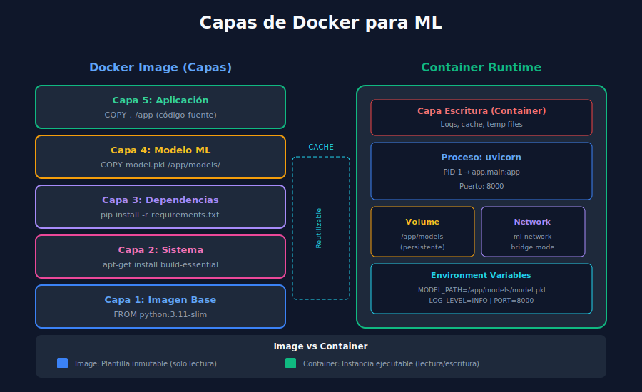

# 🐳 Docker para Machine Learning

## 🎯 Objetivos de Aprendizaje

- Comprender los conceptos fundamentales de Docker
- Crear Dockerfiles optimizados para aplicaciones ML
- Usar Docker Compose para orquestar servicios
- Implementar buenas prácticas de containerización

---

## 1. Introducción a Docker

**Docker** permite empaquetar aplicaciones con todas sus dependencias en contenedores portables y reproducibles.

### 1.1 ¿Por qué Docker para ML?

| Problema | Solución Docker |
|----------|-----------------|
| "Funciona en mi máquina" | Entorno idéntico en todas partes |
| Dependencias conflictivas | Aislamiento de librerías |
| Setup complejo | Un comando para todo |
| Escalabilidad | Múltiples réplicas fáciles |

### 1.2 Conceptos Clave



```
┌─────────────────────────────────────────────────────────────┐
│                    CONCEPTOS DOCKER                         │
├─────────────────────────────────────────────────────────────┤
│                                                             │
│  IMAGE (Plantilla)              CONTAINER (Instancia)       │
│  ┌─────────────────┐           ┌─────────────────┐         │
│  │ python:3.11     │  ──run──▶ │ ml-api-1        │         │
│  │ + requirements  │           │ (proceso vivo)  │         │
│  │ + app code      │           └─────────────────┘         │
│  │ + model.pkl     │           ┌─────────────────┐         │
│  └─────────────────┘  ──run──▶ │ ml-api-2        │         │
│                                │ (proceso vivo)  │         │
│  Solo lectura                  └─────────────────┘         │
│                                Lectura/Escritura           │
│                                                             │
│  DOCKERFILE                    DOCKER COMPOSE              │
│  ┌─────────────────┐           ┌─────────────────┐         │
│  │ Instrucciones   │           │ Orquestación    │         │
│  │ para crear      │           │ multi-container │         │
│  │ una imagen      │           │ (api+db+redis)  │         │
│  └─────────────────┘           └─────────────────┘         │
│                                                             │
└─────────────────────────────────────────────────────────────┘
```

---

## 2. Dockerfile Básico

### 2.1 Estructura de un Dockerfile

```dockerfile
# Dockerfile

# === BASE IMAGE ===
# Usar imagen slim para menor tamaño
FROM python:3.11-slim

# === METADATA ===
LABEL maintainer="ml-team@example.com"
LABEL version="1.0.0"
LABEL description="ML API for Iris classification"

# === ENVIRONMENT VARIABLES ===
ENV PYTHONDONTWRITEBYTECODE=1 \
    PYTHONUNBUFFERED=1 \
    PIP_NO_CACHE_DIR=1 \
    PIP_DISABLE_PIP_VERSION_CHECK=1

# === WORKING DIRECTORY ===
WORKDIR /app

# === INSTALL DEPENDENCIES ===
# Copiar solo requirements primero (cache de Docker)
COPY requirements.txt .
RUN pip install --no-cache-dir -r requirements.txt

# === COPY APPLICATION ===
COPY . .

# === EXPOSE PORT ===
EXPOSE 8000

# === HEALTH CHECK ===
HEALTHCHECK --interval=30s --timeout=10s --start-period=5s --retries=3 \
    CMD curl -f http://localhost:8000/health || exit 1

# === RUN COMMAND ===
CMD ["uvicorn", "app.main:app", "--host", "0.0.0.0", "--port", "8000"]
```

### 2.2 Comandos Docker Básicos

```bash
# Construir imagen
docker build -t ml-api:1.0.0 .

# Listar imágenes
docker images

# Ejecutar contenedor
docker run -d -p 8000:8000 --name ml-api ml-api:1.0.0

# Ver contenedores activos
docker ps

# Ver logs
docker logs ml-api

# Ejecutar comando dentro del contenedor
docker exec -it ml-api bash

# Detener contenedor
docker stop ml-api

# Eliminar contenedor
docker rm ml-api

# Eliminar imagen
docker rmi ml-api:1.0.0
```

---

## 3. Dockerfile Optimizado para ML

### 3.1 Multi-Stage Build

```dockerfile
# Dockerfile.multistage

# ============================================
# STAGE 1: Builder
# ============================================
FROM python:3.11-slim as builder

WORKDIR /app

# Instalar dependencias de compilación
RUN apt-get update && apt-get install -y --no-install-recommends \
    build-essential \
    && rm -rf /var/lib/apt/lists/*

# Crear virtualenv
RUN python -m venv /opt/venv
ENV PATH="/opt/venv/bin:$PATH"

# Instalar dependencias Python
COPY requirements.txt .
RUN pip install --no-cache-dir -r requirements.txt


# ============================================
# STAGE 2: Production
# ============================================
FROM python:3.11-slim as production

# Crear usuario no-root
RUN groupadd -r appgroup && useradd -r -g appgroup appuser

WORKDIR /app

# Copiar virtualenv desde builder
COPY --from=builder /opt/venv /opt/venv
ENV PATH="/opt/venv/bin:$PATH"

# Copiar aplicación
COPY --chown=appuser:appgroup . .

# Cambiar a usuario no-root
USER appuser

EXPOSE 8000

HEALTHCHECK --interval=30s --timeout=10s --start-period=5s --retries=3 \
    CMD python -c "import urllib.request; urllib.request.urlopen('http://localhost:8000/health')" || exit 1

CMD ["uvicorn", "app.main:app", "--host", "0.0.0.0", "--port", "8000"]
```

### 3.2 Comparación de Tamaños

```bash
# Sin optimización
python:3.11          # ~1.0 GB
+ dependencias ML    # +500 MB
= Total: ~1.5 GB

# Con optimización (slim + multi-stage)
python:3.11-slim     # ~150 MB
+ dependencias ML    # +300 MB (sin cache)
= Total: ~450 MB

# Reducción: ~70%
```

### 3.3 .dockerignore

```dockerignore
# .dockerignore

# Git
.git
.gitignore

# Python
__pycache__
*.py[cod]
*$py.class
*.so
.Python
.venv
venv/
ENV/

# IDE
.idea
.vscode
*.swp
*.swo

# Tests
tests/
pytest.ini
.pytest_cache
.coverage
htmlcov/

# Docs
docs/
*.md
!README.md

# Docker
Dockerfile*
docker-compose*
.docker

# Misc
.env.local
*.log
tmp/
```

---

## 4. Docker Compose

### 4.1 Archivo Básico

```yaml
# docker-compose.yml
version: '3.8'

services:
  # === ML API ===
  api:
    build:
      context: .
      dockerfile: Dockerfile
    container_name: ml-api
    ports:
      - "8000:8000"
    environment:
      - APP_NAME=ML API
      - LOG_LEVEL=INFO
      - MODEL_PATH=/app/models/model.pkl
    volumes:
      - ./models:/app/models:ro  # Read-only
    healthcheck:
      test: ["CMD", "curl", "-f", "http://localhost:8000/health"]
      interval: 30s
      timeout: 10s
      retries: 3
      start_period: 10s
    restart: unless-stopped
    networks:
      - ml-network

networks:
  ml-network:
    driver: bridge
```

### 4.2 Stack Completo con Monitoreo

```yaml
# docker-compose.full.yml
version: '3.8'

services:
  # === ML API ===
  api:
    build:
      context: .
      dockerfile: Dockerfile
    container_name: ml-api
    ports:
      - "8000:8000"
    environment:
      - APP_NAME=ML API
      - LOG_LEVEL=INFO
    volumes:
      - ./models:/app/models:ro
    depends_on:
      - prometheus
    networks:
      - ml-network
    deploy:
      resources:
        limits:
          cpus: '1.0'
          memory: 512M
        reservations:
          cpus: '0.5'
          memory: 256M

  # === PROMETHEUS ===
  prometheus:
    image: prom/prometheus:v2.47.0
    container_name: prometheus
    ports:
      - "9090:9090"
    volumes:
      - ./monitoring/prometheus.yml:/etc/prometheus/prometheus.yml:ro
      - prometheus-data:/prometheus
    command:
      - '--config.file=/etc/prometheus/prometheus.yml'
      - '--storage.tsdb.path=/prometheus'
      - '--web.enable-lifecycle'
    networks:
      - ml-network

  # === GRAFANA ===
  grafana:
    image: grafana/grafana:10.1.0
    container_name: grafana
    ports:
      - "3000:3000"
    environment:
      - GF_SECURITY_ADMIN_USER=admin
      - GF_SECURITY_ADMIN_PASSWORD=admin123
      - GF_USERS_ALLOW_SIGN_UP=false
    volumes:
      - ./monitoring/grafana/provisioning:/etc/grafana/provisioning:ro
      - grafana-data:/var/lib/grafana
    depends_on:
      - prometheus
    networks:
      - ml-network

volumes:
  prometheus-data:
  grafana-data:

networks:
  ml-network:
    driver: bridge
```

### 4.3 Comandos Docker Compose

```bash
# Construir e iniciar servicios
docker compose up --build

# Iniciar en background
docker compose up -d

# Ver logs de todos los servicios
docker compose logs -f

# Ver logs de un servicio específico
docker compose logs -f api

# Detener servicios
docker compose down

# Detener y eliminar volúmenes
docker compose down -v

# Reconstruir un servicio específico
docker compose up --build api

# Escalar servicio (múltiples réplicas)
docker compose up -d --scale api=3

# Ver estado de servicios
docker compose ps

# Ejecutar comando en servicio
docker compose exec api bash
```

---

## 5. Volúmenes y Persistencia

### 5.1 Tipos de Volúmenes

```yaml
services:
  api:
    volumes:
      # 1. Bind Mount (desarrollo)
      - ./src:/app/src              # Host -> Container
      
      # 2. Named Volume (persistencia)
      - model-cache:/app/cache      # Docker managed
      
      # 3. Read-only (seguridad)
      - ./models:/app/models:ro     # Solo lectura
      
      # 4. tmpfs (memoria, temporal)
      - type: tmpfs
        target: /app/tmp

volumes:
  model-cache:
```

### 5.2 Uso para Modelos ML

```yaml
# Estrategia para modelos grandes
services:
  api:
    volumes:
      # Modelos compartidos entre contenedores
      - ml-models:/app/models:ro
      
      # Cache de predicciones
      - prediction-cache:/app/cache
      
      # Logs persistentes
      - ./logs:/app/logs

volumes:
  ml-models:
    driver: local
    driver_opts:
      type: none
      o: bind
      device: /data/ml-models  # Path en el host
  
  prediction-cache:
```

---

## 6. Variables de Entorno

### 6.1 Archivo .env

```bash
# .env
# API Configuration
APP_NAME=ML Classifier API
APP_VERSION=1.0.0
DEBUG=false

# Server
HOST=0.0.0.0
PORT=8000
WORKERS=4

# Model
MODEL_PATH=/app/models/model.pkl
MODEL_VERSION=1.0.0

# Monitoring
PROMETHEUS_PORT=9090
GRAFANA_PORT=3000
GRAFANA_ADMIN_PASSWORD=secure_password_here

# Logging
LOG_LEVEL=INFO
LOG_FORMAT=json
```

### 6.2 Usar en Docker Compose

```yaml
# docker-compose.yml
version: '3.8'

services:
  api:
    build: .
    env_file:
      - .env
    environment:
      # Override específicos
      - DEBUG=true
      - LOG_LEVEL=DEBUG
```

### 6.3 Múltiples Entornos

```bash
# Desarrollo
docker compose --env-file .env.development up

# Producción
docker compose --env-file .env.production up

# Staging
docker compose --env-file .env.staging up
```

---

## 7. Networking

### 7.1 Redes Docker

```yaml
version: '3.8'

services:
  api:
    networks:
      - frontend   # Expuesto al exterior
      - backend    # Comunicación interna
  
  prometheus:
    networks:
      - backend    # Solo interno
  
  grafana:
    networks:
      - frontend
      - backend

networks:
  frontend:
    driver: bridge
  backend:
    driver: bridge
    internal: true  # No acceso a internet
```

### 7.2 Comunicación entre Servicios

```python
# Dentro de Docker, usar nombres de servicio como hostname
import httpx

# Desde el servicio 'api' hacia 'prometheus'
async def get_metrics():
    async with httpx.AsyncClient() as client:
        # 'prometheus' es el nombre del servicio en docker-compose
        response = await client.get("http://prometheus:9090/api/v1/query")
        return response.json()
```

---

## 8. Buenas Prácticas

### 8.1 Seguridad

```dockerfile
# 1. Usuario no-root
RUN groupadd -r appgroup && useradd -r -g appgroup appuser
USER appuser

# 2. No almacenar secretos en la imagen
# MAL:
# ENV DATABASE_PASSWORD=secret123

# BIEN: usar secrets de Docker o variables en runtime

# 3. Imagen mínima
FROM python:3.11-slim  # No usar :latest

# 4. Escanear vulnerabilidades
# docker scan ml-api:1.0.0
```

### 8.2 Optimización de Cache

```dockerfile
# Orden de instrucciones importa para cache

# 1. Instrucciones que cambian poco (arriba)
FROM python:3.11-slim
WORKDIR /app

# 2. Dependencias (cambian ocasionalmente)
COPY requirements.txt .
RUN pip install -r requirements.txt

# 3. Código fuente (cambia frecuentemente)
COPY . .

# Si cambias código, solo se reconstruye desde COPY . .
# Las dependencias se mantienen en cache
```

### 8.3 Logging Estructurado

```python
# config/logging.py
import logging
import json
from datetime import datetime

class JsonFormatter(logging.Formatter):
    """Formatter para logs en JSON (mejor para Docker/K8s)."""
    
    def format(self, record):
        log_entry = {
            "timestamp": datetime.utcnow().isoformat(),
            "level": record.levelname,
            "logger": record.name,
            "message": record.getMessage(),
            "module": record.module,
            "function": record.funcName,
            "line": record.lineno
        }
        
        if record.exc_info:
            log_entry["exception"] = self.formatException(record.exc_info)
        
        return json.dumps(log_entry)

# Configurar logging
def setup_logging():
    handler = logging.StreamHandler()
    handler.setFormatter(JsonFormatter())
    
    logging.root.handlers = [handler]
    logging.root.setLevel(logging.INFO)
```

---

## 9. Debugging en Docker

### 9.1 Comandos Útiles

```bash
# Ver logs en tiempo real
docker logs -f ml-api

# Inspeccionar contenedor
docker inspect ml-api

# Ver uso de recursos
docker stats ml-api

# Ejecutar shell interactivo
docker exec -it ml-api bash

# Copiar archivos desde/hacia contenedor
docker cp ml-api:/app/logs/app.log ./debug/
docker cp ./debug/test_data.json ml-api:/app/data/

# Ver procesos dentro del contenedor
docker top ml-api
```

### 9.2 Debug Mode en Compose

```yaml
# docker-compose.debug.yml
version: '3.8'

services:
  api:
    build:
      context: .
      dockerfile: Dockerfile
    environment:
      - DEBUG=true
      - LOG_LEVEL=DEBUG
    volumes:
      # Mount código fuente para hot-reload
      - ./app:/app/app
    command: uvicorn app.main:app --reload --host 0.0.0.0 --port 8000
    ports:
      - "8000:8000"
      - "5678:5678"  # Debugger port
```

---

## 📚 Recursos Adicionales

- [Docker Documentation](https://docs.docker.com/)
- [Docker Compose Documentation](https://docs.docker.com/compose/)
- [Best Practices for Dockerfiles](https://docs.docker.com/develop/develop-images/dockerfile_best-practices/)

---

## ✅ Checklist de Verificación

- [ ] Crear Dockerfile básico para aplicación ML
- [ ] Optimizar imagen con multi-stage build
- [ ] Configurar .dockerignore
- [ ] Crear docker-compose.yml con múltiples servicios
- [ ] Manejar variables de entorno correctamente
- [ ] Implementar health checks

---

## 🔗 Navegación

| Anterior | Índice | Siguiente |
|----------|--------|-----------|
| [FastAPI ML](02-fastapi-ml.md) | [Semana 34](../README.md) | [Monitoring](04-monitoring-production.md) |
