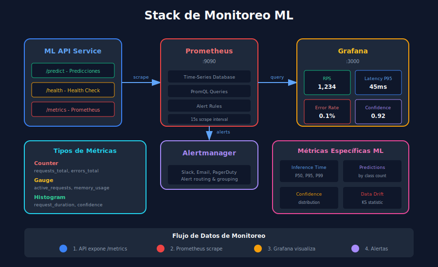

# 📊 Monitoreo en Producción

## 🎯 Objetivos de Aprendizaje

- Implementar métricas con Prometheus en FastAPI
- Crear dashboards con Grafana
- Configurar alertas para modelos ML
- Implementar logging estructurado

---

## 1. ¿Por qué Monitorear Modelos ML?

Los modelos en producción pueden degradarse silenciosamente. El monitoreo nos permite detectar problemas antes de que impacten al negocio.

### 1.1 Tipos de Monitoreo



```
┌─────────────────────────────────────────────────────────────┐
│              PILARES DEL MONITOREO ML                       │
├─────────────────────────────────────────────────────────────┤
│                                                             │
│  1. INFRAESTRUCTURA         2. APLICACIÓN                  │
│  ┌───────────────────┐      ┌───────────────────┐          │
│  │ • CPU/Memory      │      │ • Latencia        │          │
│  │ • Disk I/O        │      │ • Throughput      │          │
│  │ • Network         │      │ • Error rate      │          │
│  │ • Container health│      │ • Request count   │          │
│  └───────────────────┘      └───────────────────┘          │
│                                                             │
│  3. MODELO                  4. DATOS                       │
│  ┌───────────────────┐      ┌───────────────────┐          │
│  │ • Prediction dist │      │ • Feature drift   │          │
│  │ • Confidence      │      │ • Data quality    │          │
│  │ • Model accuracy  │      │ • Missing values  │          │
│  │ • Class balance   │      │ • Outliers        │          │
│  └───────────────────┘      └───────────────────┘          │
│                                                             │
└─────────────────────────────────────────────────────────────┘
```

### 1.2 Métricas Clave

| Categoría | Métrica | Descripción | Umbral típico |
|-----------|---------|-------------|---------------|
| **Latencia** | p50, p95, p99 | Tiempo de respuesta | p99 < 200ms |
| **Throughput** | requests/sec | Capacidad del sistema | > 100 RPS |
| **Errores** | error_rate | % de errores | < 1% |
| **Modelo** | prediction_confidence | Confianza promedio | > 0.7 |

---

## 2. Prometheus

### 2.1 Conceptos Básicos

```
┌─────────────────────────────────────────────────────────────┐
│                  ARQUITECTURA PROMETHEUS                    │
├─────────────────────────────────────────────────────────────┤
│                                                             │
│   ┌─────────┐    scrape     ┌─────────────┐               │
│   │ ML API  │ ◀──────────── │ Prometheus  │               │
│   │ /metrics│               │   Server    │               │
│   └─────────┘               └──────┬──────┘               │
│                                    │                       │
│   ┌─────────┐    scrape            │ query                │
│   │ Node    │ ◀──────────────      │                      │
│   │Exporter │                      ▼                       │
│   └─────────┘               ┌─────────────┐               │
│                             │   Grafana   │               │
│   ┌─────────┐    alert      │ Dashboards  │               │
│   │AlertMgr │ ◀──────────   └─────────────┘               │
│   └─────────┘                                              │
│                                                             │
└─────────────────────────────────────────────────────────────┘
```

### 2.2 Tipos de Métricas

```python
# prometheus_client types

# 1. COUNTER - Solo incrementa (requests totales, errores)
from prometheus_client import Counter

request_count = Counter(
    'http_requests_total',
    'Total HTTP requests',
    ['method', 'endpoint', 'status']
)
# Uso: request_count.labels(method='POST', endpoint='/predict', status='200').inc()

# 2. GAUGE - Puede subir o bajar (memoria, conexiones activas)
from prometheus_client import Gauge

active_requests = Gauge(
    'active_requests',
    'Currently processing requests'
)
# Uso: active_requests.inc() / active_requests.dec()

# 3. HISTOGRAM - Distribución de valores (latencias)
from prometheus_client import Histogram

request_latency = Histogram(
    'http_request_duration_seconds',
    'Request latency in seconds',
    ['endpoint'],
    buckets=[0.01, 0.05, 0.1, 0.25, 0.5, 1.0, 2.5, 5.0]
)
# Uso: request_latency.labels(endpoint='/predict').observe(0.125)

# 4. SUMMARY - Similar a histogram con percentiles
from prometheus_client import Summary

prediction_confidence = Summary(
    'model_prediction_confidence',
    'Prediction confidence distribution'
)
# Uso: prediction_confidence.observe(0.95)
```

---

## 3. Implementar Métricas en FastAPI

### 3.1 Módulo de Métricas

```python
# app/monitoring/metrics.py
from prometheus_client import Counter, Histogram, Gauge, Summary
from prometheus_client import generate_latest, CONTENT_TYPE_LATEST
from fastapi import Response
import time

# === MÉTRICAS DE INFRAESTRUCTURA ===

# Requests totales
REQUEST_COUNT = Counter(
    'ml_api_requests_total',
    'Total number of requests',
    ['method', 'endpoint', 'status_code']
)

# Latencia de requests
REQUEST_LATENCY = Histogram(
    'ml_api_request_duration_seconds',
    'Request duration in seconds',
    ['endpoint'],
    buckets=[0.01, 0.025, 0.05, 0.075, 0.1, 0.25, 0.5, 1.0, 2.5]
)

# Requests activos
ACTIVE_REQUESTS = Gauge(
    'ml_api_active_requests',
    'Number of requests currently being processed'
)

# === MÉTRICAS DE MODELO ===

# Predicciones por clase
PREDICTIONS_BY_CLASS = Counter(
    'ml_model_predictions_total',
    'Total predictions by class',
    ['model_version', 'predicted_class']
)

# Confianza de predicciones
PREDICTION_CONFIDENCE = Histogram(
    'ml_model_prediction_confidence',
    'Prediction confidence distribution',
    ['model_version'],
    buckets=[0.5, 0.6, 0.7, 0.8, 0.85, 0.9, 0.95, 0.99]
)

# Tiempo de inferencia
INFERENCE_TIME = Histogram(
    'ml_model_inference_seconds',
    'Model inference time in seconds',
    ['model_version'],
    buckets=[0.001, 0.005, 0.01, 0.025, 0.05, 0.1, 0.25]
)

# Modelo cargado
MODEL_LOADED = Gauge(
    'ml_model_loaded',
    'Whether the model is loaded (1) or not (0)',
    ['model_version']
)

# === FUNCIONES HELPER ===

def get_metrics():
    """Generar métricas en formato Prometheus."""
    return Response(
        content=generate_latest(),
        media_type=CONTENT_TYPE_LATEST
    )

class MetricsMiddleware:
    """Middleware para capturar métricas de requests."""
    
    def __init__(self, app):
        self.app = app
    
    async def __call__(self, scope, receive, send):
        if scope["type"] != "http":
            await self.app(scope, receive, send)
            return
        
        start_time = time.time()
        ACTIVE_REQUESTS.inc()
        
        # Variables para capturar status code
        status_code = 500
        
        async def send_wrapper(message):
            nonlocal status_code
            if message["type"] == "http.response.start":
                status_code = message["status"]
            await send(message)
        
        try:
            await self.app(scope, receive, send_wrapper)
        finally:
            ACTIVE_REQUESTS.dec()
            
            # Registrar métricas
            duration = time.time() - start_time
            path = scope.get("path", "unknown")
            method = scope.get("method", "unknown")
            
            REQUEST_COUNT.labels(
                method=method,
                endpoint=path,
                status_code=str(status_code)
            ).inc()
            
            REQUEST_LATENCY.labels(endpoint=path).observe(duration)
```

### 3.2 Integrar en FastAPI

```python
# app/main.py
from fastapi import FastAPI
from prometheus_client import make_asgi_app
from app.monitoring.metrics import (
    MetricsMiddleware, 
    MODEL_LOADED,
    get_metrics
)

app = FastAPI(title="ML API with Monitoring")

# Middleware de métricas
app.add_middleware(MetricsMiddleware)

# Endpoint de métricas para Prometheus
@app.get("/metrics")
async def metrics():
    return get_metrics()

# O montar la app de prometheus
metrics_app = make_asgi_app()
app.mount("/metrics", metrics_app)

# En el startup, marcar modelo como cargado
@app.on_event("startup")
async def startup():
    MODEL_LOADED.labels(model_version="1.0.0").set(1)
```

### 3.3 Métricas en Predicciones

```python
# app/routers/predict.py
from app.monitoring.metrics import (
    PREDICTIONS_BY_CLASS,
    PREDICTION_CONFIDENCE,
    INFERENCE_TIME
)
import time

@router.post("/predict")
async def predict(features: IrisFeatures):
    model_version = ml_model.version
    
    # Medir tiempo de inferencia
    start_time = time.time()
    
    prediction, confidence, probabilities = ml_model.predict([
        features.sepal_length,
        features.sepal_width,
        features.petal_length,
        features.petal_width
    ])
    
    inference_duration = time.time() - start_time
    
    # Registrar métricas
    PREDICTIONS_BY_CLASS.labels(
        model_version=model_version,
        predicted_class=prediction
    ).inc()
    
    PREDICTION_CONFIDENCE.labels(
        model_version=model_version
    ).observe(confidence)
    
    INFERENCE_TIME.labels(
        model_version=model_version
    ).observe(inference_duration)
    
    return PredictionResponse(
        prediction=prediction,
        confidence=confidence,
        probabilities=probabilities,
        model_version=model_version
    )
```

---

## 4. Configurar Prometheus

### 4.1 prometheus.yml

```yaml
# monitoring/prometheus.yml
global:
  scrape_interval: 15s
  evaluation_interval: 15s

# Reglas de alertas
rule_files:
  - "alerts.yml"

# Alertmanager
alerting:
  alertmanagers:
    - static_configs:
        - targets:
          # - alertmanager:9093

# Scrape configurations
scrape_configs:
  # Prometheus itself
  - job_name: 'prometheus'
    static_configs:
      - targets: ['localhost:9090']
  
  # ML API
  - job_name: 'ml-api'
    static_configs:
      - targets: ['api:8000']
    metrics_path: '/metrics'
    scrape_interval: 10s
```

### 4.2 Reglas de Alertas

```yaml
# monitoring/alerts.yml
groups:
  - name: ml-api-alerts
    rules:
      # Alta tasa de errores
      - alert: HighErrorRate
        expr: |
          sum(rate(ml_api_requests_total{status_code=~"5.."}[5m])) 
          / sum(rate(ml_api_requests_total[5m])) > 0.05
        for: 5m
        labels:
          severity: critical
        annotations:
          summary: "Alta tasa de errores en ML API"
          description: "Error rate > 5% en los últimos 5 minutos"
      
      # Latencia alta
      - alert: HighLatency
        expr: |
          histogram_quantile(0.95, 
            rate(ml_api_request_duration_seconds_bucket[5m])
          ) > 0.5
        for: 5m
        labels:
          severity: warning
        annotations:
          summary: "Latencia alta en ML API"
          description: "P95 latency > 500ms"
      
      # Modelo no cargado
      - alert: ModelNotLoaded
        expr: ml_model_loaded == 0
        for: 1m
        labels:
          severity: critical
        annotations:
          summary: "Modelo ML no cargado"
          description: "El modelo no está disponible"
      
      # Baja confianza en predicciones
      - alert: LowPredictionConfidence
        expr: |
          histogram_quantile(0.5, 
            rate(ml_model_prediction_confidence_bucket[1h])
          ) < 0.7
        for: 30m
        labels:
          severity: warning
        annotations:
          summary: "Baja confianza en predicciones"
          description: "La confianza mediana es menor al 70%"
```

---

## 5. Grafana Dashboards

### 5.1 Provisioning de Datasource

```yaml
# monitoring/grafana/provisioning/datasources/prometheus.yml
apiVersion: 1

datasources:
  - name: Prometheus
    type: prometheus
    access: proxy
    url: http://prometheus:9090
    isDefault: true
    editable: false
```

### 5.2 Dashboard JSON (Simplificado)

```json
{
  "dashboard": {
    "title": "ML API Dashboard",
    "panels": [
      {
        "title": "Requests per Second",
        "type": "graph",
        "targets": [
          {
            "expr": "sum(rate(ml_api_requests_total[1m]))",
            "legendFormat": "RPS"
          }
        ]
      },
      {
        "title": "Latency P95",
        "type": "gauge",
        "targets": [
          {
            "expr": "histogram_quantile(0.95, rate(ml_api_request_duration_seconds_bucket[5m]))"
          }
        ]
      },
      {
        "title": "Error Rate",
        "type": "stat",
        "targets": [
          {
            "expr": "sum(rate(ml_api_requests_total{status_code=~\"5..\"}[5m])) / sum(rate(ml_api_requests_total[5m])) * 100"
          }
        ]
      },
      {
        "title": "Predictions by Class",
        "type": "piechart",
        "targets": [
          {
            "expr": "sum by (predicted_class) (ml_model_predictions_total)"
          }
        ]
      },
      {
        "title": "Prediction Confidence Distribution",
        "type": "histogram",
        "targets": [
          {
            "expr": "ml_model_prediction_confidence_bucket"
          }
        ]
      }
    ]
  }
}
```

### 5.3 Queries Útiles para Grafana

```promql
# Requests por segundo
sum(rate(ml_api_requests_total[1m]))

# Requests por endpoint
sum by (endpoint) (rate(ml_api_requests_total[1m]))

# Latencia P50, P95, P99
histogram_quantile(0.50, rate(ml_api_request_duration_seconds_bucket[5m]))
histogram_quantile(0.95, rate(ml_api_request_duration_seconds_bucket[5m]))
histogram_quantile(0.99, rate(ml_api_request_duration_seconds_bucket[5m]))

# Error rate
sum(rate(ml_api_requests_total{status_code=~"5.."}[5m])) 
/ sum(rate(ml_api_requests_total[5m])) * 100

# Predicciones por clase (últimas 24h)
sum by (predicted_class) (increase(ml_model_predictions_total[24h]))

# Confianza promedio
sum(rate(ml_model_prediction_confidence_sum[5m])) 
/ sum(rate(ml_model_prediction_confidence_count[5m]))

# Tiempo de inferencia P95
histogram_quantile(0.95, rate(ml_model_inference_seconds_bucket[5m]))
```

---

## 6. Logging Estructurado

### 6.1 Configuración de Logging

```python
# app/utils/logger.py
import logging
import json
import sys
from datetime import datetime
from typing import Any
import uuid

class StructuredLogger:
    """Logger con formato JSON estructurado."""
    
    def __init__(self, name: str):
        self.logger = logging.getLogger(name)
        self.logger.setLevel(logging.INFO)
        
        # Handler para stdout
        handler = logging.StreamHandler(sys.stdout)
        handler.setFormatter(JsonFormatter())
        self.logger.addHandler(handler)
    
    def _log(self, level: str, message: str, **kwargs):
        extra = {"extra_fields": kwargs}
        getattr(self.logger, level)(message, extra=extra)
    
    def info(self, message: str, **kwargs):
        self._log("info", message, **kwargs)
    
    def warning(self, message: str, **kwargs):
        self._log("warning", message, **kwargs)
    
    def error(self, message: str, **kwargs):
        self._log("error", message, **kwargs)
    
    def debug(self, message: str, **kwargs):
        self._log("debug", message, **kwargs)

class JsonFormatter(logging.Formatter):
    """Formatter que produce logs en JSON."""
    
    def format(self, record: logging.LogRecord) -> str:
        log_entry = {
            "timestamp": datetime.utcnow().isoformat() + "Z",
            "level": record.levelname,
            "logger": record.name,
            "message": record.getMessage(),
            "module": record.module,
            "function": record.funcName,
            "line": record.lineno
        }
        
        # Agregar campos extra si existen
        if hasattr(record, "extra_fields"):
            log_entry.update(record.extra_fields)
        
        # Agregar exception info si existe
        if record.exc_info:
            log_entry["exception"] = self.formatException(record.exc_info)
        
        return json.dumps(log_entry)

# Logger global
logger = StructuredLogger("ml-api")
```

### 6.2 Logging de Requests

```python
# app/middleware/logging.py
from fastapi import Request
from starlette.middleware.base import BaseHTTPMiddleware
import time
import uuid
from app.utils.logger import logger

class RequestLoggingMiddleware(BaseHTTPMiddleware):
    """Middleware para logging de requests."""
    
    async def dispatch(self, request: Request, call_next):
        # Generar request ID
        request_id = str(uuid.uuid4())[:8]
        request.state.request_id = request_id
        
        # Info del request
        start_time = time.time()
        
        logger.info(
            "Request started",
            request_id=request_id,
            method=request.method,
            path=request.url.path,
            client_ip=request.client.host if request.client else "unknown"
        )
        
        # Procesar request
        try:
            response = await call_next(request)
            
            duration_ms = (time.time() - start_time) * 1000
            
            logger.info(
                "Request completed",
                request_id=request_id,
                status_code=response.status_code,
                duration_ms=round(duration_ms, 2)
            )
            
            # Agregar request ID al response header
            response.headers["X-Request-ID"] = request_id
            
            return response
            
        except Exception as e:
            duration_ms = (time.time() - start_time) * 1000
            
            logger.error(
                "Request failed",
                request_id=request_id,
                error=str(e),
                duration_ms=round(duration_ms, 2)
            )
            raise
```

### 6.3 Logging de Predicciones

```python
# En el endpoint de predicción
from app.utils.logger import logger

@router.post("/predict")
async def predict(features: IrisFeatures, request: Request):
    request_id = getattr(request.state, "request_id", "unknown")
    
    logger.info(
        "Prediction request",
        request_id=request_id,
        features={
            "sepal_length": features.sepal_length,
            "sepal_width": features.sepal_width,
            "petal_length": features.petal_length,
            "petal_width": features.petal_width
        }
    )
    
    prediction, confidence, probabilities = ml_model.predict(...)
    
    logger.info(
        "Prediction result",
        request_id=request_id,
        prediction=prediction,
        confidence=round(confidence, 4),
        model_version=ml_model.version
    )
    
    return PredictionResponse(...)
```

---

## 7. Health Checks

### 7.1 Endpoints de Salud

```python
# app/routers/health.py
from fastapi import APIRouter, status
from pydantic import BaseModel
from datetime import datetime
from app.services.ml_model import ml_model

router = APIRouter(tags=["health"])

class HealthResponse(BaseModel):
    status: str
    timestamp: datetime
    version: str
    checks: dict

class ReadinessResponse(BaseModel):
    ready: bool
    checks: dict

@router.get("/health", response_model=HealthResponse)
async def health_check():
    """
    Health check básico - para load balancers.
    Indica si el servicio está vivo.
    """
    return HealthResponse(
        status="healthy",
        timestamp=datetime.utcnow(),
        version="1.0.0",
        checks={}
    )

@router.get("/ready", response_model=ReadinessResponse)
async def readiness_check():
    """
    Readiness check - indica si puede recibir tráfico.
    Verifica que todas las dependencias estén listas.
    """
    checks = {
        "model_loaded": ml_model.model is not None,
        "model_version": ml_model.version if ml_model.model else None
    }
    
    all_ready = all([
        checks["model_loaded"]
    ])
    
    return ReadinessResponse(
        ready=all_ready,
        checks=checks
    )

@router.get("/live")
async def liveness_check():
    """
    Liveness check - para Kubernetes.
    Si falla, el contenedor se reinicia.
    """
    return {"status": "alive"}
```

### 7.2 Docker Health Check

```dockerfile
# En Dockerfile
HEALTHCHECK --interval=30s --timeout=10s --start-period=10s --retries=3 \
    CMD curl -f http://localhost:8000/health || exit 1
```

```yaml
# En docker-compose.yml
services:
  api:
    healthcheck:
      test: ["CMD", "curl", "-f", "http://localhost:8000/ready"]
      interval: 30s
      timeout: 10s
      retries: 3
      start_period: 10s
```

---

## 8. Model Drift Detection

### 8.1 Monitorear Distribución de Predicciones

```python
# app/monitoring/drift.py
import numpy as np
from collections import deque
from scipy import stats
from datetime import datetime
from app.utils.logger import logger

class DriftDetector:
    """Detector de drift en predicciones."""
    
    def __init__(self, window_size: int = 1000, threshold: float = 0.05):
        self.window_size = window_size
        self.threshold = threshold
        self.baseline_predictions = None
        self.recent_predictions = deque(maxlen=window_size)
        self.last_check = None
    
    def set_baseline(self, predictions: list):
        """Establecer distribución baseline."""
        self.baseline_predictions = np.array(predictions)
        logger.info(
            "Baseline set",
            samples=len(predictions),
            mean=float(np.mean(predictions)),
            std=float(np.std(predictions))
        )
    
    def add_prediction(self, confidence: float):
        """Agregar nueva predicción."""
        self.recent_predictions.append(confidence)
    
    def check_drift(self) -> dict:
        """Verificar si hay drift."""
        if self.baseline_predictions is None:
            return {"status": "no_baseline", "drift_detected": False}
        
        if len(self.recent_predictions) < self.window_size // 2:
            return {"status": "insufficient_data", "drift_detected": False}
        
        recent = np.array(self.recent_predictions)
        
        # Test Kolmogorov-Smirnov
        statistic, p_value = stats.ks_2samp(
            self.baseline_predictions,
            recent
        )
        
        drift_detected = p_value < self.threshold
        
        result = {
            "status": "checked",
            "drift_detected": drift_detected,
            "ks_statistic": float(statistic),
            "p_value": float(p_value),
            "baseline_mean": float(np.mean(self.baseline_predictions)),
            "recent_mean": float(np.mean(recent)),
            "samples_checked": len(recent),
            "timestamp": datetime.utcnow().isoformat()
        }
        
        if drift_detected:
            logger.warning("Drift detected!", **result)
        
        self.last_check = result
        return result

# Singleton
drift_detector = DriftDetector()
```

### 8.2 Endpoint de Drift

```python
# app/routers/monitoring.py
from app.monitoring.drift import drift_detector

@router.get("/drift")
async def check_drift():
    """Verificar drift en el modelo."""
    return drift_detector.check_drift()

@router.post("/drift/baseline")
async def set_baseline(predictions: list[float]):
    """Establecer baseline para detección de drift."""
    drift_detector.set_baseline(predictions)
    return {"status": "baseline_set", "samples": len(predictions)}
```

---

## 📚 Recursos Adicionales

- [Prometheus Documentation](https://prometheus.io/docs/)
- [Grafana Documentation](https://grafana.com/docs/)
- [prometheus_client Python](https://github.com/prometheus/client_python)

---

## ✅ Checklist de Verificación

- [ ] Implementar métricas básicas con prometheus_client
- [ ] Configurar Prometheus para scraping
- [ ] Crear dashboard básico en Grafana
- [ ] Implementar logging estructurado en JSON
- [ ] Configurar health checks (health, ready, live)
- [ ] Implementar detección básica de drift

---

## 🔗 Navegación

| Anterior | Índice | Siguiente |
|----------|--------|-----------|
| [Docker](03-docker-containerization.md) | [Semana 34](../README.md) | [Prácticas](../2-practicas/) |
