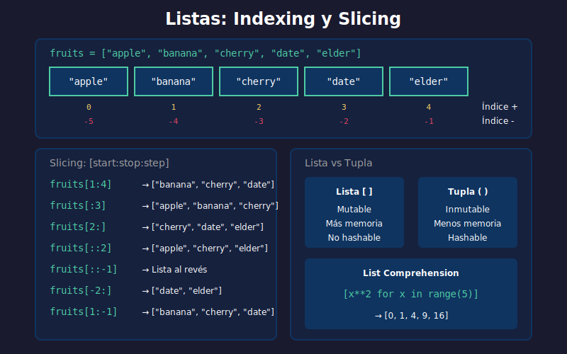

# 📚 Listas y Tuplas

## 🎯 Objetivos

- Dominar las listas: creación, acceso, modificación
- Aplicar métodos de listas y slicing
- Comprender las tuplas y su inmutabilidad
- Usar comprensiones de lista eficientemente
- Saber cuándo usar lista vs tupla

---

## 📋 Contenido



### 1. Listas: Colecciones Mutables

Una lista es una colección **ordenada y mutable** de elementos.

```python
# Crear listas
empty_list = []
numbers = [1, 2, 3, 4, 5]
mixed = [1, "hello", 3.14, True]  # Tipos mixtos
nested = [[1, 2], [3, 4], [5, 6]]  # Listas anidadas

# Crear con list()
from_range = list(range(5))    # [0, 1, 2, 3, 4]
from_string = list("Python")   # ['P', 'y', 't', 'h', 'o', 'n']
```

---

### 2. Acceso a Elementos (Indexing)

```python
fruits = ["apple", "banana", "cherry", "date", "elderberry"]

# Índices positivos (desde el inicio)
print(fruits[0])   # apple (primer elemento)
print(fruits[2])   # cherry

# Índices negativos (desde el final)
print(fruits[-1])  # elderberry (último)
print(fruits[-2])  # date (penúltimo)
```

#### Visualización de Índices

```
         +-------+--------+--------+------+-----------+
Lista:   | apple | banana | cherry | date | elderberry|
         +-------+--------+--------+------+-----------+
Índice:      0       1        2       3         4
Negativo:   -5      -4       -3      -2        -1
```

---

### 3. Slicing (Rebanado)

Extraer sublistas con `[start:stop:step]`:

```python
numbers = [0, 1, 2, 3, 4, 5, 6, 7, 8, 9]

# [start:stop] - stop no incluido
print(numbers[2:5])    # [2, 3, 4]
print(numbers[:4])     # [0, 1, 2, 3] (desde inicio)
print(numbers[6:])     # [6, 7, 8, 9] (hasta final)

# [start:stop:step]
print(numbers[::2])    # [0, 2, 4, 6, 8] (pares de índice)
print(numbers[1::2])   # [1, 3, 5, 7, 9] (impares de índice)

# Reversar lista
print(numbers[::-1])   # [9, 8, 7, 6, 5, 4, 3, 2, 1, 0]
```

---

### 4. Modificar Listas

Las listas son **mutables** - puedes cambiar sus elementos:

```python
colors = ["red", "green", "blue"]

# Modificar elemento
colors[1] = "yellow"
print(colors)  # ['red', 'yellow', 'blue']

# Modificar rango
colors[0:2] = ["black", "white"]
print(colors)  # ['black', 'white', 'blue']
```

---

### 5. Métodos de Listas

#### Agregar Elementos

```python
fruits = ["apple", "banana"]

# append: agregar al final
fruits.append("cherry")
print(fruits)  # ['apple', 'banana', 'cherry']

# insert: agregar en posición específica
fruits.insert(1, "orange")
print(fruits)  # ['apple', 'orange', 'banana', 'cherry']

# extend: agregar múltiples elementos
fruits.extend(["date", "elderberry"])
print(fruits)  # ['apple', 'orange', 'banana', 'cherry', 'date', 'elderberry']
```

#### Eliminar Elementos

```python
numbers = [1, 2, 3, 2, 4, 2, 5]

# remove: eliminar primera ocurrencia
numbers.remove(2)
print(numbers)  # [1, 3, 2, 4, 2, 5]

# pop: eliminar por índice (retorna elemento)
last = numbers.pop()      # Elimina último
print(last)               # 5
second = numbers.pop(1)   # Elimina índice 1
print(second)             # 3

# clear: vaciar lista
numbers.clear()
print(numbers)  # []

# del: eliminar por índice o slice
nums = [0, 1, 2, 3, 4, 5]
del nums[0]      # Eliminar índice 0
del nums[1:3]    # Eliminar slice
```

#### Buscar y Contar

```python
letters = ['a', 'b', 'c', 'b', 'd', 'b']

# index: encontrar posición
print(letters.index('b'))      # 1 (primera ocurrencia)
print(letters.index('b', 2))   # 3 (buscar desde índice 2)

# count: contar ocurrencias
print(letters.count('b'))      # 3

# in: verificar existencia
print('c' in letters)          # True
print('z' in letters)          # False
```

#### Ordenar y Reversar

```python
numbers = [3, 1, 4, 1, 5, 9, 2, 6]

# sort: ordenar in-place (modifica original)
numbers.sort()
print(numbers)  # [1, 1, 2, 3, 4, 5, 6, 9]

numbers.sort(reverse=True)
print(numbers)  # [9, 6, 5, 4, 3, 2, 1, 1]

# sorted: retorna nueva lista (no modifica original)
original = [3, 1, 4]
ordenada = sorted(original)
print(original)  # [3, 1, 4]
print(ordenada)  # [1, 3, 4]

# reverse: reversar in-place
letters = ['a', 'b', 'c']
letters.reverse()
print(letters)  # ['c', 'b', 'a']
```

---

### 6. Comprensiones de Lista (List Comprehensions)

Forma pythónica de crear listas:

```python
# Sintaxis: [expresión for item in iterable if condición]

# Tradicional
squares = []
for x in range(10):
    squares.append(x ** 2)

# Comprehension
squares = [x ** 2 for x in range(10)]
print(squares)  # [0, 1, 4, 9, 16, 25, 36, 49, 64, 81]
```

#### Con Condición

```python
# Números pares
evens = [x for x in range(20) if x % 2 == 0]
print(evens)  # [0, 2, 4, 6, 8, 10, 12, 14, 16, 18]

# Filtrar valores
words = ["Python", "is", "awesome", "for", "AI"]
long_words = [w for w in words if len(w) > 3]
print(long_words)  # ['Python', 'awesome']
```

#### Con Transformación

```python
# Mayúsculas
words = ["hello", "world"]
upper = [w.upper() for w in words]
print(upper)  # ['HELLO', 'WORLD']

# Condicional en expresión
numbers = [1, 2, 3, 4, 5]
labels = ["even" if n % 2 == 0 else "odd" for n in numbers]
print(labels)  # ['odd', 'even', 'odd', 'even', 'odd']
```

#### Comprensiones Anidadas

```python
# Aplanar matriz
matrix = [[1, 2, 3], [4, 5, 6], [7, 8, 9]]
flat = [num for row in matrix for num in row]
print(flat)  # [1, 2, 3, 4, 5, 6, 7, 8, 9]

# Crear matriz
matrix = [[i * j for j in range(1, 4)] for i in range(1, 4)]
print(matrix)  # [[1, 2, 3], [4, 5, 6], [7, 8, 9]]
```

---

### 7. Tuplas: Colecciones Inmutables

Una tupla es una colección **ordenada e inmutable**.

```python
# Crear tuplas
empty_tuple = ()
single = (42,)  # ¡Coma necesaria para un elemento!
point = (10, 20)
rgb = (255, 128, 0)
mixed = (1, "hello", 3.14)

# Sin paréntesis (tuple packing)
coordinates = 10, 20, 30
print(type(coordinates))  # <class 'tuple'>
```

#### Acceso (igual que listas)

```python
colors = ("red", "green", "blue")

print(colors[0])    # red
print(colors[-1])   # blue
print(colors[1:])   # ('green', 'blue')
```

#### Inmutabilidad

```python
point = (10, 20)

# ❌ No se puede modificar
# point[0] = 15  # TypeError: 'tuple' object does not support item assignment

# ✅ Crear nueva tupla
point = (15, 20)  # Reasignación completa permitida
```

#### Desempaquetado (Unpacking)

```python
# Desempaquetado básico
coordinates = (10, 20, 30)
x, y, z = coordinates
print(f"x={x}, y={y}, z={z}")  # x=10, y=20, z=30

# Desempaquetado con *
first, *rest = (1, 2, 3, 4, 5)
print(first)  # 1
print(rest)   # [2, 3, 4, 5]

# Intercambiar valores
a, b = 10, 20
a, b = b, a
print(f"a={a}, b={b}")  # a=20, b=10
```

#### Métodos de Tuplas

```python
numbers = (1, 2, 3, 2, 4, 2)

print(numbers.count(2))   # 3
print(numbers.index(3))   # 2
```

---

### 8. Lista vs Tupla: ¿Cuándo usar cada una?

| Característica  | Lista       | Tupla                      |
| --------------- | ----------- | -------------------------- |
| **Mutabilidad** | Mutable     | Inmutable                  |
| **Sintaxis**    | `[1, 2, 3]` | `(1, 2, 3)`                |
| **Rendimiento** | Más lento   | Más rápido                 |
| **Memoria**     | Más memoria | Menos memoria              |
| **Hashable**    | No          | Sí (puede ser key de dict) |

#### Usa Lista cuando:

```python
# ✅ Colección que cambiará
shopping_list = ["milk", "eggs", "bread"]
shopping_list.append("butter")

# ✅ Orden de datos homogéneos
scores = [85, 90, 78, 92, 88]
scores.sort()
```

#### Usa Tupla cuando:

```python
# ✅ Datos que no deben cambiar
RGB_RED = (255, 0, 0)
COORDINATES = (40.7128, -74.0060)

# ✅ Retorno múltiple de funciones
def get_user():
    return ("Ana", 25, "Madrid")

name, age, city = get_user()

# ✅ Keys de diccionarios
locations = {
    (40.7128, -74.0060): "New York",
    (51.5074, -0.1278): "London"
}
```

---

### 9. Listas en ML/IA

```python
# Datos de entrenamiento como listas
X_train = [[1, 2], [3, 4], [5, 6], [7, 8]]
y_train = [0, 0, 1, 1]

# Preprocesamiento con comprehensions
# Normalizar valores (min-max scaling)
values = [10, 20, 30, 40, 50]
min_val, max_val = min(values), max(values)
normalized = [(v - min_val) / (max_val - min_val) for v in values]
print(normalized)  # [0.0, 0.25, 0.5, 0.75, 1.0]

# Filtrar outliers
data = [10, 15, 12, 100, 14, 11, 200, 13]
threshold = 50
clean_data = [x for x in data if x < threshold]
print(clean_data)  # [10, 15, 12, 14, 11, 13]
```

---

## 📚 Recursos Adicionales

- [Python Lists - Real Python](https://realpython.com/python-lists-tuples/)
- [List Comprehensions - Real Python](https://realpython.com/list-comprehension-python/)
- [Python Tuples - W3Schools](https://www.w3schools.com/python/python_tuples.asp)

---

## ✅ Checklist de Verificación

- [ ] Puedo crear y acceder a elementos de listas
- [ ] Domino slicing con start:stop:step
- [ ] Conozco los métodos principales de listas
- [ ] Puedo escribir comprensiones de lista
- [ ] Entiendo la diferencia entre lista y tupla
- [ ] Sé cuándo usar cada estructura

---

_Siguiente: [03-diccionarios-sets.md](03-diccionarios-sets.md)_
