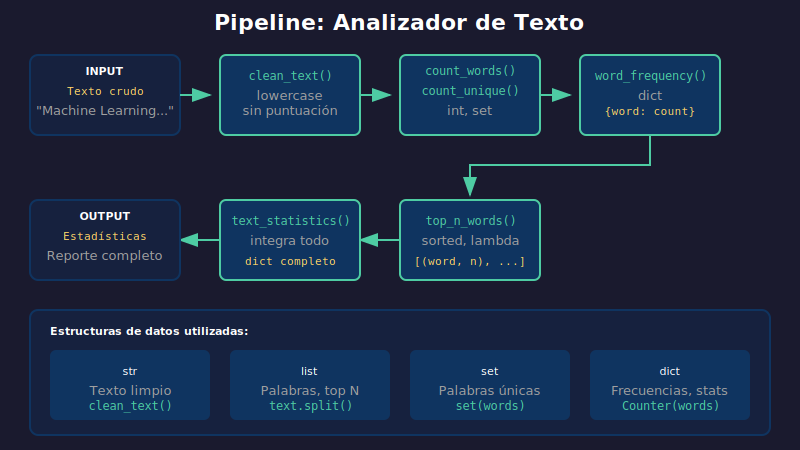

# 🚀 Proyecto Semana 02: Analizador de Texto

## 🎯 Objetivo

Crear un **analizador de texto** que procese documentos y genere estadísticas utilizando funciones y estructuras de datos.

---

## 📋 Descripción

Desarrollarás un sistema que:

1. Reciba un texto como entrada
2. Limpie y normalice el texto
3. Calcule estadísticas (palabras, caracteres, frecuencias)
4. Identifique palabras más comunes
5. Genere un reporte completo

---

## 📊 Funcionalidades a Implementar



| Función                | Descripción                                  | Retorno       |
| ---------------------- | -------------------------------------------- | ------------- |
| `clean_text()`         | Normaliza texto (minúsculas, sin puntuación) | `str`         |
| `count_words()`        | Cuenta palabras totales                      | `int`         |
| `count_unique_words()` | Cuenta palabras únicas (set)                 | `int`         |
| `word_frequency()`     | Diccionario de frecuencias                   | `dict`        |
| `top_n_words()`        | Top N palabras más frecuentes                | `list[tuple]` |
| `text_statistics()`    | Estadísticas completas                       | `dict`        |

---

## 📁 Estructura del Proyecto

```
3-proyecto/
├── README.md           # Este archivo
├── starter/
│   └── main.py         # Plantilla con TODOs
└── .solution/
    └── main.py         # Solución de referencia
```

---

## 📋 Instrucciones

### 1. Abre `starter/main.py`

El archivo contiene:

- Estructura del programa
- Texto de prueba
- Funciones con TODOs para implementar

### 2. Implementa las funciones

Completa cada función siguiendo los docstrings y comentarios.

### 3. Ejecuta y verifica

```bash
cd bootcamp/week-02/3-proyecto
python starter/main.py
```

### 4. Compara con la solución

Si tienes dudas, revisa `.solution/main.py`.

---

## ✅ Criterios de Evaluación

| Criterio                                 | Puntos     |
| ---------------------------------------- | ---------- |
| `clean_text()` funciona correctamente    | 4 pts      |
| `count_words()` cuenta palabras          | 4 pts      |
| `count_unique_words()` usa set           | 4 pts      |
| `word_frequency()` retorna dict correcto | 6 pts      |
| `top_n_words()` ordena correctamente     | 6 pts      |
| `text_statistics()` integra todo         | 6 pts      |
| **Total**                                | **30 pts** |

---

## 💡 Pistas

### Para `clean_text()`:

```python
# Eliminar puntuación
import string
text = text.translate(str.maketrans('', '', string.punctuation))
```

### Para `word_frequency()`:

```python
# Usar dict comprehension o Counter
from collections import Counter
```

### Para `top_n_words()`:

```python
# sorted() con key y reverse
sorted(freq.items(), key=lambda x: x[1], reverse=True)[:n]
```

---

## 📝 Ejemplo de Salida Esperada

```
=== ANALIZADOR DE TEXTO ===

Texto original (primeros 100 caracteres):
"Machine learning is a subset of artificial intelligence. Machine learning algorithms learn from dat..."

--- Estadísticas ---
Total palabras: 42
Palabras únicas: 28
Caracteres: 285
Promedio letras/palabra: 6.79

--- Top 5 Palabras ---
1. learning: 4
2. machine: 3
3. data: 3
4. is: 2
5. and: 2

=== FIN DEL ANÁLISIS ===
```

---

## 🎯 Reto Extra (Opcional)

Si terminas antes, intenta agregar:

- [ ] Contar oraciones
- [ ] Detectar palabras más largas
- [ ] Filtrar stopwords (the, is, a, an, etc.)
- [ ] Calcular legibilidad del texto

---

_Volver a: [Semana 02](../README.md)_
