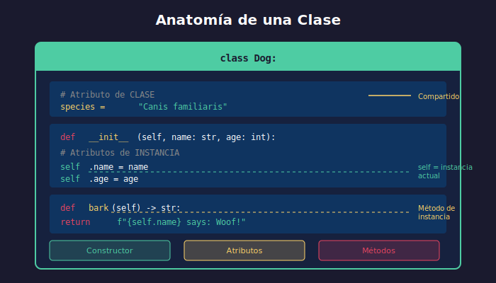

# 🏗️ Clases y Objetos en Python

## 🎯 Objetivos

- Comprender qué son clases y objetos
- Crear clases con el método `__init__`
- Definir atributos de instancia y clase
- Implementar métodos de instancia
- Conocer métodos especiales (dunder methods)

---

## 📋 Contenido

### 1. ¿Qué es la Programación Orientada a Objetos?

La **POO** (Programación Orientada a Objetos) es un paradigma que organiza el código en torno a **objetos** que combinan datos (atributos) y comportamiento (métodos).



#### Conceptos Fundamentales

| Concepto     | Descripción                        | Ejemplo            |
| ------------ | ---------------------------------- | ------------------ |
| **Clase**    | Plantilla/molde para crear objetos | `class Dog:`       |
| **Objeto**   | Instancia concreta de una clase    | `mi_perro = Dog()` |
| **Atributo** | Variable que pertenece al objeto   | `self.name`        |
| **Método**   | Función que pertenece al objeto    | `def bark(self):`  |

---

### 2. Crear una Clase Básica

```python
# Definición más simple de una clase
class Dog:
    pass

# Crear objetos (instancias)
dog1 = Dog()
dog2 = Dog()

# Cada objeto es único
print(dog1)  # <__main__.Dog object at 0x...>
print(dog1 == dog2)  # False - son objetos diferentes
```

---

### 3. El Método `__init__` (Constructor)

El método `__init__` se ejecuta automáticamente al crear un objeto:

```python
class Dog:
    def __init__(self, name: str, age: int):
        """Initialize a new Dog instance."""
        self.name = name  # Atributo de instancia
        self.age = age    # Atributo de instancia

# Crear objetos con datos
buddy = Dog("Buddy", 3)
max_dog = Dog("Max", 5)

print(buddy.name)  # Buddy
print(max_dog.age)  # 5
```

#### ¿Qué es `self`?

`self` es una referencia al objeto actual. Es el primer parámetro de todos los métodos de instancia:

```python
class Dog:
    def __init__(self, name: str):
        # self.name = atributo del objeto
        # name = parámetro recibido
        self.name = name

    def greet(self):
        # Accedemos al atributo con self
        return f"Hello, I'm {self.name}!"

buddy = Dog("Buddy")
print(buddy.greet())  # Hello, I'm Buddy!
```

---

### 4. Atributos de Instancia vs Clase

```python
class Dog:
    # Atributo de CLASE - compartido por todas las instancias
    species = "Canis familiaris"
    count = 0

    def __init__(self, name: str, age: int):
        # Atributos de INSTANCIA - únicos para cada objeto
        self.name = name
        self.age = age
        Dog.count += 1  # Incrementar contador de clase

# Crear instancias
buddy = Dog("Buddy", 3)
max_dog = Dog("Max", 5)

# Atributos de instancia (diferentes)
print(buddy.name)  # Buddy
print(max_dog.name)  # Max

# Atributo de clase (mismo para todos)
print(buddy.species)  # Canis familiaris
print(max_dog.species)  # Canis familiaris
print(Dog.species)  # Canis familiaris

# Contador de instancias
print(Dog.count)  # 2
```

#### ⚠️ Cuidado con atributos mutables de clase

```python
# ❌ PELIGROSO - lista compartida
class BadExample:
    items = []  # ¡Compartido por TODAS las instancias!

    def add_item(self, item):
        self.items.append(item)

a = BadExample()
b = BadExample()
a.add_item("A")
print(b.items)  # ['A'] - ¡b también lo tiene!

# ✅ CORRECTO - lista en __init__
class GoodExample:
    def __init__(self):
        self.items = []  # Única para cada instancia

    def add_item(self, item):
        self.items.append(item)

a = GoodExample()
b = GoodExample()
a.add_item("A")
print(b.items)  # [] - independiente
```

---

### 5. Métodos de Instancia

Los métodos definen el comportamiento de los objetos:

```python
class Dog:
    def __init__(self, name: str, age: int):
        self.name = name
        self.age = age
        self.energy = 100

    def bark(self) -> str:
        """Make the dog bark."""
        return f"{self.name} says: Woof!"

    def play(self, minutes: int) -> str:
        """Play and lose energy."""
        self.energy -= minutes * 2
        if self.energy < 0:
            self.energy = 0
        return f"{self.name} played for {minutes} minutes. Energy: {self.energy}"

    def rest(self, minutes: int) -> str:
        """Rest and recover energy."""
        self.energy += minutes
        if self.energy > 100:
            self.energy = 100
        return f"{self.name} rested. Energy: {self.energy}"

# Uso
buddy = Dog("Buddy", 3)
print(buddy.bark())        # Buddy says: Woof!
print(buddy.play(30))      # Buddy played for 30 minutes. Energy: 40
print(buddy.rest(20))      # Buddy rested. Energy: 60
```

---

### 6. Métodos Especiales (Dunder Methods)

Los métodos con doble guion bajo (`__nombre__`) tienen significados especiales:

#### `__str__` y `__repr__`

```python
class Dog:
    def __init__(self, name: str, age: int):
        self.name = name
        self.age = age

    def __str__(self) -> str:
        """Human-readable string (para usuarios)."""
        return f"{self.name}, {self.age} years old"

    def __repr__(self) -> str:
        """Developer string (para debugging)."""
        return f"Dog(name='{self.name}', age={self.age})"

buddy = Dog("Buddy", 3)

print(buddy)          # Buddy, 3 years old (usa __str__)
print(repr(buddy))    # Dog(name='Buddy', age=3) (usa __repr__)
print([buddy])        # [Dog(name='Buddy', age=3)] (listas usan __repr__)
```

#### `__eq__` para comparación

```python
class Dog:
    def __init__(self, name: str, age: int):
        self.name = name
        self.age = age

    def __eq__(self, other) -> bool:
        """Compare two dogs by name and age."""
        if not isinstance(other, Dog):
            return False
        return self.name == other.name and self.age == other.age

dog1 = Dog("Buddy", 3)
dog2 = Dog("Buddy", 3)
dog3 = Dog("Max", 3)

print(dog1 == dog2)  # True
print(dog1 == dog3)  # False
```

#### `__len__` para len()

```python
class Playlist:
    def __init__(self, name: str):
        self.name = name
        self.songs: list[str] = []

    def add_song(self, song: str) -> None:
        self.songs.append(song)

    def __len__(self) -> int:
        """Return number of songs."""
        return len(self.songs)

playlist = Playlist("My Favorites")
playlist.add_song("Song 1")
playlist.add_song("Song 2")
print(len(playlist))  # 2
```

---

### 7. Tabla de Dunder Methods Comunes

| Método         | Operación      | Ejemplo                  |
| -------------- | -------------- | ------------------------ |
| `__init__`     | Constructor    | `obj = Class()`          |
| `__str__`      | String legible | `str(obj)`, `print(obj)` |
| `__repr__`     | Representación | `repr(obj)`              |
| `__eq__`       | Igualdad       | `obj1 == obj2`           |
| `__ne__`       | Desigualdad    | `obj1 != obj2`           |
| `__lt__`       | Menor que      | `obj1 < obj2`            |
| `__le__`       | Menor o igual  | `obj1 <= obj2`           |
| `__gt__`       | Mayor que      | `obj1 > obj2`            |
| `__ge__`       | Mayor o igual  | `obj1 >= obj2`           |
| `__len__`      | Longitud       | `len(obj)`               |
| `__getitem__`  | Índice         | `obj[key]`               |
| `__setitem__`  | Asignar índice | `obj[key] = value`       |
| `__contains__` | Membresía      | `item in obj`            |
| `__iter__`     | Iteración      | `for x in obj`           |
| `__add__`      | Suma           | `obj1 + obj2`            |
| `__hash__`     | Hash           | `hash(obj)`              |

---

### 8. Ejemplo Completo: Clase BankAccount

```python
class BankAccount:
    """A simple bank account with basic operations."""

    # Atributo de clase
    bank_name = "Python Bank"

    def __init__(self, owner: str, balance: float = 0.0):
        """Initialize account with owner and optional balance."""
        self.owner = owner
        self._balance = balance  # Convención: _ indica "privado"
        self._transactions: list[str] = []

    def deposit(self, amount: float) -> str:
        """Deposit money into account."""
        if amount <= 0:
            return "Amount must be positive"
        self._balance += amount
        self._transactions.append(f"Deposit: +${amount:.2f}")
        return f"Deposited ${amount:.2f}. New balance: ${self._balance:.2f}"

    def withdraw(self, amount: float) -> str:
        """Withdraw money from account."""
        if amount <= 0:
            return "Amount must be positive"
        if amount > self._balance:
            return "Insufficient funds"
        self._balance -= amount
        self._transactions.append(f"Withdrawal: -${amount:.2f}")
        return f"Withdrew ${amount:.2f}. New balance: ${self._balance:.2f}"

    def get_balance(self) -> float:
        """Return current balance."""
        return self._balance

    def get_statement(self) -> str:
        """Return transaction history."""
        header = f"Statement for {self.owner}\n{'=' * 30}\n"
        transactions = "\n".join(self._transactions) or "No transactions"
        footer = f"\n{'=' * 30}\nCurrent Balance: ${self._balance:.2f}"
        return header + transactions + footer

    def __str__(self) -> str:
        return f"Account({self.owner}): ${self._balance:.2f}"

    def __repr__(self) -> str:
        return f"BankAccount(owner='{self.owner}', balance={self._balance})"

# Uso
account = BankAccount("Alice", 100.0)
print(account.deposit(50))     # Deposited $50.00. New balance: $150.00
print(account.withdraw(30))    # Withdrew $30.00. New balance: $120.00
print(account.withdraw(200))   # Insufficient funds
print()
print(account.get_statement())
```

---

## 💡 Buenas Prácticas

1. **Nombres descriptivos**: Clases en `PascalCase`, métodos en `snake_case`
2. **Type hints**: Siempre anotar tipos de parámetros y retorno
3. **Docstrings**: Documentar todas las clases y métodos públicos
4. **`__str__` y `__repr__`**: Implementar para debugging
5. **Validación**: Validar datos en `__init__` y métodos
6. **Single Responsibility**: Cada clase debe tener una responsabilidad clara

---

## ✅ Checklist de Verificación

- [ ] Puedo crear clases con `class`
- [ ] Entiendo el rol de `__init__` y `self`
- [ ] Distingo atributos de instancia vs clase
- [ ] Puedo crear métodos de instancia
- [ ] Conozco `__str__`, `__repr__`, `__eq__`
- [ ] Uso type hints y docstrings

---

## 🔗 Recursos

- [Python Docs - Classes](https://docs.python.org/3/tutorial/classes.html)
- [Real Python - OOP Basics](https://realpython.com/python3-object-oriented-programming/)
- [Special Methods](https://docs.python.org/3/reference/datamodel.html#special-method-names)

---

_Siguiente: [Herencia](02-herencia.md)_
