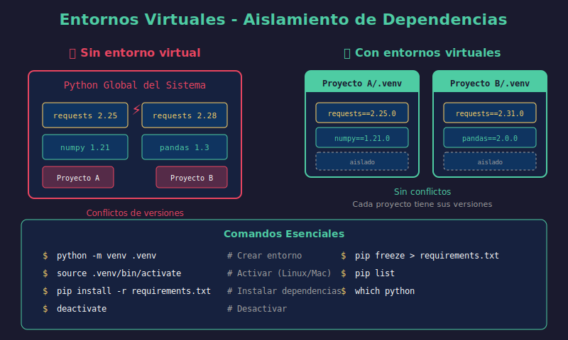

# 🌐 Entornos Virtuales y Gestión de Dependencias



## 🎯 Objetivos

- Entender por qué usar entornos virtuales
- Crear y gestionar entornos con `venv`
- Manejar dependencias con `pip`
- Usar `requirements.txt` para reproducibilidad

---

## 📖 ¿Por Qué Entornos Virtuales?

### El Problema

```
Sistema Python Global
├── requests==2.25.0   ← Proyecto A necesita esta versión
├── requests==2.28.0   ← Proyecto B necesita esta versión (¡CONFLICTO!)
├── numpy==1.21.0
└── pandas==1.3.0
```

### La Solución

```
Proyecto A/                      Proyecto B/
└── .venv/                       └── .venv/
    └── requests==2.25.0             └── requests==2.28.0

# Cada proyecto tiene su propio entorno aislado
```

### Beneficios

| Beneficio            | Descripción                                  |
| -------------------- | -------------------------------------------- |
| **Aislamiento**      | Cada proyecto tiene sus propias dependencias |
| **Reproducibilidad** | Mismo entorno en cualquier máquina           |
| **Sin conflictos**   | Diferentes versiones de paquetes coexisten   |
| **Limpio**           | No contamina el Python del sistema           |
| **Portabilidad**     | Fácil de compartir y replicar                |

---

## 🔧 Crear Entorno Virtual con `venv`

### Creación

```bash
# Sintaxis
python -m venv <nombre_entorno>

# Convención: usar .venv (punto lo oculta en Unix)
python -m venv .venv

# Con Python específico
python3.11 -m venv .venv
```

### Estructura Creada

```
.venv/
├── bin/                    # Linux/Mac
│   ├── activate            # Script de activación
│   ├── pip
│   └── python -> python3.11
├── Scripts/                # Windows
│   ├── activate.bat
│   ├── Activate.ps1
│   └── pip.exe
├── lib/
│   └── python3.11/
│       └── site-packages/  # Paquetes instalados aquí
├── include/
└── pyvenv.cfg              # Configuración
```

---

## ⚡ Activar y Desactivar

### Linux / macOS

```bash
# Activar
source .venv/bin/activate

# Tu prompt cambiará:
# (.venv) user@machine:~/project$

# Desactivar
deactivate
```

### Windows

```powershell
# PowerShell
.venv\Scripts\Activate.ps1

# CMD
.venv\Scripts\activate.bat

# Desactivar
deactivate
```

### Verificar Activación

```bash
# Ver qué Python está activo
which python        # Linux/Mac
where python        # Windows

# Debería mostrar la ruta dentro de .venv
# /home/user/project/.venv/bin/python

# Ver paquetes instalados
pip list
```

---

## 📦 Gestión de Dependencias con `pip`

### Comandos Básicos

```bash
# Instalar paquete
pip install requests

# Instalar versión específica
pip install requests==2.28.0

# Instalar versión mínima
pip install "requests>=2.25.0"

# Instalar rango de versiones
pip install "requests>=2.25.0,<3.0.0"

# Actualizar paquete
pip install --upgrade requests

# Desinstalar
pip uninstall requests

# Ver información de un paquete
pip show requests

# Listar todos los paquetes
pip list

# Listar paquetes desactualizados
pip list --outdated
```

### Instalar Múltiples Paquetes

```bash
# Desde archivo requirements.txt
pip install -r requirements.txt

# Múltiples en una línea
pip install numpy pandas scikit-learn
```

---

## 📋 `requirements.txt`

El archivo `requirements.txt` lista las dependencias del proyecto.

### Crear requirements.txt

```bash
# Exportar TODOS los paquetes instalados
pip freeze > requirements.txt

# El archivo contendrá:
# certifi==2023.7.22
# charset-normalizer==3.2.0
# idna==3.4
# requests==2.31.0
# urllib3==2.0.4
```

### Formato del Archivo

```txt
# requirements.txt

# Versión exacta (máxima reproducibilidad)
requests==2.31.0
numpy==1.24.0

# Versión mínima
pandas>=2.0.0

# Rango de versiones
scikit-learn>=1.0.0,<2.0.0

# Última versión (no recomendado para producción)
matplotlib

# Desde URL
# git+https://github.com/user/repo.git@v1.0.0

# Comentarios
# Esta es una dependencia de desarrollo
pytest==7.4.0
```

### Instalar desde requirements.txt

```bash
pip install -r requirements.txt
```

---

## 📁 Múltiples Archivos de Requirements

```
project/
├── requirements/
│   ├── base.txt        # Dependencias core
│   ├── dev.txt         # Desarrollo (tests, linting)
│   └── prod.txt        # Producción
└── requirements.txt    # Apunta a base.txt
```

```txt
# requirements/base.txt
requests==2.31.0
pandas==2.0.0
```

```txt
# requirements/dev.txt
-r base.txt             # Incluye base.txt
pytest==7.4.0
black==23.7.0
mypy==1.5.0
```

```txt
# requirements/prod.txt
-r base.txt
gunicorn==21.2.0
```

```bash
# Instalar para desarrollo
pip install -r requirements/dev.txt

# Instalar para producción
pip install -r requirements/prod.txt
```

---

## 🔄 Flujo de Trabajo Completo

### Nuevo Proyecto

```bash
# 1. Crear directorio del proyecto
mkdir myproject && cd myproject

# 2. Crear entorno virtual
python -m venv .venv

# 3. Activar
source .venv/bin/activate  # Linux/Mac

# 4. Instalar dependencias
pip install requests pandas numpy

# 5. Guardar dependencias
pip freeze > requirements.txt

# 6. Agregar .venv a .gitignore
echo ".venv/" >> .gitignore

# 7. Commit
git add requirements.txt .gitignore
git commit -m "Initial project setup"
```

### Clonar Proyecto Existente

```bash
# 1. Clonar
git clone https://github.com/user/myproject.git
cd myproject

# 2. Crear entorno virtual
python -m venv .venv

# 3. Activar
source .venv/bin/activate  # Linux/Mac

# 4. Instalar dependencias
pip install -r requirements.txt

# 5. ¡Listo para trabajar!
```

---

## 🔧 Instalar Tu Propio Paquete

### Desarrollo Editable (`pip install -e`)

```bash
# Desde la raíz del proyecto (donde está pyproject.toml)
pip install -e .

# Ahora puedes importar tu paquete desde cualquier lugar
# Y los cambios se reflejan inmediatamente
```

### ¿Por qué `-e` (editable)?

```python
# Sin -e: pip copia el código a site-packages
# Cambios requieren reinstalar

# Con -e: pip crea un enlace al código fuente
# Cambios se reflejan automáticamente
```

---

## 📊 Alternativas a `venv`

| Herramienta | Descripción                         | Cuándo usar             |
| ----------- | ----------------------------------- | ----------------------- |
| **venv**    | Incluido en Python                  | Proyectos simples       |
| **conda**   | Gestiona Python + paquetes binarios | Data Science, CUDA      |
| **poetry**  | Gestión moderna de dependencias     | Proyectos complejos     |
| **pipenv**  | venv + pip en uno                   | Alternativa a pip       |
| **pyenv**   | Múltiples versiones de Python       | Necesitas varios Python |

### Ejemplo con Conda

```bash
# Crear entorno
conda create -n myproject python=3.11

# Activar
conda activate myproject

# Instalar
conda install numpy pandas
pip install requests  # También funciona pip

# Exportar
conda env export > environment.yml

# Crear desde archivo
conda env create -f environment.yml
```

---

## 📁 `.gitignore` para Python

```gitignore
# Entornos virtuales
.venv/
venv/
ENV/

# Cache de Python
__pycache__/
*.py[cod]
*$py.class
.pytest_cache/
.mypy_cache/

# Distribución
dist/
build/
*.egg-info/

# IDE
.idea/
.vscode/
*.swp

# Variables de entorno
.env
.env.local

# Jupyter
.ipynb_checkpoints/
```

---

## ⚠️ Errores Comunes

### 1. Olvidar activar el entorno

```bash
# ❌ Instalar sin activar
pip install requests  # Va al Python global!

# ✅ Siempre activar primero
source .venv/bin/activate
pip install requests
```

### 2. Commitear el entorno virtual

```bash
# ❌ MAL - .venv en el repo
git add .venv/  # ¡NO!

# ✅ BIEN - Solo requirements.txt
echo ".venv/" >> .gitignore
git add requirements.txt
```

### 3. `pip freeze` con dependencias innecesarias

```bash
# pip freeze incluye TODO lo instalado
# Incluyendo dependencias transitivas

# Solución: pip-tools
pip install pip-tools

# requirements.in (solo dependencias directas)
# requests
# pandas

pip-compile requirements.in  # Genera requirements.txt con versiones fijadas
```

### 4. Entorno corrupto

```bash
# Si el entorno tiene problemas, recrear
rm -rf .venv
python -m venv .venv
source .venv/bin/activate
pip install -r requirements.txt
```

---

## 🔒 Seguridad

### Verificar Vulnerabilidades

```bash
# Instalar safety
pip install safety

# Verificar dependencias
safety check -r requirements.txt
```

### Actualizar Dependencias

```bash
# Ver paquetes desactualizados
pip list --outdated

# Actualizar uno
pip install --upgrade requests

# Actualizar todos (con cuidado)
pip install --upgrade -r requirements.txt
```

---

## ✅ Buenas Prácticas

1. **Siempre usar entorno virtual** - Nunca instalar en el Python global
2. **Fijar versiones** - Usar `==` en requirements.txt para reproducibilidad
3. **No commitear `.venv/`** - Solo el requirements.txt
4. **Un entorno por proyecto** - Evita mezclar dependencias
5. **Documentar setup** - README con instrucciones de instalación
6. **Actualizar regularmente** - Revisar vulnerabilidades periódicamente
7. **Usar `-e .`** - Para desarrollo de paquetes propios

---

## 📚 Resumen

| Comando                           | Descripción                       |
| --------------------------------- | --------------------------------- |
| `python -m venv .venv`            | Crear entorno                     |
| `source .venv/bin/activate`       | Activar (Linux/Mac)               |
| `deactivate`                      | Desactivar                        |
| `pip install package`             | Instalar paquete                  |
| `pip freeze > requirements.txt`   | Exportar dependencias             |
| `pip install -r requirements.txt` | Instalar desde archivo            |
| `pip install -e .`                | Instalar paquete en modo editable |

---

## 🔗 Siguiente

Continúa con los [ejercicios prácticos](../2-practicas/) para aplicar estos conceptos.

---

_Volver a: [Semana 04](../README.md)_
