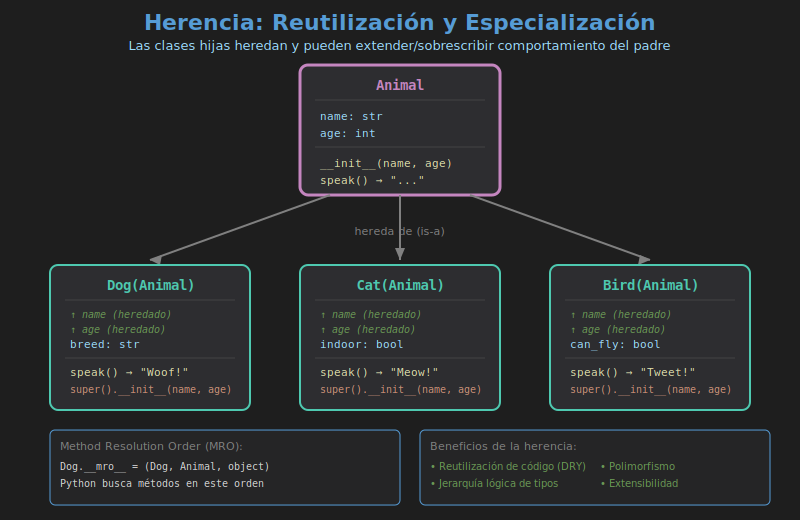

# 📘 Herencia en Python

## 🎯 Objetivos

- Comprender el concepto de herencia
- Implementar herencia simple y múltiple
- Usar `super()` correctamente
- Entender el MRO (Method Resolution Order)

---

## 📋 Contenido

1. [¿Qué es la Herencia?](#1-qué-es-la-herencia)
2. [Herencia Simple](#2-herencia-simple)
3. [El Método `super()`](#3-el-método-super)
4. [Sobrescritura de Métodos](#4-sobrescritura-de-métodos)
5. [Herencia Múltiple](#5-herencia-múltiple)
6. [MRO (Method Resolution Order)](#6-mro-method-resolution-order)

---

## 1. ¿Qué es la Herencia?

La **herencia** permite crear nuevas clases basadas en clases existentes, reutilizando y extendiendo su funcionalidad.

### Terminología

| Término            | Descripción                  | También llamado    |
| ------------------ | ---------------------------- | ------------------ |
| **Clase Base**     | Clase de la que se hereda    | Parent, Superclass |
| **Clase Derivada** | Clase que hereda             | Child, Subclass    |
| **Heredar**        | Adquirir atributos y métodos | Extend             |

### Relación "Es un" (IS-A)

La herencia modela relaciones "es un tipo de":



```python
class Animal:
    pass

class Dog(Animal):  # Dog IS-A Animal
    pass

# Verify inheritance
fido = Dog()
print(isinstance(fido, Dog))     # True
print(isinstance(fido, Animal))  # True
print(issubclass(Dog, Animal))   # True
```

---

## 2. Herencia Simple

### Sintaxis Básica

```python
class ParentClass:
    # Parent implementation
    pass

class ChildClass(ParentClass):
    # Child inherits from Parent
    pass
```

### Ejemplo Completo

```python
class Animal:
    """Base class for all animals."""

    def __init__(self, name: str, age: int):
        self.name = name
        self.age = age

    def speak(self) -> str:
        return "Some sound"

    def describe(self) -> str:
        return f"{self.name} is {self.age} years old"


class Dog(Animal):
    """Dog inherits from Animal."""

    def __init__(self, name: str, age: int, breed: str):
        # Initialize parent
        Animal.__init__(self, name, age)
        # Add child-specific attribute
        self.breed = breed

    def speak(self) -> str:
        return "Woof!"

    def fetch(self) -> str:
        return f"{self.name} is fetching the ball"


# Usage
fido = Dog("Fido", 3, "Labrador")
print(fido.describe())  # Inherited: Fido is 3 years old
print(fido.speak())     # Overridden: Woof!
print(fido.fetch())     # New method: Fido is fetching the ball
```

---

## 3. El Método `super()`

`super()` retorna un objeto proxy que permite llamar métodos de la clase padre.

### ¿Por qué usar `super()`?

```python
# ❌ Sin super() - Hardcoded parent name
class Dog(Animal):
    def __init__(self, name, age, breed):
        Animal.__init__(self, name, age)  # Problema si cambia el padre

# ✅ Con super() - Flexible y mantenible
class Dog(Animal):
    def __init__(self, name, age, breed):
        super().__init__(name, age)  # Automáticamente llama al padre
        self.breed = breed
```

### Ejemplo con `super()`

```python
class Vehicle:
    def __init__(self, brand: str, model: str):
        self.brand = brand
        self.model = model

    def start(self) -> str:
        return "Vehicle starting..."


class Car(Vehicle):
    def __init__(self, brand: str, model: str, doors: int):
        super().__init__(brand, model)  # Call parent __init__
        self.doors = doors

    def start(self) -> str:
        parent_msg = super().start()  # Call parent method
        return f"{parent_msg} Car engine running!"


class ElectricCar(Car):
    def __init__(self, brand: str, model: str, doors: int, battery_kwh: int):
        super().__init__(brand, model, doors)
        self.battery_kwh = battery_kwh

    def start(self) -> str:
        return f"{super().start()} Battery at 100%"


# Chain of inheritance
tesla = ElectricCar("Tesla", "Model 3", 4, 75)
print(tesla.brand)   # Tesla (from Vehicle)
print(tesla.doors)   # 4 (from Car)
print(tesla.start()) # Vehicle starting... Car engine running! Battery at 100%
```

---

## 4. Sobrescritura de Métodos

La clase hija puede **sobrescribir** (override) métodos del padre para cambiar su comportamiento.

### Ejemplo

```python
class Shape:
    def area(self) -> float:
        return 0.0

    def describe(self) -> str:
        return f"Shape with area {self.area()}"


class Rectangle(Shape):
    def __init__(self, width: float, height: float):
        self.width = width
        self.height = height

    def area(self) -> float:
        return self.width * self.height


class Circle(Shape):
    def __init__(self, radius: float):
        self.radius = radius

    def area(self) -> float:
        import math
        return math.pi * self.radius ** 2


# Polymorphic behavior
shapes = [Rectangle(10, 5), Circle(7)]
for shape in shapes:
    print(shape.describe())
# Shape with area 50.0
# Shape with area 153.93804002589985
```

### Extender vs Sobrescribir

```python
class Logger:
    def log(self, message: str) -> None:
        print(f"[LOG] {message}")


class TimestampLogger(Logger):
    def log(self, message: str) -> None:
        from datetime import datetime
        timestamp = datetime.now().strftime("%Y-%m-%d %H:%M:%S")
        # Extend: add timestamp, then call parent
        super().log(f"{timestamp} - {message}")


logger = TimestampLogger()
logger.log("Application started")
# [LOG] 2024-01-15 10:30:00 - Application started
```

---

## 5. Herencia Múltiple

Python permite heredar de múltiples clases.

### Sintaxis

```python
class Child(Parent1, Parent2, Parent3):
    pass
```

### Ejemplo: Mixins

Los **mixins** son clases diseñadas para agregar funcionalidad específica.

```python
class JSONMixin:
    """Mixin to add JSON serialization."""

    def to_json(self) -> str:
        import json
        return json.dumps(self.__dict__, indent=2)


class PrintableMixin:
    """Mixin to add formatted printing."""

    def print_info(self) -> None:
        for key, value in self.__dict__.items():
            print(f"  {key}: {value}")


class Person:
    def __init__(self, name: str, age: int):
        self.name = name
        self.age = age


class Employee(Person, JSONMixin, PrintableMixin):
    def __init__(self, name: str, age: int, employee_id: str):
        super().__init__(name, age)
        self.employee_id = employee_id


# Usage
emp = Employee("Alice", 30, "EMP001")
print(emp.to_json())
# {
#   "name": "Alice",
#   "age": 30,
#   "employee_id": "EMP001"
# }

emp.print_info()
#   name: Alice
#   age: 30
#   employee_id: EMP001
```

### El Problema del Diamante

```
      A
     / \
    B   C
     \ /
      D
```

```python
class A:
    def method(self):
        print("A.method")

class B(A):
    def method(self):
        print("B.method")
        super().method()

class C(A):
    def method(self):
        print("C.method")
        super().method()

class D(B, C):
    def method(self):
        print("D.method")
        super().method()

d = D()
d.method()
# D.method
# B.method
# C.method
# A.method
```

---

## 6. MRO (Method Resolution Order)

El **MRO** define el orden en que Python busca métodos en la jerarquía de herencia.

### Ver el MRO

```python
class A: pass
class B(A): pass
class C(A): pass
class D(B, C): pass

# Ver MRO
print(D.__mro__)
# (<class 'D'>, <class 'B'>, <class 'C'>, <class 'A'>, <class 'object'>)

# O usando el método
print(D.mro())
```

### Algoritmo C3 Linearization

Python usa el algoritmo **C3** para calcular el MRO:

1. La clase siempre va primero
2. Padres de izquierda a derecha
3. Cada clase aparece solo una vez
4. Se preserva el orden de herencia

### Ejemplo Práctico

```python
class Creature:
    def identify(self) -> str:
        return "I am a creature"

class Flyer:
    def identify(self) -> str:
        return "I can fly"

class Swimmer:
    def identify(self) -> str:
        return "I can swim"

class Duck(Flyer, Swimmer, Creature):
    pass

# MRO determines which identify() is called
duck = Duck()
print(duck.identify())  # "I can fly" (Flyer is first)
print(Duck.__mro__)
# (Duck, Flyer, Swimmer, Creature, object)
```

---

## 🔑 Resumen

| Concepto          | Descripción                               |
| ----------------- | ----------------------------------------- |
| Herencia simple   | Una clase hereda de una sola clase padre  |
| `super()`         | Llama métodos de la clase padre           |
| Override          | Sobrescribir método del padre             |
| Herencia múltiple | Heredar de varias clases                  |
| Mixin             | Clase que agrega funcionalidad específica |
| MRO               | Orden de búsqueda de métodos              |

```python
class Parent:
    def method(self):
        return "parent"

class Child(Parent):
    def method(self):
        parent_result = super().method()
        return f"child + {parent_result}"
```

---

## 📚 Referencias

- [Python Inheritance](https://docs.python.org/3/tutorial/classes.html#inheritance)
- [MRO Documentation](https://docs.python.org/3/library/stdtypes.html#class.__mro__)
- [Super Considered Super](https://rhettinger.wordpress.com/2011/05/26/super-considered-super/)

---

## 🔗 Navegación

| Anterior                                   | Índice      | Siguiente                                  |
| ------------------------------------------ | ----------- | ------------------------------------------ |
| [← Clases y Objetos](01-clases-objetos.md) | [Teoría](.) | [Encapsulamiento →](03-encapsulamiento.md) |
