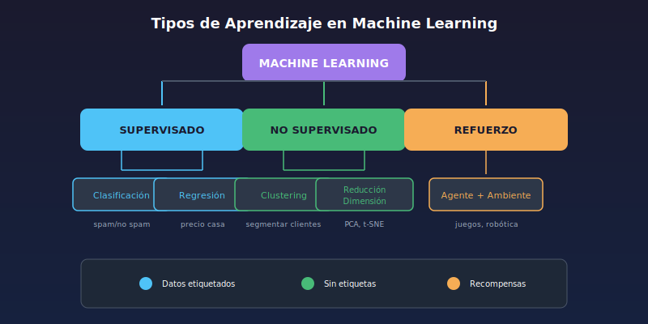

# 📊 Tipos de Aprendizaje en Machine Learning

## 🎯 Objetivos

- Diferenciar aprendizaje supervisado, no supervisado y por refuerzo
- Identificar problemas de clasificación vs regresión
- Conocer algoritmos comunes de cada tipo
- Saber cuándo aplicar cada tipo de aprendizaje

---

## 1. Panorama General



---

## 2. Aprendizaje Supervisado

### Definición

El modelo aprende de datos **etiquetados** (conocemos la respuesta correcta).

```
Datos de entrada (X) + Etiquetas (y) → Modelo → Predicciones
```

### Analogía

Como un estudiante que aprende con ejercicios resueltos:

- Ve el problema (X)
- Ve la respuesta correcta (y)
- Aprende el patrón

### Tipos de Problemas Supervisados

#### A) Clasificación

Predecir una **categoría/clase** discreta.

```python
# Ejemplo: ¿El email es spam o no?
from sklearn.tree import DecisionTreeClassifier

X = [[0, 0], [1, 1], [0, 1], [1, 0]]  # Features
y = ['A', 'B', 'A', 'B']               # Clases

modelo = DecisionTreeClassifier()
modelo.fit(X, y)
print(modelo.predict([[0.5, 0.5]]))  # Predice clase
```

**Ejemplos de clasificación:**

- Spam vs No spam (binaria)
- Diagnóstico de enfermedad (binaria)
- Tipo de flor (multiclase)
- Dígitos escritos 0-9 (multiclase)

**Algoritmos comunes:**

- Regresión Logística
- Árboles de Decisión
- Random Forest
- SVM (Support Vector Machines)
- K-Nearest Neighbors (KNN)
- Naive Bayes

#### B) Regresión

Predecir un **valor numérico** continuo.

```python
# Ejemplo: ¿Cuál será el precio de la casa?
from sklearn.linear_model import LinearRegression

X = [[50], [80], [120], [150]]  # Metros cuadrados
y = [100000, 180000, 250000, 300000]  # Precios

modelo = LinearRegression()
modelo.fit(X, y)
print(modelo.predict([[100]]))  # Predice precio
```

**Ejemplos de regresión:**

- Precio de casa
- Temperatura mañana
- Ventas del próximo mes
- Edad de una persona

**Algoritmos comunes:**

- Regresión Lineal
- Regresión Polinomial
- Ridge / Lasso
- Random Forest Regressor
- Gradient Boosting

### Tabla Comparativa: Clasificación vs Regresión

| Aspecto        | Clasificación              | Regresión                   |
| -------------- | -------------------------- | --------------------------- |
| Salida         | Categoría discreta         | Valor continuo              |
| Ejemplo        | spam / no spam             | precio = 150,000            |
| Métrica típica | Accuracy, F1-Score         | MSE, R²                     |
| Función        | `predict()` devuelve clase | `predict()` devuelve número |

---

## 3. Aprendizaje No Supervisado

### Definición

El modelo encuentra patrones en datos **sin etiquetas**.

```
Datos de entrada (X) → Modelo → Estructuras/Patrones
```

### Analogía

Como organizar una biblioteca sin saber las categorías:

- Agrupa libros similares
- Descubre patrones por tu cuenta

### Tipos de Problemas No Supervisados

#### A) Clustering (Agrupamiento)

Agrupar datos similares en clusters.

```python
# Ejemplo: Segmentar clientes
from sklearn.cluster import KMeans

X = [[1, 2], [1.5, 1.8], [5, 8], [8, 8], [1, 0.6], [9, 11]]

modelo = KMeans(n_clusters=2, random_state=42)
modelo.fit(X)
print(modelo.labels_)  # [0, 0, 1, 1, 0, 1]
print(modelo.cluster_centers_)  # Centros de clusters
```

**Ejemplos de clustering:**

- Segmentación de clientes
- Agrupación de documentos
- Detección de anomalías
- Compresión de imágenes

**Algoritmos comunes:**

- K-Means
- DBSCAN
- Hierarchical Clustering
- Gaussian Mixture Models

#### B) Reducción de Dimensionalidad

Reducir el número de features manteniendo información importante.

```python
# Ejemplo: Reducir de muchas dimensiones a 2
from sklearn.decomposition import PCA

X = [[1, 2, 3, 4], [5, 6, 7, 8], [9, 10, 11, 12]]  # 4D

pca = PCA(n_components=2)
X_reducido = pca.fit_transform(X)  # Ahora 2D
print(X_reducido.shape)  # (3, 2)
```

**Ejemplos de reducción:**

- Visualización de datos de alta dimensión
- Compresión de datos
- Eliminación de ruido
- Preprocesamiento para otros algoritmos

**Algoritmos comunes:**

- PCA (Principal Component Analysis)
- t-SNE
- UMAP
- Autoencoders

---

## 4. Aprendizaje por Refuerzo

### Definición

Un **agente** aprende a tomar **acciones** en un **ambiente** para maximizar una **recompensa**.

```
Agente ← Observa estado → Ambiente
   │                         │
   └── Toma acción ──────────┘
   │                         │
   └── Recibe recompensa ────┘
```

### Analogía

Como entrenar a un perro:

- El perro (agente) hace algo
- Recibe premio o castigo (recompensa)
- Aprende qué acciones son buenas

### Ejemplo Conceptual

```python
# Pseudocódigo de Q-Learning
estado = ambiente.reset()

for episodio in range(1000):
    accion = agente.elegir_accion(estado)
    nuevo_estado, recompensa, terminado = ambiente.step(accion)
    agente.aprender(estado, accion, recompensa, nuevo_estado)
    estado = nuevo_estado
```

**Ejemplos de refuerzo:**

- Juegos (AlphaGo, Atari)
- Robótica (caminar, manipular)
- Trading algorítmico
- Control de sistemas

**Algoritmos comunes:**

- Q-Learning
- Deep Q-Network (DQN)
- Policy Gradient
- Actor-Critic (A3C)

---

## 5. Comparación de los Tres Tipos

| Aspecto        | Supervisado              | No Supervisado     | Refuerzo             |
| -------------- | ------------------------ | ------------------ | -------------------- |
| **Datos**      | Etiquetados              | Sin etiquetar      | Interacción          |
| **Objetivo**   | Predecir etiqueta        | Encontrar patrones | Maximizar recompensa |
| **Feedback**   | Directo (etiquetas)      | No hay             | Recompensas          |
| **Ejemplos**   | Clasificación, Regresión | Clustering, PCA    | Juegos, Robótica     |
| **Dificultad** | ⭐⭐                     | ⭐⭐⭐             | ⭐⭐⭐⭐             |

---

## 6. ¿Cuándo Usar Cada Tipo?

### Usar Supervisado cuando:

- ✅ Tienes datos etiquetados
- ✅ Sabes qué quieres predecir
- ✅ Tienes suficientes ejemplos de cada clase

```python
# ¿Tengo etiquetas?
if tengo_labels:
    if label_es_categoria:
        usar = "Clasificación"
    else:
        usar = "Regresión"
```

### Usar No Supervisado cuando:

- ✅ No tienes etiquetas
- ✅ Quieres descubrir estructura en los datos
- ✅ Necesitas agrupar o simplificar datos

```python
# ¿Qué quiero hacer?
if quiero_agrupar:
    usar = "Clustering"
elif quiero_reducir_dimensiones:
    usar = "PCA / t-SNE"
elif quiero_detectar_anomalias:
    usar = "Isolation Forest"
```

### Usar Refuerzo cuando:

- ✅ El problema involucra decisiones secuenciales
- ✅ Hay un ambiente con el que interactuar
- ✅ Puedes definir recompensas claras

---

## 7. Algoritmos por Tipo (Resumen Visual)

```
SUPERVISADO                 NO SUPERVISADO           REFUERZO
├── Clasificación           ├── Clustering           ├── Q-Learning
│   ├── Logistic Reg.       │   ├── K-Means          ├── DQN
│   ├── Decision Tree       │   ├── DBSCAN           ├── Policy Gradient
│   ├── Random Forest       │   └── Hierarchical     └── Actor-Critic
│   ├── SVM                 │
│   ├── KNN                 └── Reducción Dim.
│   └── Naive Bayes             ├── PCA
│                               ├── t-SNE
└── Regresión                   └── UMAP
    ├── Linear Reg.
    ├── Polynomial
    ├── Ridge/Lasso
    └── Gradient Boosting
```

---

## 8. Ejemplo Práctico: Mismo Dataset, Diferente Enfoque

```python
import pandas as pd
from sklearn.cluster import KMeans
from sklearn.linear_model import LogisticRegression

# Dataset de clientes
clientes = pd.DataFrame({
    'edad': [25, 35, 45, 20, 55, 30],
    'ingresos': [30000, 50000, 80000, 20000, 90000, 45000],
    'compro': [0, 1, 1, 0, 1, 0]  # Etiqueta
})

X = clientes[['edad', 'ingresos']]

# SUPERVISADO: Predecir si comprará
y = clientes['compro']
modelo_sup = LogisticRegression()
modelo_sup.fit(X, y)
print('Predicción supervisada:', modelo_sup.predict([[40, 60000]]))

# NO SUPERVISADO: Segmentar clientes (ignoramos 'compro')
modelo_nosup = KMeans(n_clusters=2, random_state=42)
modelo_nosup.fit(X)
print('Clusters:', modelo_nosup.labels_)
```

---

## ✅ Resumen

| Tipo               | Datos         | Objetivo             | Algoritmos               |
| ------------------ | ------------- | -------------------- | ------------------------ |
| **Supervisado**    | Etiquetados   | Predecir             | Regresión, Clasificación |
| **No Supervisado** | Sin etiquetar | Descubrir patrones   | Clustering, PCA          |
| **Refuerzo**       | Interacción   | Maximizar recompensa | Q-Learning, DQN          |

---

## 🔗 Navegación

| Anterior                       | Siguiente                                         |
| ------------------------------ | ------------------------------------------------- |
| [← Qué es ML](01-que-es-ml.md) | [Flujo de Proyecto ML →](03-flujo-proyecto-ml.md) |
