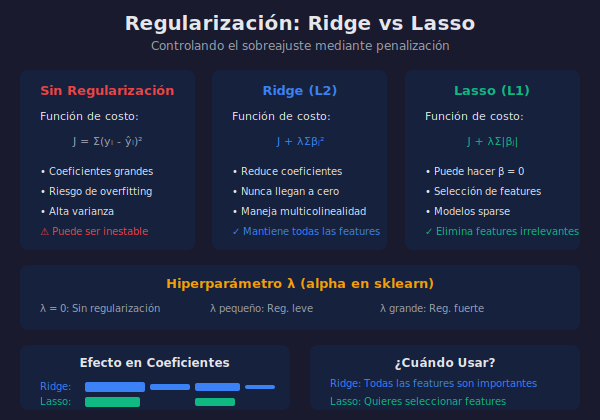

# Regularización: Ridge y Lasso

## 🎯 Objetivos

- Entender el problema del overfitting en regresión
- Comprender la regularización L1 y L2
- Implementar Ridge y Lasso con sklearn
- Saber cuándo usar cada técnica

## 📖 ¿Por qué Regularizar?

La regularización añade una **penalización** a la función de costo para evitar que los coeficientes crezcan demasiado, reduciendo el **overfitting**.

### Problema: Coeficientes Grandes

Cuando el modelo tiene muchas features o poca data:

- Los coeficientes pueden ser muy grandes
- El modelo se ajusta demasiado al ruido
- Mala generalización a datos nuevos



## 🔷 Ridge Regression (L2)

### Función de Costo

$$J_{Ridge} = \sum_{i=1}^{n}(y_i - \hat{y}_i)^2 + \lambda\sum_{j=1}^{p}\beta_j^2$$

- **Primer término**: Error cuadrático (MSE)
- **Segundo término**: Penalización L2 (suma de cuadrados de coeficientes)
- **λ (lambda)**: Hiperparámetro que controla la fuerza de regularización

### Características de Ridge

- Reduce todos los coeficientes, pero **nunca a cero**
- Maneja bien la **multicolinealidad**
- Mantiene todas las features en el modelo

### Implementación

```python
from sklearn.linear_model import Ridge
from sklearn.preprocessing import StandardScaler
from sklearn.model_selection import train_test_split
from sklearn.datasets import fetch_california_housing
import numpy as np

# Cargar datos
housing = fetch_california_housing()
X, y = housing.data, housing.target

# Dividir
X_train, X_test, y_train, y_test = train_test_split(
    X, y, test_size=0.2, random_state=42
)

# Escalar (importante para regularización)
scaler = StandardScaler()
X_train_scaled = scaler.fit_transform(X_train)
X_test_scaled = scaler.transform(X_test)

# Ridge con diferentes valores de alpha (lambda en sklearn)
alphas = [0.01, 0.1, 1, 10, 100]

print('Alpha      R² Train    R² Test')
print('-' * 35)
for alpha in alphas:
    ridge = Ridge(alpha=alpha)
    ridge.fit(X_train_scaled, y_train)
    r2_train = ridge.score(X_train_scaled, y_train)
    r2_test = ridge.score(X_test_scaled, y_test)
    print(f'{alpha:6.2f}     {r2_train:.4f}      {r2_test:.4f}')
```

## 🔶 Lasso Regression (L1)

### Función de Costo

$$J_{Lasso} = \sum_{i=1}^{n}(y_i - \hat{y}_i)^2 + \lambda\sum_{j=1}^{p}|\beta_j|$$

- **Penalización L1**: Suma de valores absolutos de coeficientes

### Características de Lasso

- Puede hacer coeficientes exactamente **cero**
- Realiza **selección de features** automáticamente
- Genera modelos **sparse** (dispersos)

### Implementación

```python
from sklearn.linear_model import Lasso

print('\nComparación Ridge vs Lasso:')
print('=' * 60)

# Entrenar ambos modelos
ridge = Ridge(alpha=1.0)
lasso = Lasso(alpha=0.1)

ridge.fit(X_train_scaled, y_train)
lasso.fit(X_train_scaled, y_train)

# Comparar coeficientes
print('\nFeature              Ridge Coef    Lasso Coef')
print('-' * 50)
for i, name in enumerate(housing.feature_names):
    print(f'{name:20} {ridge.coef_[i]:10.4f}    {lasso.coef_[i]:10.4f}')

# Contar coeficientes cero en Lasso
zeros_lasso = np.sum(lasso.coef_ == 0)
print(f'\nCoeficientes = 0 en Lasso: {zeros_lasso}/{len(lasso.coef_)}')
```

## 🔀 ElasticNet (L1 + L2)

**ElasticNet** combina ambas penalizaciones:

$$J_{ElasticNet} = \sum(y_i - \hat{y}_i)^2 + \lambda_1\sum|\beta_j| + \lambda_2\sum\beta_j^2$$

```python
from sklearn.linear_model import ElasticNet

# l1_ratio controla la mezcla (1=Lasso, 0=Ridge)
elastic = ElasticNet(alpha=0.1, l1_ratio=0.5)
elastic.fit(X_train_scaled, y_train)

print(f'ElasticNet R²: {elastic.score(X_test_scaled, y_test):.4f}')
```

## 🔍 Selección de Alpha (λ)

### Cross-Validation

```python
from sklearn.linear_model import RidgeCV, LassoCV

# RidgeCV encuentra el mejor alpha automáticamente
ridge_cv = RidgeCV(alphas=[0.1, 1, 10, 100], cv=5)
ridge_cv.fit(X_train_scaled, y_train)
print(f'Mejor alpha Ridge: {ridge_cv.alpha_}')

# LassoCV
lasso_cv = LassoCV(alphas=[0.001, 0.01, 0.1, 1], cv=5)
lasso_cv.fit(X_train_scaled, y_train)
print(f'Mejor alpha Lasso: {lasso_cv.alpha_}')
```

### Visualización del Efecto de Alpha

```python
import matplotlib.pyplot as plt

alphas = np.logspace(-3, 3, 100)
ridge_coefs = []
lasso_coefs = []

for alpha in alphas:
    ridge = Ridge(alpha=alpha)
    ridge.fit(X_train_scaled, y_train)
    ridge_coefs.append(ridge.coef_)

    lasso = Lasso(alpha=alpha, max_iter=10000)
    lasso.fit(X_train_scaled, y_train)
    lasso_coefs.append(lasso.coef_)

# Plot
fig, axes = plt.subplots(1, 2, figsize=(14, 5))

# Ridge
axes[0].plot(alphas, ridge_coefs)
axes[0].set_xscale('log')
axes[0].set_xlabel('Alpha')
axes[0].set_ylabel('Coeficientes')
axes[0].set_title('Ridge: Coeficientes vs Alpha')
axes[0].legend(housing.feature_names, loc='right')

# Lasso
axes[1].plot(alphas, lasso_coefs)
axes[1].set_xscale('log')
axes[1].set_xlabel('Alpha')
axes[1].set_ylabel('Coeficientes')
axes[1].set_title('Lasso: Coeficientes vs Alpha')

plt.tight_layout()
plt.savefig('regularizacion_coefs.png', dpi=150)
plt.show()
```

## 📊 Comparación: ¿Cuándo Usar Cada Uno?

| Criterio               | Ridge (L2) | Lasso (L1) | ElasticNet |
| ---------------------- | ---------- | ---------- | ---------- |
| **Coefs a cero**       | No         | Sí         | Algunos    |
| **Selección features** | No         | Sí         | Parcial    |
| **Multicolinealidad**  | Excelente  | Inestable  | Bueno      |
| **Muchas features**    | Bueno      | Excelente  | Excelente  |
| **Interpretabilidad**  | Moderada   | Alta       | Moderada   |

### Guía de Decisión

```
¿Quieres seleccionar features?
├── SÍ → ¿Hay multicolinealidad?
│       ├── SÍ → ElasticNet
│       └── NO → Lasso
└── NO → Ridge
```

## 💻 Pipeline Completo con Regularización

```python
from sklearn.pipeline import Pipeline
from sklearn.preprocessing import StandardScaler
from sklearn.linear_model import RidgeCV, LassoCV
from sklearn.model_selection import cross_val_score

# Pipeline Ridge
pipe_ridge = Pipeline([
    ('scaler', StandardScaler()),
    ('regressor', RidgeCV(alphas=[0.1, 1, 10, 100]))
])

# Pipeline Lasso
pipe_lasso = Pipeline([
    ('scaler', StandardScaler()),
    ('regressor', LassoCV(alphas=[0.001, 0.01, 0.1, 1]))
])

# Evaluar con cross-validation
scores_ridge = cross_val_score(pipe_ridge, X, y, cv=5, scoring='r2')
scores_lasso = cross_val_score(pipe_lasso, X, y, cv=5, scoring='r2')

print(f'Ridge R² (CV): {scores_ridge.mean():.4f} ± {scores_ridge.std():.4f}')
print(f'Lasso R² (CV): {scores_lasso.mean():.4f} ± {scores_lasso.std():.4f}')
```

## ⚠️ Importancia del Escalado

**SIEMPRE escalar features antes de regularizar**:

```python
# ❌ MAL: Sin escalar
ridge_bad = Ridge(alpha=1)
ridge_bad.fit(X_train, y_train)  # Coeficientes dependen de escala

# ✅ BIEN: Con escalado
scaler = StandardScaler()
X_train_scaled = scaler.fit_transform(X_train)
ridge_good = Ridge(alpha=1)
ridge_good.fit(X_train_scaled, y_train)
```

## ✅ Checklist de Verificación

- [ ] Entiendo por qué regularizar previene overfitting
- [ ] Conozco la diferencia entre L1 (Lasso) y L2 (Ridge)
- [ ] Sé que Lasso hace selección de features
- [ ] Puedo usar RidgeCV y LassoCV para encontrar alpha
- [ ] Sé que debo escalar antes de regularizar

## 🔗 Recursos Adicionales

- [Sklearn Ridge](https://scikit-learn.org/stable/modules/generated/sklearn.linear_model.Ridge.html)
- [Sklearn Lasso](https://scikit-learn.org/stable/modules/generated/sklearn.linear_model.Lasso.html)
- [StatQuest: Regularization](https://www.youtube.com/watch?v=Q81RR3yKn30)
